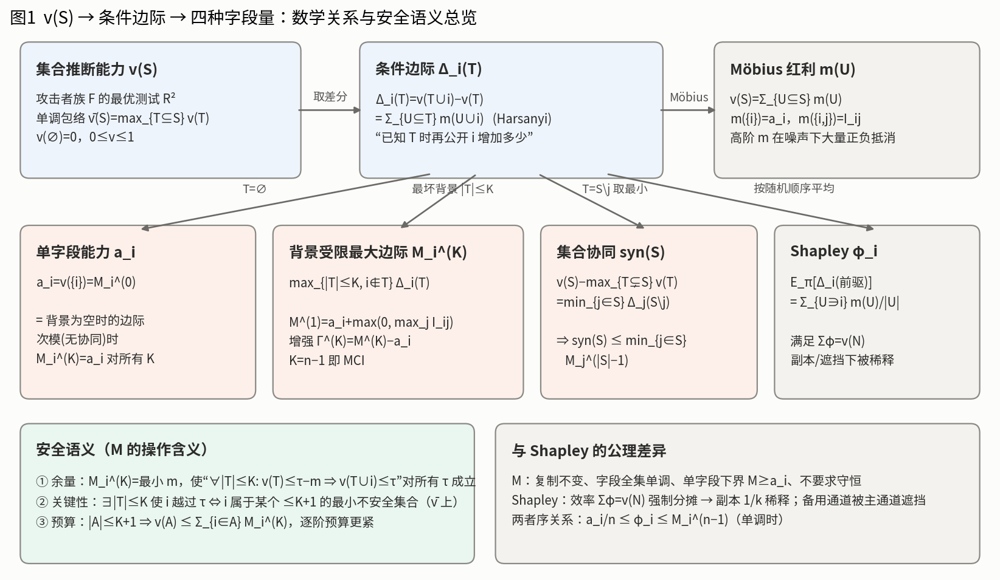
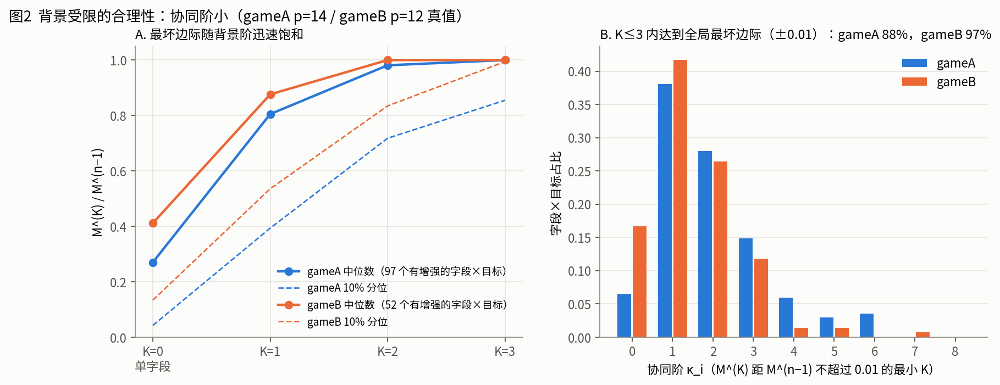
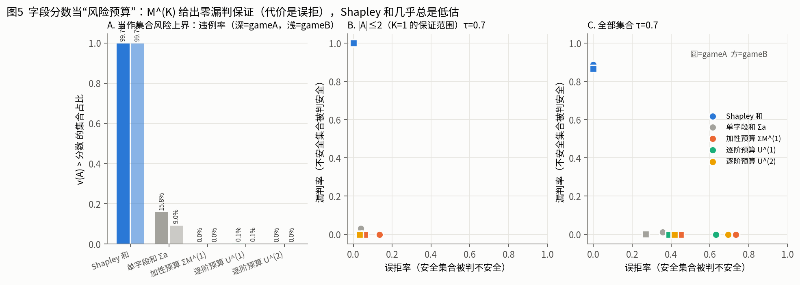
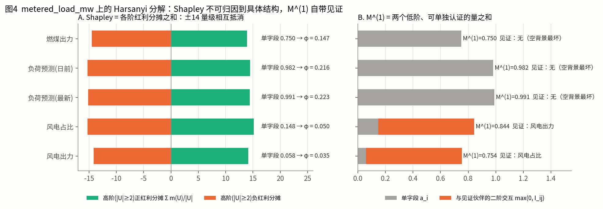
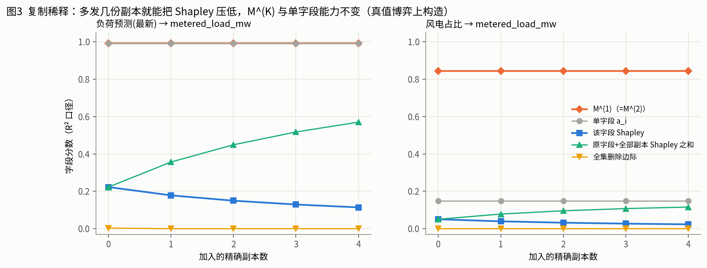
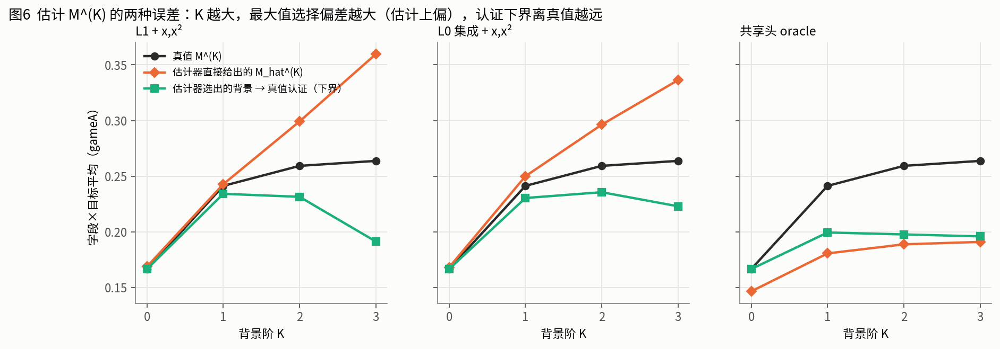

# 20260915　背景受限最大边际 M^(K)：严格定义、安全语义，以及它与单字段能力、协同、Shapley 的数学关系

> 接续：[`20260914_字段级分级方案与可行性.md`](20260914_字段级分级方案与可行性.md)、`reports/field_grading_review_20260914/REVIEW.md`、98 号（GPT Shapley 方案检验）。
> 数值核验：[`DNN_Aggresvation99/`](../DNN_Aggresvation99/)（复用 98 号 gameA p=14 / gameB p=12 的精确枚举真值，纯 CPU）。图均在 `DNN_Aggresvation99/figures/`。
> 本文所有命题都给出证明；标"核验"的数字来自 99 号。

---

## 0. 一页结论

1. **定义**。在固定的攻击者族、公开基底 B、目标 c 下，字段 i 的 K 背景风险是
   **M_i^(K) = max_{T⊆G∖{i}, |T|≤K} [ v̄(B∪T∪{i}) − v̄(B∪T) ]**。
   其中 v̄ 是集合推断能力的**单调包络**（攻击者总可以丢弃字段）。取到最大值的 T* 称为**见证背景**。
2. **它回答的问题**：若攻击者除基底外还可能掌握任意至多 K 个其他字段，公开 i **最多**会让推断能力上升多少。
3. **三条安全语义定理**：
   - **余量**：M_i^(K) 恰是使"背景风险 ≤ τ−m ⇒ 加上 i 后仍 ≤ τ"对**所有阈值 τ** 成立的最小余量 m；
   - **关键性**：i 能在某个 ≤K 的背景上把风险推过 τ，当且仅当 i 属于某个规模 ≤K+1 的**最小不安全集合**；
   - **预算**：任意 |A|≤K+1 的发布集合都满足 v̄(A) ≤ Σ_{i∈A} M_i^(K)；逐阶预算给出更紧的上界。
4. **与单字段能力、协同的关系**：
   - a_i = M_i^(0) ≤ M_i^(1) ≤ … ≤ M_i^(n−1) = MCI；
   - K=1 有精确闭式 **M_i^(1) = a_i + max(0, max_j I_ij)**，I_ij = v(ij)−v(i)−v(j) 是二阶交互；
   - 一般地，M_i^(K) − a_i 是字段 i 参与的、规模 ≤K+1 的 Möbius 红利在最坏背景上的最大组合；
   - 增强幅度为 0，当且仅当 v 在 i 处（≤K 背景内）满足次模；
   - 任何 k 阶不可约协同集合 S，其每个成员都满足 M^(k−1) ≥ syn(S)。
5. **为什么比 Shapley 更符合安全语义**。Shapley 满足"效率"Σφ=v(N)，这正是问题所在：**任何满足效率 + 对称的分数，在存在冗余时必然低于某些字段的单字段风险**（命题 9）。副本会稀释它，主通道会遮挡备用通道（解析解：备用协同对的 Shapley 从 β/2 降到 β/6）。M^(K) 满足复制不变、字段全集单调、单字段下界，并且每个分数都自带可复核的见证背景。
6. **诚实的边界**：
   - Shapley 之和作为集合风险的**排序量**其实很好（AUC 0.97–0.99，高于 M 预算的 0.93–0.97），M 的优势在"保证"而不是"排序"；
   - M 不守恒，用加和做大集合预算时误拒 60–70%，字段级分数替代不了集合级判定；
   - 估计 M 时，K 越大，最大值选择偏差越大（K=3 时正偏约 0.1），所以 K 必须有界，而且要做认证。

---

## 1. 设定与记号

- 一般字段全集 G，|G|=n；受保护目标 Y_c；公开基底 B⊆G（总是可见，不计入 K）；候选字段 H=G∖B。
- **攻击者族** 𝓕 = {𝓕_S}：𝓕_S 是只读取 X_S 的预测函数集合。

**假设 A1（可忽略输入）**：S⊆T ⇒ 𝓕_S ⊆ 𝓕_T（多给的字段可以不用）。
**假设 A2（含常数）**：常数预测器属于 𝓕_∅。

**定义 1（集合推断能力）**

  v(S) = 1 − inf_{f∈𝓕_S} E[(Y − f(X_S))²] / Var(Y).

**命题 1**。在 A1、A2 下，v(∅)=0，0≤v≤1，并且 S⊆T ⇒ v(S)≤v(T)。
*证明*：A2 给出 inf ≤ Var(Y)，所以 v(∅)=0 且 v≥0；平方损失非负，所以 v≤1；A1 使 inf 在更大的集合上取得，所以 v 单调。∎
𝓕 取全部可测函数时，v(S)=Var(E[Y|X_S])/Var(Y)。

**定义 2（单调包络）**：v̄(S) = max_{T⊆S} v(T)。

**为什么正式定义必须用 v̄**：实际得到的 v̂ 是有限样本、有限训练的测试 R²，**并不单调**。核验：两博弈中 7–9% 的集合有 v̄−v>0.01，最大 0.09。但攻击者拿到 S 后总可以只用它的一个子集，所以**攻击者真实可达的能力是 v̄，而不是 v**。v̄ 是 ≥v 的最小单调函数；在总体层面（命题 1 成立时）v̄=v。第 3 节的关键性定理只在单调函数上成立：核验在 v 上有 0.2% 的不一致，在 v̄ 上为 0。

**口径**。本文用**绝对 R² 增量**。阈值 τ 就定义在这个口径上，只有同一口径才能得到余量语义（定理 1）。对数残差口径 g(v)=−½ln(1−v) 与条件剩余比例口径是变体，见 §7.3。

---

## 2. M^(K) 的定义

**定义 3（条件边际）**：Δ_i(T) = v̄(T∪{i}) − v̄(T)，其中 i∉T（有基底时把 T 换成 B∪T）。v̄ 单调，所以 Δ≥0。

**定义 4（背景受限最大边际）**

  **M_i^(K)(c, B, 𝓕, G) = max_{T⊆H∖{i}, |T|≤K} Δ_i(B∪T)**

**定义 5（见证背景）**：T*_i^(K) ∈ argmax。它是一个具体、可被独立攻击复核的字段组合。

**定义 6（增强幅度与协同阶）**

  Γ_i^(K) = M_i^(K) − M_i^(0)，　κ_i(ε) = min{K : M_i^(K) ≥ M_i^(n−1) − ε}.

要写进定义的参数有五个：目标 c、基底 B、攻击者族 𝓕、字段全集 G、背景阶 K。**同一个字段的分数离开这五个参数就没有意义**，分级表必须写明适用条件。

### 2.1 为什么是这个形式：被否决的候选

| 候选 | 形式 | 否决原因 |
| --- | --- | --- |
| 到达水平 | max_{\|T\|≤K} v̄(T∪i) | 不可归责：只要存在一个强字段 j，所有字段都满足 v̄(i,j) ≥ v̄(j) ≈ 0.99，全部顶格 |
| 全集删除 | v̄(G) − v̄(G∖i) | 副本全部判为 0（删掉一个还有另一个）；核验中两个负荷预测的删除边际为 0.003 / −0.001 |
| 平均边际 | Shapley、Banzhaf | 冗余稀释、主通道遮挡（§5） |
| 最坏边际，不限 K | M^(n−1)（即 MCI） | 需要 2^n 次查询、无法认证；max 选择偏差随候选数增长；另外"攻击者掌握全部其余字段"的威胁模型过强 |
| **最坏边际，背景 ≤K** | **M^(K)** | K 是威胁模型参数，O(n^K) 可算，≤K+1 阶集合可认证 |

### 2.2 多目标与基底

- **多目标**：各目标用自己的阈值 τ_c 和档位分别分级，然后取最严档位。**不要把不同目标的 M 相加或平均**，因为余量语义只在同一目标内成立。
- **基底 B**：固定可见，不占 K 的名额。若 v̄(B) 本身已经 >τ_c，说明目标已经被基底泄露，应当标记"基底泄露"，而不是继续打分。

### 2.3 K 怎么选

同时满足三个约束，取最小者：
1. **威胁模型**：攻击者可能额外掌握的字段数（例如同一数据门户里其他发布）；
2. **饱和**：K ≥ 多数字段的协同阶 κ。核验：K≤3 内达到全局最坏边际（±0.01）的比例为 gameA 88%、gameB 97%；有增强的字段上，M^(K)/M^(n−1) 的平均值为 K=1 0.78、K=2 0.92、K=3 0.97（图2）；
3. **可认证**：K 越大，估计器挑出的背景越不可靠。K=1 时认证值是真值的 96–97%，K=3 时降到 64–85%（§6、图6）。

本数据上，**K=2 是推荐主口径，K=1 与 K=3 作为敏感性报告**。

---

## 3. 安全语义：三个定理

### 定理 1（余量刻画）

对 m≥0，下面两条等价：

  (i) 对所有 τ∈ℝ 和所有 |T|≤K：v̄(T) ≤ τ−m ⇒ v̄(T∪i) ≤ τ；
  (ii) m ≥ M_i^(K)。

*证明*。(ii)⇒(i)：v̄(T∪i) = v̄(T)+Δ_i(T) ≤ (τ−m) + M_i^(K) ≤ τ。
(i)⇒(ii)：对任一 T 取 τ=v̄(T)+m，(i) 给出 Δ_i(T) ≤ m；对 T 取最大即 M_i^(K) ≤ m。∎

**含义**：M_i^(K) 是**与阈值无关的最小安全余量**。发布 i 的前提是"攻击者可能已有的背景风险 ≤ τ − M_i^(K)"。它是字段自身的属性，不需要事先定下 τ。这是 Shapley 没有的操作含义：φ_i 不对应任何阈值规则。

### 定理 2（关键性 ⇔ 小最小不安全集合）

称 E 为**最小不安全集合**（MUS），如果 v̄(E)>τ 且 E 的每个真子集 T 都有 v̄(T)≤τ。
称 i 在 K 背景下是 **τ-关键的**，如果存在 |T|≤K、i∉T，使得 v̄(T)≤τ<v̄(T∪i)。那么：

  **i 是 τ-关键的 ⇔ i 属于某个规模 ≤K+1 的 MUS。**

*证明*。
(⇐) 设 E∋i 是 MUS，|E|≤K+1。取 T=E∖i，则 |T|≤K，由最小性 v̄(T)≤τ，而 v̄(T∪i)=v̄(E)>τ。
(⇒) 设 v̄(T)≤τ<v̄(T∪i)。在有限集合 T∪i 的不安全子集中取一个包含关系下的极小元 E，则 E 是 MUS，且 |E|≤K+1。若 i∉E，则 E⊆T，由单调性得 v̄(T) ≥ v̄(E) > τ，矛盾。所以 i∈E。∎

**核验**：τ∈{0.5,0.7,0.9}、K∈{1,2,3}，两博弈全部字段×目标，在 v̄ 上不一致率 0；在非单调的 v 上为 0.2%（gameA）。

**与 M 的联系**：若 M_i^(K) ≤ m，则 i 只可能在背景风险落在 (τ−m, τ] 的窄带里成为关键字段（定理 1）。
**意义**：审计报告建议的安全对象"最小不安全集合"，在字段层面正好由"是否 τ-关键"刻画。**K 背景分级与"≤K+1 阶危险组合"是同一件事的两面。**

### 定理 3（预算包络）

(a) **加性预算**：若 |A|≤K+1，则 v̄(A) ≤ Σ_{i∈A} M_i^(K)。
(b) **逐阶预算**：令 U^(K)(∅)=0，U^(K)(A) = min_{j∈A} [U^(K)(A∖j) + M_j^(min(|A|−1, K))]。若 |A|≤K+1，则 v̄(A) ≤ U^(K)(A) ≤ Σ_{i∈A} M_i^(K)。
(c) **任意规模**：若对每个 i∈A 都有 M_i^(K) = M_i^(|A|−1)（即 κ_i ≤ K），则 (a)(b) 对该 A 成立，不需要 |A|≤K+1。

*证明*。
(a) 任取顺序 i_1,…,i_m 展开：v̄(A) = Σ_t Δ_{i_t}({i_1..i_{t−1}})。第 t 步的背景规模 t−1 ≤ m−1 ≤ K，所以每项 ≤ M_{i_t}^(K)。这一步只用到 v̄(∅)=0，不需要单调。
(b) 对 |A| 归纳：v̄(A) = v̄(A∖j) + Δ_j(A∖j) ≤ U(A∖j) + M_j^(|A|−1)，对 j 取最小。第二个不等式由 M^(k) 对 k 单调得到。
(c) 同 (a)，把每一步的上界换成 M^(|A|−1) = M^(K)。∎

**核验**（图5）：
- 加性预算 ΣM^(1) 在全部集合上的违例率为 0.01% / 0（这 0.01% 落在 |A|>2 的集合上，不违反定理）；
- τ=0.7 时 |A|≤2 的漏判为 0，误拒 13.6% / 5.9%；
- 逐阶预算 U^(1) 把这部分误拒降到 4.2% / 3.2%；
- 单字段之和 Σa（隐含"无协同"的次模假设）违例 16% / 9%；
- Shapley 之和违例 99.7%。

**含义：字段级"风险预算制"**。M_i^(K) 是每个字段消耗的风险预算的**可证明上界**。发布规则"逐阶预算 ≤ τ 则快速放行，否则转集合级审计"对 ≤K+1 阶集合零漏判。
**代价**：大集合上误拒 60–70%。所以字段级分数负责分级、快速放行和给出见证，**大规模发布的最终判定仍需集合级估计器与重训认证**。

---

## 4. 与单字段能力、协同的数学关系

### 命题 4（层级与全集单调）

(a) a_i := v̄({i}) = M_i^(0) ≤ M_i^(1) ≤ … ≤ M_i^(n−1)。
(b) 字段全集由 G 扩大到 G′⊇G 时，M_i^(K)(G′) ≥ M_i^(K)(G)。

*证明*：两者都是在更大的可行背景集合上取最大值。∎（核验：K 上的单调违例为 0。）

(b) 就是**复制不变性**的来源：加入副本或任何新字段，都不会降低已有字段的分数。

### 命题 5（增强 ⇔ 次模性被破坏）

Γ_i^(K) > 0 ⇔ 存在 1≤|T|≤K 使 Δ_i(T) > Δ_i(∅)。
特别地，若 v̄ 次模（边际递减），则对所有 K 都有 M_i^(K) = a_i。

*证明*：由定义，M^(K) > M^(0) 当且仅当某个非空背景上的边际超过空背景边际；次模时 Δ_i(T) ≤ Δ_i(∅)。∎

所以**"字段升档"与"存在协同"在数学上是同一件事**，升档的见证就是破坏次模性的那个背景。

### 命题 6（Harsanyi 表示）

令 m(U) = Σ_{W⊆U} (−1)^{|U∖W|} v̄(W) 为 Möbius 变换（Harsanyi 红利），则 v̄(S) = Σ_{U⊆S} m(U)，并且

  **Δ_i(T) = Σ_{U⊆T} m(U∪{i})，　M_i^(K) = a_i + max_{|T|≤K} Σ_{∅≠U⊆T} m(U∪{i}).**

*证明*：v̄(T∪i) − v̄(T) = Σ_{U⊆T∪i, i∈U} m(U) = Σ_{W⊆T} m(W∪i)，而 W=∅ 的项是 m({i})=a_i。∎

**解读**：M^(K) 的增强部分，是字段 i 参与的、规模 ≤K+1 的纯交互项在最坏背景上的最大组合。最坏背景会自动避开负红利（冗余），只收集正红利（协同）。

### 推论 7（K=1 的精确闭式）

  **M_i^(1) = a_i + max(0, max_{j≠i} I_ij)，　I_ij := m({i,j}) = v̄(ij) − v̄(i) − v̄(j).**

与项目历史定义 syn₂(ij) = v̄(ij) − max(a_i, a_j) 的关系：**I_ij = syn₂(ij) − min(a_i, a_j)**，所以

  M_i^(1) − a_i = max(0, max_j [ syn₂(ij) − min(a_i, a_j) ]).

**注意 syn₂>0 不等于升档**。例：a_i=0.9、a_j=0.1、v(ij)=0.95，则 syn₂=0.05，但 I_ij=−0.05（次可加），双方都不升档。审计报告里的 Y=X₁+X₂ 反例（syn₂=1/2、I=0）也是这种情况。**升档的判据是严格超可加 I_ij>0，而不是 syn₂>0。** M^(1) 自动使用了正确的判据。

核验（图4B）：风电出力 a=0.058，与见证伙伴风电占比的 I=0.696，M^(1)=0.754；两个负荷预测与燃煤出力的见证背景都是空集。

### 命题 8（集合协同的字段级下界）

对任意 |S|≥2，令 syn(S) = v(S) − max_{T⊊S} v(T)，则

  **syn(S) ≤ min_{j∈S} M_j^(|S|−1).**

*证明*：对任一 j∈S，max_{T⊊S} v(T) ≥ v(S∖j)，所以 syn(S) ≤ v(S) − v(S∖j) = Δ_j(S∖j) ≤ M_j^(|S|−1)。只要 syn、Δ、M 用同一个价值函数（v 或 v̄）定义，证明就不需要单调性。∎

核验：两博弈全部集合，最大违例 3×10⁻⁸（float32 精度）。

**解读**：**任何强度为 s 的 k 阶不可约协同，都必然让它的全部成员在 K=k−1 下 M ≥ s**，高阶强协同不可能在字段级分级里"隐身"。反之不成立：M 高可能来自多个低阶协同的叠加。

### 命题 9（守恒型归因的不可能性）

设字段分数 s 满足**效率**（Σ_i s_i = v̄(N)）和**对称**（等价字段同分）。考虑 k 个副本博弈 v̄(S)=1[S∩D≠∅]，则 s_i = 1/k < 1 = a_i。一般地，
**只要 Σ_i a_i > v̄(N)（存在冗余），任何满足效率的分数都不可能对所有 i 满足 s_i ≥ a_i。**

*证明*：若 s_i ≥ a_i 对所有 i 成立，则 v̄(N) = Σ s_i ≥ Σ a_i > v̄(N)，矛盾。副本情形由对称性直接得到。∎

**解读**：这不是 Shapley 实现的缺陷，而是"守恒分摊"这一公理与安全需求（单字段下界）的**逻辑冲突**。电力数据里冗余无处不在（燃料出力/占比、日前/实时、同一量的多种口径），这个冲突在实际数据上必然发生：两个负荷预测都能推 0.98，而 v̄(N)=0.99。

### 命题 10（Shapley 的 Harsanyi 表示与序关系）

  φ_i = Σ_{U∋i} m(U)/|U| = (1/n) Σ_{k=0}^{n−1} E_{|T|=k, i∉T}[Δ_i(T)].

因此 **a_i/n ≤ φ_i ≤ M_i^(n−1)**（左边需要单调），并且 φ_i ≤ (1/n) Σ_k M_i^{[=k]}，其中 M^{[=k]} 是恰好 k 个字段背景上的最大边际。

*证明*：前一式是标准结果；第二式是按联盟规模分层写 Shapley 权重。单调时每个 Δ≥0，保留 k=0 项得到下界；每层期望 ≤ 该层最大值得到上界。∎（核验：两个不等式违例均为 0。）

**Shapley 与 M^(K) 的代数对照**：

| | Shapley φ_i | M_i^(K) |
| --- | --- | --- |
| 使用的红利 | 全部 U∋i，任意阶 | 仅 \|U\|≤K+1 |
| 负红利（冗余） | 计入，与正红利相抵 | 最坏背景自动避开 |
| 每个红利的份额 | 除以 \|U\|（平均分给成员） | 不除（成员各自承担全部） |
| 聚合 | 所有背景的加权平均 | 最坏背景 |
| 需要的集合值 | 全部 2^n | 规模 ≤K+1 的集合，O(n^K) |

核验（图4A）：metered_load_mw 上，风电出力的 φ=0.035，是"单字段 0.058 + 高阶正红利分摊 14.12 + 高阶负红利分摊 −14.14"的结果。**净值来自两个 14 量级的数相抵，无法归因到任何具体结构。** 而 M^(1) 是两个可单独认证的低阶量之和。

---

## 5. 为什么 M^(K) 比 Shapley 更符合安全语义

### 5.1 安全分级应满足的性质

| 性质 | 含义 | M^(K) | Shapley |
| --- | --- | --- | --- |
| S1 最坏背景 | 分数覆盖攻击者可能持有的任一背景 | ✓（≤K） | ✗ 平均 |
| S2 复制不变 | 加入副本不降低已有字段分数 | ✓（命题 4b） | ✗ 1/k 稀释 |
| S3 全集单调 | 加入新字段不降低已有字段分数 | ✓ | ✗ |
| S4 单字段下界 | s_i ≥ a_i | ✓ | ✗（命题 9：与效率冲突） |
| S5 协同显现 | 纯 AND 对：两成员分数 = 协同强度 | ✓（=β） | 仅 β/2，有主通道时 β/6 |
| S6 阈值语义 | 分数对应一条阈值规则 | ✓ 余量（定理 1）、预算（定理 3） | ✗ |
| S7 可见证 | 分数由一个具体组合实现，可独立复核 | ✓ T* | ✗ 全体联盟的加权平均 |
| S8 局部可算 | 只依赖低阶集合 | ✓ O(n^K) | ✗ 2^n 或采样 |
| 效率（守恒） | Σ 分数 = 总风险 | ✗ | ✓ |

效率是归因（"总风险怎么分"）需要的性质，不是安全（"这个字段有多危险"）需要的性质。**两者的公理组不相容**（命题 9），所以二者只能分工，不能互相替代。

### 5.2 两个解析反例

**副本**：k 个字段各自完全决定目标，v̄(S)=1[S∩D≠∅]。
φ = 1/k，M^(K) = 1，全集删除边际 = 0（k≥2）。
核验（图3）：给负荷预测再加 4 个副本，φ 从 0.223 降到 0.114，5 个副本的 φ 之和也只有 0.57；M^(1) 始终为 0.991。

**遮挡**：主通道 A（强度 α）与协同对 (x,y)（强度 β），v̄(S) = max(α·1[A∈S], β·1[x,y∈S])，另有若干零字段。
- 若 α≥β：φ_x = β/6（只有在 y 已经出现、A 尚未出现时 x 才有边际，概率 1/6）；
- 若 α<β：φ_x = β/6 + 2(β−α)/6；
- 没有主通道时 φ_x = β/2；
- M_x^(1) = β（见证 T={y}），与 A 是否存在无关。

核验：(α,β)=(0.9,0.8) 时 φ_x=0.1333、(0.5,0.8) 时 0.2333，与解析值一致。

**遮挡正是安全场景的要害**：发布方最常见的处置是删掉主通道（A）。删除之后，备用通道 (x,y) 就成为实际风险来源，而 Shapley 在删除之前给它的分数只有 β/6。真实数据中的对应案例：负荷预测是主通道，风电出力/占比是备用通道，φ 分别为 0.035/0.050，M^(1) 为 0.754/0.844。

### 5.3 公平地说，Shapley 仍然擅长什么

- 作为集合风险的**排序代理**，Σ_{i∈A} φ_i 的 AUC 为 0.97 / 0.99，高于 M 预算（0.93–0.97）。原因是 M 预算在大集合上迅速饱和到 >τ。
- 作为"总风险的份额解释"（例如"这 44 个字段对全量发布的 0.99 分别贡献多少"），Shapley 是唯一满足效率 + 对称 + 零玩家 + 可加的分配。
- **建议**：论文主分级用 M^(K)，Shapley 作为附表"份额解释"，并明确写出二者回答的是不同问题。

---

## 6. 估计与认证

实际只有估计器 v̂（通用模型）和有限的重训预算，M 的估计会带两类误差：

1. **最大值选择偏差**：M̂ = max_T Δ̂_i(T)，候选数为 Σ_{k≤K} C(n−1,k)，Δ̂ 的误差在 max 下产生正偏。核验：L1+x 在 K=0/1/2/3 的平均偏差为 +0.002 / +0.001 / +0.040 / +0.096。
2. **估计器系统偏差**：共享头 oracle 在所有 K 上都负偏（约 −0.02 到 −0.07），会漏掉升档。

**区间估计方案**：

  **下界** L_i = Δ_audit,i(T̂*)：在独立审计数据上重训认证固定背景 T̂* 的边际。T̂* 在认证前已经选定，所以没有选择偏差；并且按定义 Δ(T̂*) ≤ M。
  **上界** M̂_i + ε_Δ：ε_Δ 为估计器的边际误差带，在配对集合上测量（98 号的 Shapley 加权边际误差界）。

核验：用估计器挑背景、再用真值认证，K=1 时认证值是真值的 96–97%（L0 / L1+x / L0 集成），K=2 为 89–91%，K=3 为 64–85%。

**结论**：**K 越大，"找对最坏背景"越难**，这是 K 必须有界的统计理由，与 97 号"k*=5 以上不可认证"是同一现象在字段级的表现。

---

## 7. 推荐的正式口径（可直接写进论文方法部分）

### 7.1 定义块

> 给定目标 c、公开基底 B、攻击者族 𝓕、候选字段 H 与背景阶 K，字段 i 的背景受限推断风险为
> M_{c,i}^(K) = max_{T⊆H∖{i}, |T|≤K} [ v̄_c(B∪T∪{i}) − v̄_c(B∪T) ]，
> 其中 v̄_c(S)=max_{S′⊆S} v_c(S′)，v_c(S) 为 𝓕 在 X_S 上对 Y_c 的最优测试 R²。
> 取到最大值的 T* 为见证背景，Γ^(K) = M^(K) − M^(0) 为背景增强幅度。

### 7.2 分级表

每个字段一行：固有等级、a_i、M^(1)、**M^(2)（主口径）**、Γ^(2)、见证背景 T*（及其认证值）、协同阶 κ、最受威胁目标、**推断风险等级**、状态（已认证 / 待复核）。

档位建议按余量解释来切，例如 τ=0.7 时：M<0.05 可忽略；0.05–0.2 需控制背景；0.2–0.5 高；≥0.5 单独即可跨阈。档位边界要在论文中预先登记。

**发布规则**（与分级配套，不能只用"每个字段等级都达标即可发布"）：
核验中"字段阈值规则 max_i M_i ≤ τ"的漏判为 5–53%，与用哪种分数无关。所以规则应当是：
1. 逐阶预算 U^(K)(A) ≤ τ → 字段级放行（≤K+1 阶零漏判）；
2. 否则 → 集合级估计器 + 重训认证。

### 7.3 口径变体

- **条件剩余比例** q_i(T) = Δ_i(T)/(1−v̄(T))。它的最大值 Q_i^(K) 给出乘法包络 1−v̄(A) ≥ Π_{i∈A}(1−Q_i^(K))，对 |A|≤K+1 成立，证明同定理 3。适合"剩余可保护部分被消耗多少"的叙述，但没有定理 1 的绝对余量语义。
- **对数残差口径** g(v)=−½ln(1−v)。在 g 上定义 M 时，定理 1–3 都成立（阈值换成 g(τ)），但 argmax 背景可能不同。只在高斯情形下有互信息解释。

---

## 8. 与已有工作的关系（需正式查新）

- **MCI**（Catav 等，ICML 2021）：M^(n−1) 就是把 MCI 应用于推断能力集合函数。MCI 的"集合价值 ≤ 字段 MCI 之和"是本文定理 3(a) 在 K=n−1 时的特例。**不能声称最大边际本身是新概念。**
- **Shapley / SAGE / SPVIM**：平均边际类归因，与本文是互补关系（§5.3）。
- **Harsanyi 红利 / Möbius 表示**：经典工具；本文用它统一 M、协同与 Shapley。
- **可以主张的新意**：
  (1) 背景受限（K）的威胁模型参数化，以及它在推断风险上的三条安全语义定理（余量、关键性 ⇔ 最小不安全集合、逐阶预算）；
  (2) 用 Harsanyi 表示把"单字段能力 / 背景增强 / 二阶交互 / 不可约协同 / Shapley"放进同一代数框架，并证明守恒型归因与单字段下界的不可能性；
  (3) 协同阶的经验测量，以及估计–认证区间。

## 9. 局限

- 核验用的是 12/14 个字段的精确博弈，44 字段上无法枚举全部背景（K=2 需要 946 个两字段背景 × 44 个字段的集合值，可行；K=3 约 1.5 万个背景）。
- 真值只使用了一种 DNN 攻击者；若 𝓕 换成更强的攻击者，v 与 M 都会变化，结论依赖 𝓕 的声明。
- 定理 2、3 是关于 v̄ 的精确命题；v̄ 本身由有限样本估计，定理保证的是"对所声明的攻击者与数据"，不是对未知最强攻击者。
- 预算规则在大集合上过于保守，需要集合层补充（通用模型直接判定或几何代理）。
- 未在 CAISO 上复现。
