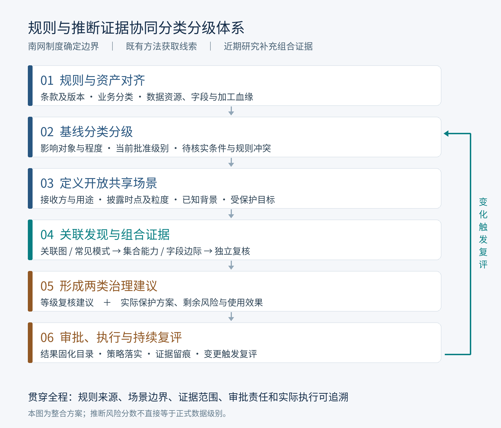

# 南网数据分类分级一体化体系方案

**规则确定基线，推断证据补充评估，场景约束指导开放，审批与复评形成闭环。**

版本：2026-09-29，项目研究与方案讨论稿。本文以所给论文及南网材料为基础，区分“已有规定/材料内容”“已有研究结果”和“本次提出的整合设计”，不将草案、研究分数或待验证方案写成已批准的南网结论。

## 1. 我们最终要建立什么体系

建议将项目分类分级部分表述为：

> **面向南网数据开放共享的规则与推断证据协同分类分级体系。** 以南网业务架构、数据分级规则、开放目录和市场披露要求为基础，利用知识增强技术完成规则与数据语义对齐，通过关联发现和背景组合推断评估识别隐含风险，形成可解释的分级复核与保护建议，经业务和管理审批后落实到数据目录及开放控制，并随数据、背景和制度变化持续复评。

这条主线把三部分材料放到同一条业务链中：

| 材料/研究 | 在体系中承担的责任 | 不应越过的边界 |
|---|---|---|
| 南网既有制度与目录 | 规定分类、等级依据、开放对象与条件、披露要求、审核职责 | 征求意见稿/审议稿与生效规则分别管理 |
| 师兄的研究 | 文档规则抽取、对象模式分析、关联候选发现、动态策略推荐 | 关联强度和频繁模式分数不能直接成为南网等级 |
| 你近期的研究 | 评估字段集合的推断能力，度量字段在不同背景下的增量风险，提供可复核组合证据 | 模型能力不等于事件概率、损害程度或法定身份 |

当前最直接的落点是：分类分级手册关于衍生、聚合及时效变化的复评要求，以及风险评估手册附录 3 **第 382 项“数据公开聚合性风险”**。体系不是另造一套脱离南网的分级标准，而是为现有标准增加可计算、可解释、可复核的证据。[S02，附录 D/E；S03，附录 3 序号 382]

## 2. 先分清六个经常混在一起的概念

| 概念 | 回答的问题 | 结果形式 |
|---|---|---|
| 业务分类 | 数据属于什么业务、对象和流程？ | 业务分类路径及编码 |
| 数据安全级别 | 数据受损或被不当使用可能造成什么后果？ | 一般/重要/核心身份及 1—5 级，附依据和状态 |
| 推断暴露 | 在明确背景下，其他受保护信息能被恢复到什么程度？ | 集合能力、字段增益、关键背景及证据范围 |
| 风险问题等级 | 某场景下问题的可能性与危害如何？ | 高/中/低及整改优先级 |
| 开放/披露权限 | 谁在何时、何种用途下能获取哪些信息？ | 对象、内容、粒度、时点、授权与协议条件 |
| 保护动作 | 采用什么措施才能满足要求？ | 访问限制、处理后的产品、隔离使用、审计等措施 |

不能建立“MIC 高→4 级→禁止开放”这样的直接链条。也不能建立“开放目录中有→1 级→公众可下载”的直接链条。S06 共有 561 项资源，其中 548 项有条件开放、13 项无条件开放，且没有逐项安全等级列；市场规则的“公开信息”是向有关市场成员提供。[S06；S10，5.1]

同一个字段可以保持原安全等级，但在特定主体、时间或组合下受到更严格的开放限制。一次应用风险上升，首先产生场景保护与复核需求；只有分级要素和影响判断确实变化，才进入正式等级变更。

## 3. 总体架构：把规则、对象、证据和动作连起来

上图是本次整合设计，具体流程如下。

1. **规则和资产进入同一目录。** 记录规范条款、版本、业务对象、字段语义、真实数据位置、加工血缘及已审批等级。
2. **按照南网口径分类和建立基线。** 业务分类使用业务架构；分级根据适用规则、影响对象与程度形成识别/初判结果，再进入审批。
3. **定义具体开放场景。** 明确接收主体、用途、时点、粒度、拟提供内容和该主体已可得的信息。
4. **发现线索并核验推断风险。** 师兄的方法提出候选，近期研究补充集合能力、字段边际和背景解释。
5. **生成等级复核与保护建议。** 分别回答“是否需要复核数据等级”和“当前场景如何提供”，并评估措施后的剩余风险及业务效用。
6. **审批、执行、留痕和更新。** 审批结果进入目录与策略系统；新数据、新产品、新背景、新规则或主体状态变化触发复评。

关键是两条链始终相互关联：**制度依据链**解释为何需要保护，**技术证据链**解释具体场景中为何存在额外暴露。二者在人工复核与审批环节汇合。

## 4. 第一层：把南网规定转成可用规则

### 4.1 规则结构

沿用师兄的“大模型+检索增强+结构化输出”，但每条规则至少应包含：

| 字段组 | 建议保存内容 |
|---|---|
| 来源 | 文档编号、具体条/表/行、原文片段、文件哈希 |
| 版本 | 发布/修订日期、生效日期、征求意见/审议/正式状态、被替代关系 |
| 适用范围 | 所属业务、对象、地域、主体、处理活动 |
| 条件 | 数据类型、规模、精度、时点、加工方式、例外条件及逻辑关系 |
| 结论 | 类别/等级识别条件、开放要求、披露义务或复评触发要求 |
| 治理 | 规则负责人、审校记录、冲突状态、批准版本 |

技术上可以从文档生成候选规则，项目流程上必须先审校后启用。文件里出现一个数字，不等于该数字可以脱离对象和条件成为全局阈值。

### 4.2 分类与分级的基线

分类主路径使用“专业域—专业级流程组—操作级流程—业务对象—字段”，同时保留能源品种、活动类型、数据主体、结构类型等辅助标签。多维标签服务检索和分析，不替代业务主分类。[S02，附录 A]

南网手册的等级框架为：1—3 级属于一般数据，4 级属于重要数据，5 级属于核心数据。对同一对象分别判断各影响对象的后果，并按照适用矩阵从严形成建议；重要/核心身份还需对照有效识别规则和管理程序。[S02，P0099、表 4.4]

用符号表达制度判断，可以写为：

$$
L_{\mathrm{impact}}(d)=\max_{o\in\mathcal O}g_{v}(o,h_o(d)),
$$

其中 $h_o(d)$ 是对对象 $o$ 的影响程度判断，$g_v$ 是经确认的版本 $v$ 的矩阵。这只是制度规则的形式化表达，**不是让模型自动预测影响程度或自动认定重要/核心数据**。

已有批准级别继续保留。发现冲突、遗漏或更高影响时生成复核任务；无法确定有效依据的对象记录为“待核实”，并保持适当保护，不能默认为公开。

### 4.3 当前材料中的规则冲突要先入清单

所给手册的一些示例与国家能源局 2026 年正式指南在设施条件、数据类型及规模口径上存在差异；开放目录又引用较早的市场细则。应建立“冲突待决清单”，分别保留国家行业识别规则、企业内部从严要求和草案建议，交责任部门核实。详细对照见《南网文件逐份解读》第 7 节。正式指南来源为[国家能源局发布页](https://www.nea.gov.cn/20260630/3b456b6f83144abcb989110dcfba4d7d/c.html)。

### 4.4 按南网原有七环节接入方法

| 南网环节 | 接入师兄的基础能力 | 近期研究/本次设计补充 | 留下的业务结果 |
|---|---|---|---|
| 资产梳理 | 数据接入、文档和字段解析 | 资源—字段—产品血缘、主体可得背景 | 资产与资源映射 |
| 数据分类 | 文档语义提取、规则匹配 | 接入正式业务架构，组合分析不改写业务分类 | 分类路径与依据 |
| 数据分级 | 敏感查找表、模式辅助分析 | 先按五级规则初判，再以组合证据补充影响复核 | 初判、复核建议与证据 |
| 审批 | 将原自动动作改为可审查建议 | 区分等级、授权和措施审批，保留职责边界 | 审批记录及批准结果 |
| 结果固化 | 标定结果入库与展示 | 对象、规则、证据、批准版本关联 | 分类分级清单与目录版本 |
| 技术管控 | 动态防护策略研究 | 限定可行动作，验证实际措施和披露义务 | 可执行策略及效果记录 |
| 动态更新 | 风险变化感知、策略推荐 | 主体、背景、时效、产品与规则变更共同触发 | 复评任务、变更与整改闭环 |

表中业务对接和审批设计是本次整合建议；不能把它们描述成论文系统已完整实现的功能。[S02，第四部分七环节；S01，第 4 章]

## 5. 第二层：把数据与场景描述完整

### 5.1 以数据项、资源和产品的关系为基础

开放目录的一项资源可能包含多个字段，一个字段也可能出现在多个产品或接口中。因此至少需要四级关联：

**业务资源 → 实际数据集/接口 → 字段及时间空间粒度 → 加工后产品。**

对于每个对象保存分类、规模、覆盖范围、精度、时效、来源与血缘；对于加工产品另外保存处理方式和处理版本。原始表的级别、产品的级别、一次提供的权限分别记录。

### 5.2 场景卡：解决“公开给谁、什么时候”的歧义

每次评估定义场景 $c$，至少包括：接收方及角色、用途、评估时点、披露时刻、时间/空间粒度、拟提供字段、已提供历史、目标及其保护理由、现实可得的背景、可用措施。

其中四个集合应由业务语义和可得性确定：

- $B_c$：该主体在该时点已经获得，或应按场景视为已经掌握的信息。
- $H_c$：在该场景中可能另外掌握的字段范围，保留来源和可得性说明。
- $A_c$：本次拟提供的实际数据集合/产品。
- $Y_c$：对该主体、该时点仍需要保护的目标。

$B_c$ 既可以包含社会公众信息，也可以包含该接收方此前经授权获得的内容；不能只记本平台本次申请，忽略历史累计和其他合法来源。市场注册身份、可信数据空间入驻、具体资源授权需要分别判断。[S07，第三部分；S09，第 5—8 章；S10，2.7、5.1]

### 5.3 背景预算不是访问控制保证

近期研究中的 $K$ 表示额外背景字段数量的分析预算。项目中可按数据可得性设计多个预算场景，记录覆盖范围；不能因为实验采用 $K=2$，便声称使用方最多只能获得两个其他字段。

若对方已经能获得完整一组市场数据，应直接检查其可得整组信息的总暴露。不能以小组合扫描替代完整提供方案的评估。

## 6. 第三层：把师兄的方法与近期研究衔接起来

### 6.1 先发现候选，保留原方法的价值

师兄的三类能力分别使用：

| 原能力 | 保留的用途 | 新增衔接 |
|---|---|---|
| 大模型/RAG | 提取规范条件，识别业务语义 | 连接南网六类规则并保存版本与证据 |
| 自编码器、FP-Growth | 辅助整理对象特征与常见敏感组合 | 输出待核验模式，不依据频率直接裁定等级 |
| Pearson/Spearman/MIC 与关联图 | 缩小重点检查范围、解释物理业务联系 | 为组合风险评估提供候选，但不排除低两两关联的高阶组合 |

候选图与频繁模式都不能作为唯一准入筛选器。否则“单字段不显著、组合才显著”或“低频但高影响”的对象可能在验证前就被删除。

### 6.2 近期研究补充什么量

本次以 `paper/claude/V6_ieee` 中的风险定义、方法和局限作为近期研究的主要口径，9 月 25 日的主线规划作为研究定位补充；没有把早期 41 字段/12 目标的所有结果混入最新口径。[R01—R03]

**集合能力。** $V_{y,c}(S)$ 表示：在指定评估协议下，使用字段集合 $S$，对受保护目标 $y$ 能达到的样本外推断能力。连续量研究以测试集 $R^2$ 表征；模型训练、选择和数据划分必须独立于最终报告样本。

**字段边际。** 对某个背景 $T$，考察加入字段 $i$ 的增量：

$$
\Delta_{i\to y,c}(T)=V_{y,c}(B_c\cup T\cup\{i\})-V_{y,c}(B_c\cup T).
$$

**有限背景最大边际。**

$$
M_{i\to y,c}^{(K)}=
\max_{T\in\mathcal T_c^{(K)}(i)}\Delta_{i\to y,c}(T).
$$

其中，可行背景族 $\mathcal T_c^{(K)}(i)$ 包含满足以下条件的背景：$T\subseteq H_c$，不含 $B_c$ 中已有字段及待评估字段 $i$，且背景字段数不超过 $K$。

同时报告无额外背景的 $M^{(0)}$、背景放大量 $\Gamma^{(K)}=M^{(K)}-M^{(0)}$，以及支持高风险判断的背景集合和证据编号。这里 $\Gamma^{(K)}$ 不同于师兄以 MIC 定义的 $\Gamma_i$。

四个量分别回答：这组数据能推到多准；该字段增加多少信息；最不利的已评估背景是什么；组合比单字段多暴露多少。它们共同支撑“为什么应复核这个字段或产品”。

### 6.3 不能只看最大边际，还要看最终暴露

一个字段的边际增益小，可能是因为背景本身已经泄露了目标。因此应同时报告：

$$
V_{y,c}(B_c),\qquad V_{y,c}(B_c\cup A_c),\qquad M_{i\to y,c}^{(K)}.
$$

例如，纯示意地设某目标背景能力为 0.80，加入字段后为 0.82，则增量只有 0.02，但不能据此称发布后目标得到良好保护。这些数字只是解释定义，**不代表南网实测，也不对应任何等级阈值**。

相反，某字段在一个背景下带来的增量很大，也不必然意味着全部情况下均应提高正式级别。可能更合适的措施是收紧该组合的提供方式、降低产品精度或调整授权范围，再对等级作独立复核。

### 6.4 用快速扫描支持规模，用独立复核支持结论

近期研究的通用模型共享字段集合间的表示学习，并为具体集合建立专用读出；当前稿还包含隐藏字段重构、随机特征及多种子预测平均等改进。项目层面把它定位为**快速提出重点复核对象**的工具即可，不必把所有模型组件放到业务流程描述中。[R01，方法部分]

推荐证据流程为：训练侧学习与检索候选，验证侧选择重点场景，冻结场景后用独立留出数据复核；对实际拟提供集合及处理后的产品再作检查。时间序列业务应补充时间顺序留出和漂移分析，不能只沿用随机划分。

“扫描—认证”在项目文档中建议称为“扫描—独立复核”：验证少数候选可确认存在风险，**未发现风险不能证明所有未检验背景都安全**。抽样背景所得最大增益至多是固定经验评估范围内的搜索下界，不是所有未来模型、所有背景的安全上界，也不自动带有统计置信度。

### 6.5 多目标保留影响差异

同一个增益作用于个人权益、企业经营和系统运行目标，其后果不同。保留逐目标风险向量与影响对象，必要时按最严重后果排序。不能简单对多个目标的 $R^2$ 求平均，也不能把“目标定为 4 级”自动复制到每个与之有关联的字段。

现有回归型方法适合连续运行量的推断风险。身份重识别、文本泄露、位置识别等需要相应的评估指标与验证任务，不能直接复用相同 $R^2$ 档位。

## 7. 第四层：从证据到治理决定

### 7.1 两种输出分开审批

**输出一：等级复核建议。** 说明新证据是否改变了深度、覆盖范围、可恢复性、影响对象或影响程度，依据哪条有效规则建议重新判断。未经复核审批不覆盖正式等级；重要/核心识别按对应管理程序处理。

**输出二：场景保护建议。** 在当前有效等级和披露义务下，说明本次申请能提供什么、对谁提供、以什么粒度提供、如何验证剩余风险。即使无需改级，也可能需要增强保护。

| 发现 | 建议处理 |
|---|---|
| 命中明确有效的高等级识别条件 | 进入相应识别/审批/报送流程，模型低分不能抵消 |
| 新证据表明衍生产品揭示了更深层受保护信息 | 复核产品的分级要素与等级，检查源数据和其他产品关联 |
| 单字段风险不高，但某些组合暴露明显 | 标记组合条件，调整提供方案并提出等级复核建议 |
| 背景本身已高度暴露目标 | 检查既有公开/共享范围与目标定义，不能只处理本次字段 |
| 证据不足或来源版本冲突 | 保持现行适当保护，补齐业务依据与验证材料 |
| 处理后风险下降 | 评价新产品，保留原数据等级；降级须经充分复评与审批 |

### 7.2 原样汇聚与经处理产品分别判断

原样合并的数据集按手册要求不低于来源最高级别，并检查组合后是否进一步提高影响。脱敏、统计、标签等新产品需要重新评价其语义、可恢复性和使用场景，而不是对原始数据直接“减一级”。[S02，附录 D/E]

在这里，你的研究最有价值的输出是“处理后与既有背景联合时还能恢复多少”，但经验上的低推断能力只能构成复评材料的一部分，不能单独证明匿名化或不可恢复。

### 7.3 把强化学习的动作改成实际措施建议

建议保留师兄的动态优化思想，但将主要动作从“任意修改等级数字”调整为“选择经过许可的保护方案”，包括接收方限制、字段/粒度调整、受控计算、组合提供限制等。每种方案保存成本、使用效果及复测结果。

优化问题可以表达为：在**有效规则、授权、最低保护和披露义务**构成的可行域内，减少剩余风险，同时控制业务效用损失。规则作为硬约束，不能只在奖励中给有限惩罚。

对于按规则必须披露的内容，不能因风险分数高就自行暂停披露；应选择规则允许的保护措施或依细则第 6 章发起调整程序。跨批次提供也不能自动消除组合风险，因为接收方可能累计保存历史数据。[S10，6.1—6.4]

对措施较少、任务静态的场景，先以规则和枚举形成可解释基线；当存在多期提供、历史累积、组合约束和长期成本时，再评估 GRPO 的实际增益。该安排保留既有研究，也能使工程价值更容易验证。

## 8. 三个贯穿材料的试点场景

以下是可直接用于项目讨论的场景设计，不是南网实测结果。

### 8.1 系统运行域：预测与实际运行数据的时点差异

**材料入口**：S06 序号 532—543，S10 第 2.7、5.1、5.7 条及附表。

以拟接入资源为对象，先根据主体和时点确定哪些预测及运行信息已经可得，哪些目标尚未对该主体披露。按资源字段建立数据对应关系，评估本次提供前后的总暴露和背景增益，输出“字段—目标—场景—证据”记录。

注意，研究稿为了分析非平凡关系剔除过部分同目标预测/近副本。**生产审计中，真实可得的强代理不能为了得到更好看的组合现象而删除。** 应分别报告直接暴露与额外组合暴露。

以序号 533“周、日系统负荷预测”为例，一条完整记录可按下表形成：

| 步骤 | 已有材料能够确认的内容 | 还需项目补充的内容 |
|---|---|---|
| 识别对象 | 系统运行域；区域名称、每 15 分钟有功预测值；按日更新 | 对应系统、字段编码、数据规模及实际版本 |
| 核对开放 | 目录写有条件开放，对象为南方区域电力市场有关市场成员 | 接收方资格、具体授权及当前适用细则 |
| 建立等级基线 | 目录没有给出该项安全等级 | 现有批准级别、影响判断及有效规则依据 |
| 定义场景 | 可围绕预测和实际运行信息的披露时点差异设置场景 | 真实发布时间、已可得背景和仍受保护目标 |
| 风险复核 | 方法接口为集合能力和字段增益 | 经授权的历史数据、独立验证结果及不确定性 |
| 形成决定 | 等级复核与场景保护分别处理 | 审批结论、可行措施、复测及执行记录 |

这个例子说明：目录能直接给出一部分语义和条件，模型补充一部分风险证据，其余必须由真实资产和管理流程衔接，不能靠文档阅读补造实测结果或最终等级。

### 8.2 市场营销域：统计/标签产品的衍生风险

**材料入口**：S06 序号 471、476、484，S02 附录 D/E，S03 序号 239、382。

先核对产品是否含可定位企业或小群体的信息，再结合已有背景和授权用途，判断是否可能产生超出声明用途的推断。比较候选产品版本的风险及使用价值，分别形成原始数据、衍生产品、提供场景的记录。

涉及自然人重识别时另设合适指标；企业授权、个人信息保护及合同范围由规则核验负责，不能由一个回归模型替代。

### 8.3 主体变化：相同数据、不同可见范围

**材料入口**：S09 的注册、市场范围变更与注销条款；S07 的注册/入驻权限；S10 的三类披露范围。

主体角色或范围变化后，重新生成允许访问的数据范围与场景背景，检查历史已提供数据与本次新增权限结合后的影响。重点输出“为什么此时需要复评”，以及权限、合同与目录的更新记录。

这个场景体现动态性来自真实管理事件，而不是单纯按模型分数日常波动反复改级。

## 9. 交付物：从论文方法变成项目成果

建议形成“一套规则、四张主表、两类报告、一个闭环”。

| 交付物 | 最低内容 |
|---|---|
| 可追溯规则库 | 六类规则、条款定位、适用条件、版本、生效/冲突状态 |
| 分类分级主表 | 对象、分类路径、当前级别、识别/审批状态、影响依据、责任部门 |
| 场景与授权表 | 主体、用途、时点、粒度、候选/已知背景、目标与依据 |
| 组合风险证据表 | 集合能力、字段边际、背景放大、关键组合、数据划分、模型与复核范围 |
| 处置与变更表 | 实际保护动作、措施前后结果、业务影响、审批、策略执行及回滚记录 |
| 分类分级说明报告 | 规则依据、初判、复核与正式结果的区别，未决冲突 |
| 风险评估专题附件 | 对应检查项、风险问题、危害与可能性分析、整改与复测 |
| 持续复评闭环 | 规则/数据/产品/主体/背景变化触发，责任人处理，目录与策略同步 |

尤其要使每一个项目结论都能追溯到：**哪条规则、哪份数据、哪个场景、什么证据、谁审批、执行了什么。**

## 10. 实施顺序与验证标准

### 10.1 第一阶段：先打通制度和数据

完成版本核对、业务分类映射、561 项目录导入、字段与真实资产关联、现有等级与审批状态整理，选择一个系统运行域试点。关键产出是可追溯规则与人工复核样本，不是先训练一个更复杂的模型。

### 10.2 第二阶段：把组合证据接入复评

在有数据和授权的试点范围内，比较规则基线、规则加两两关联、规则加背景组合分析三种方案。小规模范围可做充分组合核验，以测量快速扫描漏掉多少；大规模范围明确搜索覆盖和不确定性。对具体发布集合及产品做措施前后比较。

### 10.3 第三阶段：策略与持续治理

把通过验证的措施接入审批、目录和控制系统，跟踪动态事件。需要时比较枚举/规则策略与 GRPO，衡量其是否在相同约束下提高使用价值或降低剩余风险。

### 10.4 验收指标应对应业务问题

| 目标 | 建议指标 |
|---|---|
| 规则可用 | 条件、例外、版本及来源抽取正确率；关键漏项数；人工审校通过率 |
| 分类分级可解释 | 人工确认样本上的一致率；高影响漏判数；依据完整率；未决冲突数 |
| 组合分析有效 | 已核验范围的高风险组合召回、误报、边际误差、复核成本与时延 |
| 处置确实有效 | 实际集合的措施前后风险、业务可用性、应披露内容满足情况 |
| 管理闭环可执行 | 变更审批完整率、目录/策略一致率、复评响应时间、审计证据完整率 |

以上是建议指标，不是已达到的数值或预先承诺的验收阈值。现有研究中的统计结果可以证明方法值得试点，不能代替南网数据上的验证。

## 11. 汇报时建议这样讲

> 南网已经规定了数据如何分类、如何分级、哪些资源可以面向哪些对象开放，以及开放前需要检查哪些风险。我们首先将这些规定转成可追溯的规则和数据目录。师兄的工作提供了知识抽取、关联发现和动态优化基础；在此基础上，我们补充背景组合推断评估，回答单个字段看不出来、但与既有数据结合后是否会暴露受保护信息。评估结果形成等级复核与具体保护建议，经审批后落实到目录和开放策略，并随数据、主体和规则变化持续复评。这样，现有制度、算法证据和工程管控就能在一套流程中衔接起来。

技术贡献宜表述为三点：**规则与业务数据对齐、背景组合风险可验证、风险证据与分级/开放流程联动。** 各算法服务于这三件事，避免将方案写成互不相连的算法清单。

## 12. 材料与完成边界

论文 3.1、3.4.2、第 4 章的逐节解释及方法边界见《师兄论文指定章节梳理》；南网 9 份材料的逐份摘要、完整矩阵、目录统计和版本差异见《南网文件逐份解读》；来源与定位见《来源索引》。本文提出的是体系方案及落地接口，本次未对南网实际业务数据训练模型、给出真实定级或实施开放控制。
