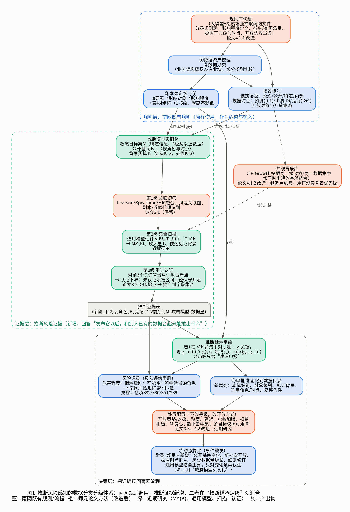
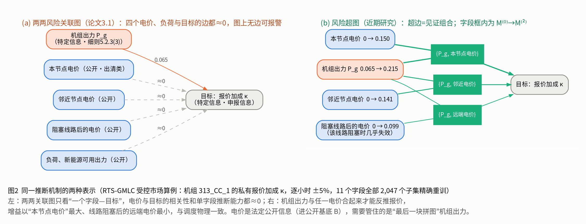
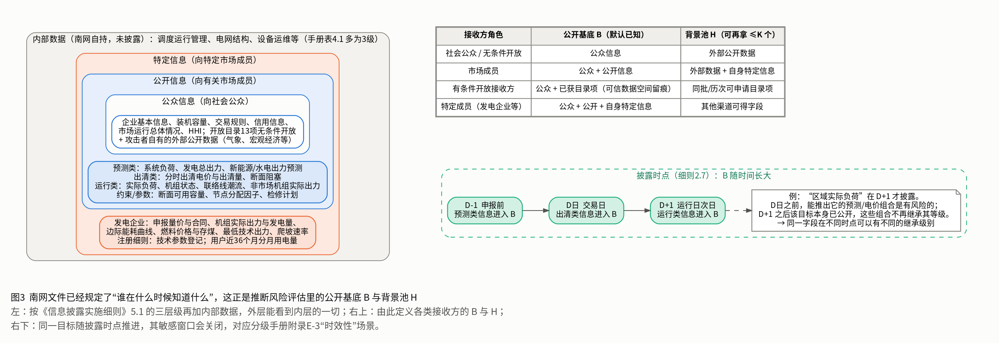

# 00 推断风险感知的电力数据分类分级体系（方案）

> 本文是这组材料的主文档，把三样东西合成一个体系：**南网已有的分类分级规则**（见 [02](02_南网文件总结.md)）、**师兄论文的方法**（见 [01](01_师兄论文分类分级内容梳理.md)）、**近期研究**（集合推断能力 V、字段级预算最坏边际风险 M^(K)、通用模型与扫描—认证）。
> 文中南网条款以征求意见稿/审议稿为准；研究数字来自论文 V6_ieee 的公开/合成电力数据实验，**尚未在南网真实数据上测过**，试点计划见第 8 节。

---

## 0 一页讲清楚

**三句话。**
1. 南网现行分级回答的是“**这份数据本身泄露了有多严重**”；推断风险要回答的是“**这份数据发出去以后，和接收方手里已有的数据放在一起，能推出什么**”。
2. 后一个问题南网文件里已经提出（从严性原则、“深度”要素、附录 D/E 的衍生与聚合场景、风险评估第 382 项的聚合推断测试、披露细则的封存条款），但**没有给方法、度量和阈值**。
3. 我们的方法补的就是这一块：用师兄论文的“关联初筛 → 模型验证”框架，把验证单位从“一对字段”推广到“字段 + 背景组合”，算出每个字段在给定接收方和背景预算下的最坏推断增益，再按“就高不就低”**把被推断目标的等级继承给字段**。南网的五级表、判定矩阵、审批与固化流程**一字不改**。

**体系结构（图 1）**：规则层（南网照用）→ 证据层（新增推断证据）→ 决策层（推断继承定级、风险评级、处置配置、动态复评）。



**三条设计原则。**
- **只加输入，不改规则**：推断风险作为南网分级要素“深度”的可计算形式，通过“继承”进入原有矩阵。
- **定级与处置分开**：定级是合规判定，确定、可审计、就高不就低；开放方式、粒度、延迟、脱敏、扣留是处置，可以权衡成本和可用性。
- **每次上调都附证据**：上调必须给出“对哪个目标、和哪几个字段一起、在哪类接收方手里、推断精度从多少升到多少、用什么攻击模型重训验证”。

---

## 1 问题：南网分级漏掉了什么

### 1.1 一个例子

图 2 是论文里的受控市场算例。目标是某机组的私有报价加成（披露细则中的“申报信息”，属特定信息）。四个电价单独看与目标的相关性和单字段推断能力都约为 0，机组出力单独看也只有 0.065；但出力与任一电价合起来就能反推报价，本节点电价作为背景时增益最大（0.215），线路阻塞后的远端电价最小，与调度物理完全一致。



逐字段审查（无论用南网的本体定级，还是论文 3.1 的两两关联）都会放行这里的每一个字段。

### 1.2 这不是个别现象

在 RTS-GMLC、澳大利亚 NEM、PJM、CAISO 四个数据集、10 个敏感目标、264 个“字段—目标”对上，逐一重训了约 1.2×10⁵ 个字段集合：
- τ=0.5 时，256 个字段在不超过 2 个背景字段的组合中成为“关键字段”，其中 **223 个单独看是安全的**；τ=0.7 时为 138 个与 113 个；
- **单字段规则只召回 13%（τ=0.5）/ 17%（τ=0.7）的关键字段**；
- 把“单独危险”的字段全部扣留后，大小 ≤3 的最小危险组合仍有 **98% / 96%** 原样存在；
- 对每个字段，它在各种背景下增益的**平均值只有最大值的约三分之一**（中位数 0.32），平均型指标会系统性低报。

### 1.3 南网文件已经提出了这个问题

| 出处 | 原文要点 | 说明了什么 |
|---|---|---|
| 分级手册 · 分级原则 4 | 从严性：多因素时按可能造成的最高影响定级 | 风险应取最坏情况 |
| 分级手册 · 分级要素 f | 深度：通过统计、关联、挖掘、融合对隐含信息的刻画程度 | 推断是正式的分级要素 |
| 分级手册 · 附录 D | 分析挖掘出更敏感、更深度的衍生数据，应提高级别 | 推断可以导致提级 |
| 分级手册 · 附录 E-2 | 汇聚后应深入分析是否可较原始数据获得更多信息 | 组合要单独评估 |
| 分级手册 · 附录 E-3 | 同一类数据在某时间点前后可有不同级别 | 等级可以随时点变化 |
| 风险手册 · 第 382 项 | 基于已公开数据结合其他公开信息，尝试能否推断出未公开关联信息 | 要求做推断测试 |
| 风险手册 · 第 330、351、239 项 | 汇聚不暴露敏感信息；加工产生新数据须审核；再识别风险 | 同类要求 |
| 披露细则 · 7.3 | 有助于还原运行日情况的关键信息应记录封存 | 承认存在还原风险 |

这些条款都只说了“要做”，没有说“怎么做、做到什么程度算有风险”。

---

## 2 核心概念：五个量和一个规则

### 2.1 集合推断能力 V

对敏感目标 $y$ 和字段集合 $S$，**集合推断能力**是只用 $S$ 训练的最强攻击者在留出数据上的推断精度：
$$V_y(S)=R^2_{\text{test}}\big(\hat h_S\big),\qquad \hat h_S=\arg\max_{h\in\mathcal H}R^2_{\text{val}}(h;S)$$
攻击者族 $\mathcal H$ 至少包含多种结构（论文中为单目标 DNN、多目标 DNN、梯度提升树，按验证集择优）。理想值 $V^*_y(S)$ 对 $S$ 单调，经验值有有限样本噪声，用单调闭包处理。

**它就是师兄论文关联性的集合版本。** 论文 3.1.1 定义 $T(y\mid x)=I(y;x)/H(y)$。把单个 $x$ 换成集合 $X_S$，得到 $T(y\mid S)=I(y;X_S)/H(y)$；对连续目标，$R^2$ 与互信息单调对应（联合高斯时 $V=1-e^{-2I}$）。所以 $V$ 与论文的关联性是同一个量纲的“推断能力”，区别只在单位从一对字段变成了字段集合。离散目标可直接用准确率或 $T(y\mid S)$ 代替 $R^2$，结构类目标（拓扑）可用论文 3.2.2 的恢复精度代替，体系的其余部分不变。

### 2.2 场景：接收方角色、公开基底、背景池、预算

推断风险取决于“谁拿到、他已经有什么”。南网文件已经规定了这一点（图 3）：
- **接收方角色 $r$**：社会公众 / 市场成员 / 有条件开放接收方（政府、企业、设备供应商……）/ 特定成员；
- **公开基底 $B_t$**：该角色在时点 $t$ 默认已知的字段。由披露细则的三层级和三时点（预测 D-1、出清 D、运行 D+1）加开放目录的无条件条目确定；**法定必须公开的字段放在 $B$ 里，不参与扣留**；
- **背景池 $H$**：该角色还可能再拿到的字段（外部公开数据、其他目录项、自身特定信息）；
- **预算 $K$**：攻击者最多再拿几个背景字段。



### 2.3 字段级风险 $M^{(K)}$、放大量 $\Gamma$、见证背景

字段 $i$ 在背景 $T$ 上的边际增益 $\Delta_i(B\cup T)=V_y(B\cup T\cup\{i\})-V_y(B\cup T)$。**预算最坏边际风险**：
$$M^{(K)}_{i\to y}=\max_{T\subseteq H\setminus\{i\},\ |T|\le K}\Delta_i(B\cup T),\qquad \Gamma^{(K)}_{i\to y}=M^{(K)}_{i\to y}-M^{(0)}_{i\to y}\ \ge 0$$
取到最大值的 $T^*$ 叫**见证背景**。$M^{(0)}$ 就是单字段风险（师兄论文 $\Gamma_i$ 的角色），$\Gamma^{(K)}$ 是“背景放大”，即单字段口径漏掉的那部分。

$M^{(K)}$ 是 Catav 等（ICML 2021）边际贡献重要性 MCI 在条件函数 $v_B(T)=V(B\cup T)-V(B)$ 上的预算受限形式；$K$ 取满时就是 MCI。MCI 已有的公理性质（哑元、对称、重复字段不稀释等）直接继承。

### 2.4 关键字段与最小不安全组合

给定目标的**泄露线** $\tau_y$（推断精度达到多少即视为该目标泄露），字段 $i$ 是 $K$-背景 $\tau_y$-**关键字段**，当且仅当存在 $|T|\le K$ 使
$$V_y(B\cup T)\le\tau_y<V_y(B\cup T\cup\{i\})$$
即“背景本身还安全，加上 $i$ 就越线”。两条性质让它适合做定级依据：
- **精确性**（论文定理：关键 ⇔ 属于小的最小不安全集）：若 $V$ 单调且 $V(B)\le\tau_y$，$i$ 是关键字段**当且仅当**它属于某个大小 ≤K+1 的最小不安全组合。标出来的正是这些组合的全部成员，不多不少。
- **余量含义**：$M^{(K)}$ 是对**所有阈值同时成立**的最小安全余量，即只要背景推断能力不超过 $\tau-M^{(K)}$，加上 $i$ 就一定不越线，而且没有更小的数能对所有 $\tau$ 都保证这一点。所以泄露线还没定下来时，$M^{(K)}$ 本身就是一个可以先算出来、与政策阈值无关的字段风险。

### 2.5 为什么取最大值，而不是平均或 Shapley

南网的从严性原则要求按可能造成的最高影响定级，对应的就是最坏背景，而不是平均背景。平均型指标还会把功劳分摊给可互相替代的字段：图 2 的例子里 SAGE 给本节点电价的分值只有 0.003，因为四个电价可以互相替代，功劳被均分了；$M^{(2)}$ 对四个电价都报警，并指出背景是机组出力。

### 2.6 $K$ 取多大

- 实测放大量随 $K$ 递减：平均 $\Gamma^{(1)}/\Gamma^{(2)}/\Gamma^{(3)}=0.082/0.110/0.119$；一个背景字段提供了 $K=2$ 时 75% 的放大，$K=2$ 提供了 $K=3$ 时 93% 的放大；$M^{(2)}$ 与 $M^{(3)}$ 的排序相关 0.96–1.0（9 个目标），NEM 一个目标为 0.81。
- 但越线判定在 $K=3$ 时还会多出一些字段，大小为 4 的最小不安全组合确实存在。
- **建议：定级用 $K=2$，处置（扣留）用 $K=3$**；按 $K=3$ 处置平均要多扣 1–2 个字段。

### 2.7 两种使用方式

| 情形 | 用什么 | 典型场景 |
|---|---|---|
| **组合已知**：一个数据集、一次开放申请、某接收方的累计获取 | 直接算 $V_y(A\cup B)$ 与 $\tau_y$ 比较 | 数据集定级（附录 E-2）、有条件开放审批、累积获取审查 |
| **组合未知**：字段将来会和什么一起出现不确定 | 字段级 $M^{(K)}$ 与关键性判定 | 字段定级、写入数据目录 |

已知组合时不需要绕道字段级量；字段级量是为“事先不知道会和什么组合”而准备的。

### 2.8 推断继承规则（体系的汇合点）

$$g_{\text{inf}}(i)=\max\big\{\,g(y)\;:\;i\ \text{在场景}(r,B_t,K)\ \text{下对}\ y\ \text{是}\ \tau_y\text{-关键字段}\,\big\},\qquad g(i)=\max\big(g_0(i),\,g_{\text{inf}}(i)\big)$$

- $g_0(i)$：南网手册按 8 要素和表 4.4 给出的本体级别；$g(y)$：目标 $y$ 的级别（同样按南网手册定）；
- 继承只**抬高**不降低，只作用于泄露维度；
- 若 $g(y)\in\{4,5\}$，算法只输出“**建议按重要/核心数据识别申报**”，在认定前按 3 级管控（4、5 级须由主管部门认定）；
- 若 $V_y(B_t)>\tau_y$，即目标已能从公开基底推出，说明问题出在已公开的数据上，单独标记为“**基底已泄露**”并提交复核，不把等级继承给新字段；
- 场景不同，继承结果可以不同：**定级按该字段允许进入的最宽场景取最高**（就高不就低），开放审批按具体场景判。

---

## 3 师兄论文方法在体系中的位置

总原则：论文的三条主线“先关联筛、再模型验证”“多字段联合暴露”“等级随风险动态调整”全部保留，各自落到更合适的层。

| 论文内容 | 体系中的位置 | 保留 | 改造 | 理由 |
|---|---|---|---|---|
| 3.1.1 有向关联性 $T(y\mid x)$、费诺界 | 证据层理论基础 | 保留定义与“关联性上界推断能力”的论证 | 推广为 $T(y\mid S)$ 与 $V(S)$ | 集合版本才能覆盖组合推断 |
| 3.1.2 多度量融合、候选边、风险关联图、路径强度 | **证据层第 1 级：关联初筛** | 三度量融合、阈值 0.7、有向图、动态扩展 | 加“副本/近似代理识别”；图升级为**风险超图**（超边来自见证背景） | 两两边表示不了“多个字段共同指向一个目标” |
| 3.2 / 3.4.3 通用 DNN 验证（R²≥0.7） | **证据层第 3 级：重训认证** | “统计关联必须经模型验证”的串联结构 | 验证对象从字段对变为（字段 + 见证背景）；攻击者族取最强 | 论文 3.4.3 自己证明了关联≠可推断，组合情形更需验证 |
| 3.3 加噪、掩码、混淆 | 决策层：处置菜单 | 三类方法及其可用性—防护权衡 | 用 $V$ 复测处置后的剩余推断能力 | 处置效果也要能量化 |
| 2.3 $s=\alpha s^{(0)}+\beta\Gamma$ | 决策层：推断继承 | “推断关系强就应提级”的思想 | 加权和改为**取最大**（继承） | 与南网从严性一致 |
| 4.1.1 大模型 + 检索增强抽取规则 | **规则层：规则库构建** | 模型、提示约束、RAG、JSON 输出 | 语料改为南网手册与细则，输出字段对齐南网（见 3.4） | 原实验抽的是环评项目属性，不是分级规则 |
| 4.1.2 自编码器 + FP-Growth | 证据层：**共现背景库** | FP-Growth 挖掘字段共现 | 挖掘对象改为“同一数据集/同一接收方获取记录”；支持度用于**背景优先级**，不直接当等级分 | 频繁≠危险，但频繁说明现实中常一起被拿到 |
| 4.2 GRPO 动态更新 | **决策层：处置配置 + 复评** | 风险—可用性—合规的多目标权衡；动态调整 | 状态换成 $M^{(K)}$/见证；动作从“等级”改为“处置档位”；合规由罚项改为硬约束 | 定级须确定可审计；处置才需要权衡与序贯决策 |
| 四级（公开/一般/重要/核心） | 等级映射 | — | 公开→1 级；一般→2 或 3 级（按南网矩阵细分）；重要→4 级、核心→5 级（须认定） | 南网为五级 |
| 第 5 章系统三模块 | 平台落地 | 数据标定、关联分析、动态分级三模块 | 关联分析模块内置通用模型与认证队列；动态分级拆为“定级”和“处置” | 与体系分层一致 |

### 3.1 关联初筛（论文 3.1）：从“结论”变为“入口”

- **作用**：以很低的成本给出候选（字段，目标）关系和候选背景，并提供可视化的关联图，方便业务人员理解。
- **新增副本识别**：论文表 3-4 中排在前面的高关联对，如“计划潮流—非计划潮流”（三指标均≈1）、“市场出清价格—封顶后出清价格”、“调频出清价格—补偿总额”，是定义性或近似复制关系。副本应在分类阶段合并为同一数据项同级管理，而不是当作“推断发现”；否则它们会占满风险排行的前列，并在后续组合评估中把目标平凡地泄露。
- **边界**：初筛只能**加**候选，不能**排除**候选。图 2 中电价与目标的相关性为 0，却是危险组合的成员；费诺界对单变量互信息成立，但组合的互信息可以远大于各单变量之和。
- **从关联图到超图**：保留论文的图作为展示载体，节点不变，另加“超边”：每条超边连接一个见证组合 $T^*\cup\{i\}$ 与目标 $y$，边权为 $M^{(K)}$。

### 3.2 重训认证（论文 3.2/3.4.3 的推广）

论文用 DNN 验证 13 个字段对，R²≥0.7 视为可利用。体系沿用这一做法，只是：
- 验证对象是（字段 $i$ + 见证背景 $T^*$），每个字段认证扫描给出的前 3 个候选背景；
- 攻击者族取多种结构中验证集最优者，并用**全部可得历史数据**训练。近期实验表明，审计方若只用 10% 数据评估，危险放行率会升到 25.6%（PJM，τ=0.5）/ 13.2%（CAISO），而且错误全是漏判。审计必须按最强攻击者评估；
- 认证结果是 $M^{(K)}$ 的**下界**（找到的背景至少能达到这么多）；未经认证的估计值按区间口径处理（估计值落在 $\tau_y-\delta$ 以上即列为“待认证”，δ 取 0.05）。

### 3.3 共现背景库（论文 4.1.2 的改造）

论文用支持度之和给对象打初始分，衡量的是“这些字段出现得多不多”。在体系里，FP-Growth 改为挖掘**现实中常被同一方拿到的字段组合**：同一数据集的列、同一开放目录条目的字段、同一接收方在可信数据空间里的历次获取记录。输出的频繁组合有两个用途：
1. **扫描优先级**：优先评估现实中最可能凑齐的背景；
2. **可能性证据**：风险评级时，见证背景若是高支持度组合，可能性取高。

$M^{(K)}$ 仍然在全部 ≤K 背景上取最坏情况，共现库只决定先算哪些，不缩小评估范围。

### 3.4 规则库（论文 4.1.1 的改造）

语料换成：分级手册（表 4.1–4.4、附录 B–E）、风险手册评估项、开放目录说明（开放边界 12 条、策略与等级对应）、披露细则（三层级、三时点、各主体清单）、注册细则（登记字段）。每条规则的 JSON 输出：

```json
{"数据项": "", "专业域": "", "业务对象": "", "影响对象": "", "影响程度": "",
 "建议本体级别": "", "依据条款": "", "披露层级": "公众|公开|特定|内部",
 "披露时点": "预测D-1|出清D|运行D+1|不披露", "是否法定公开": true,
 "开放策略": "", "开放对象": "", "是否敏感目标": false}
```

手册表 4.1–4.3 的“数据举例”可以直接作为少样本示例和评测集。规则库的输出是建议，本体级别仍走南网审批。

### 3.5 强化学习（论文 4.2）放到处置层的原因

1. **定级不应做权衡。** 南网等级是合规结论；等级一旦低于应有水平就是违规，不能用可用性收益去抵。论文用罚项 $P_i$ 约束“不低于监管基线”，体系里改为硬约束：处置只能在 $g(i)$ 允许的开放方式里选。
2. **按论文的效用形式，问题是逐字段可分的。** $U(A)=\sum_i[S_i(o_i,\Gamma_i)-V_i(o_i)-P_i(o_i,\hat o_i)]$，而 $\Gamma_i$ 不随动作变化，逐字段在四个等级里取最优就是全局最优。GRPO 的效用 210.5 比静态基线 206.6 高约 1.9%，与此一致。
3. **换成集合级风险后，决策才真正耦合。** 扣留一个字段会改变其他字段的最坏背景，所以要“扣一个、重算一次”。近期研究的两个基线：按 $\hat M^{(2)}$ 贪心扣留并重算，或对估计的最小不安全组合求最小击中集。二者都能把危险组合压到 0.3–1.6%，扣留数比真值最优多不超过 1.9 个字段。在这个耦合问题上，再引入可用性、成本等多目标时，论文的 GRPO 框架才有明确的用武之地，贪心与击中集就是它应当超过的基线。

---

## 4 近期研究在体系中的位置

| 研究成果 | 体系位置 | 作用 | 关键证据 |
|---|---|---|---|
| 集合推断能力 $V$（重训、多攻击者择优、单调闭包） | 证据层核心量 | 统一刻度，已知组合直接判定 | 与论文关联性同源（2.1 节） |
| $M^{(K)}$、$\Gamma$、见证背景 | 推断继承的判定量 | 字段定级 + 可解释的“和谁一起” | 单字段口径召回仅 13–17% |
| 关键性 ⇔ 小最小不安全组合（定理） | 继承规则的正确性保证 | 标记的恰是危险组合的全部成员 | 需 $V$ 单调、$V(B)\le\tau$ |
| 阈值无关的安全余量（定理） | 泄露线未定时的风险排序 | 先算风险，后定政策 | — |
| 与 MCI 的关系 | 学术定位 | 性质可引用，不需重证 | Catav et al., ICML 2021 |
| 按披露时点定义角色（PJM/CAISO） | 场景定义 $B_t$ | 与披露细则 2.7 口径一致 | 目标=次日运行信息，候选=预测与出清 |
| 通用模型（掩码预训练 + 列重建 + 随机特征 + 逐集合闭式读出，三种子平均） | **证据层第 2 级：集合扫描** | 以很低成本估算大量集合的 $V$ | 每集合 48–64 ms，串行重训 14–56 s，快 241–906 倍 |
| 扫描—认证 | 第 2、3 级的衔接 | 扫描排序、只对前 3 个背景重训 | 召回 76–91%，无误报 |
| 区间口径（δ=0.05） | 未认证项的保守判定 | 估计误差不致漏判 | PJM、K=2、τ=0.7 时关键字段召回 0.754→0.994（精确率 0.99→0.87） |
| 攻击者能力敏感性 | 评估口径 | 必须假设最强攻击者、全量数据 | 10% 数据审计危险放行 25.6% |
| $M$ 是最大值统计量（小样本偏高） | 评估口径 | 不同数据量/攻击者之间的 $M$ 点估计不可直接比较 | 小样本下 $M^{(2)}$ 反超全量 5–12% |
| $K$ 的选择 | 场景参数 | 定级 $K=2$，处置 $K=3$ | 2.6 节 |
| 扣留：贪心重算 / 最小击中集 | 决策层处置 | 找“最后一块拼图” | 剩余 0.3–1.6% |
| 公开一个字段后其余字段越线增多 | 动态复评触发 | 新开放批次必须触发复评 | PJM τ=0.7 越线字段 13→21 |
| 受控机制算例（报价加成） | 汇报与培训材料 | 用电力物理讲清“组合才泄露” | 图 2 |

**规模可行性**：对一个目标、$p$ 个候选字段、$K=2$，需要评估约 $p^2/2$ 个集合。$p=87$ 时全枚举为 109,823 个集合，串行重训约 472 小时；扫描约 2.8 小时加认证约 2.2 小时即可完成，召回 0.83–0.97。南网系统运行域和市场披露字段的规模（几十到一百多个字段/目标）在这个量级内。

---

## 5 体系运行流程

### 步骤 0 规则库构建（一次性，随文件修订更新）
输入：五份南网文件及上位标准。方法：论文 4.1.1 的大模型 + 检索增强抽取（3.4 节）。输出：结构化规则库。责任：项目组构建，数字化部审核。

### 步骤 1 资产梳理与分类（南网原流程）
按业务架构蓝图线分类到字段。**新增三项标注**：披露层级（公众/公开/特定/内部）、披露时点、是否法定公开。副本/近似代理在此合并（论文 3.1 的关联分析可自动提示候选）。

### 步骤 2 本体定级 $g_0$（南网原流程）
8 要素 → 影响对象 → 影响程度 → 表 4.4 矩阵 → 1–5 级，就高不就低。规则库给出建议级别和依据条款。

### 步骤 3 威胁模型实例化
- 敏感目标集 $Y$：特定信息、3 级及以上数据、个人与企业敏感信息；
- 每个目标的泄露线 $\tau_y$：**由目标的数据主管部门给出**。建议初值 0.7（与论文 3.4.3 的 R² 阈值一致），并在 0.5 和 0.9 下做敏感性报告；
- 场景：对每类接收方 $r$ 和时点 $t$ 确定 $B_t$ 与 $H$（图 3）；$K=2$。

### 步骤 4 推断证据生成（证据层三级）
1. **关联初筛**：三度量融合、风险关联图、副本提示、候选背景；
2. **集合扫描**：通用模型估计全部 $|T|\le K$ 的 $V(B\cup T\cup\{i\})$，得到 $\hat M^{(K)}$、$\hat\Gamma$、前 3 个候选见证背景；共现背景库决定计算顺序；
3. **重训认证**：对 $\hat M$ 越过 $\tau_y-\delta$ 的字段，按最强攻击者族重训前 3 个候选背景，得到认证值。
输出：**推断证据表**（第 6 节）。

### 步骤 5 推断继承定级
按 2.8 节规则计算 $g(i)=\max(g_0,g_{\text{inf}})$；4、5 级只给申报建议；“基底已泄露”单独上报。

### 步骤 6 风险评级（支撑风险评估报告）
把每条证据换算成南网风险矩阵的两个输入：

| 危害程度 | 由被推断目标的级别 $g(y)$ 决定 |
|---|---|
| 很高 / 高 / 较高 / 中 / 低 | $g(y)$ = 5 / 4 / 3 / 2 / 1（仅“待认证”项降一档） |

| 发生可能性 | 由见证背景所需的角色决定 |
|---|---|
| 高 | 见证背景全部是公众可得信息（含无条件开放目录项、外部公开数据），或是共现库中的高支持度组合 |
| 中 | 需要市场成员公开信息或有条件开放目录项 |
| 低 | 需要特定信息或内部数据 |

再查风险手册的矩阵得到高/中/低，写入评估报告第 382 项（公开）、330 项（汇聚）、351 项（加工）、239 项（再识别）、440 项（共享）的评估意见。这样第 382 项“尝试推断”就有了可复现的方法、明确的背景假设和判定标准。

### 步骤 7 审批、固化、处置
- 审批与固化走南网原流程；数据目录新增列（第 6 节）。
- **处置菜单**（按对可用性的影响从小到大）：
  1. 调整开放对象或开放策略（如无条件 → 有条件、限定接收方类型）；
  2. 降精度、降频度、提高聚合层级（手册 2 级示例本就写着“低于规定精度频度”）；
  3. **延迟发布**：让字段在目标公开之后才发布（利用 D+1 时点）；
  4. 加噪、掩码、混淆（论文 3.3），并用 $V$ 复测剩余推断能力；
  5. **扣留“最后一块拼图”**：以 $K=3$ 在最小不安全组合上求最小击中集或贪心重算；法定公开字段不在可扣留集合内；
  6. **累积获取审查**：借助可信数据空间的存证上链，记录每个接收方已获取的字段集合 $A_r$，新申请时直接评估 $V(A_r\cup\text{新字段}\cup B)$。
- 多目标权衡（可用性、成本、剩余风险）可用论文 4.2 的强化学习框架，以贪心和击中集为基线。

### 步骤 8 动态复评（事件触发）

| 触发事件 | 来源 | 需要重算什么 |
|---|---|---|
| 数据体量变化、聚合合并、时效变化、脱敏、加工、安全事件、其他要素变化 | 分级手册附录 E | 相关字段的 $g_0$ 与 $g_{\text{inf}}$ |
| 新批次开放目录发布、任何字段转为公开 | 新增 | $B$ 变大，**其余字段的风险可能上升**，需全量增量重算 |
| 披露时点到达（D+1 运行信息公开） | 新增（附录 E-3 的具体化） | 以该目标为对象的继承可以解除 |
| 历史数据累积（攻击者可用训练数据变多） | 新增 | $V$ 随数据量上升，按年重算 |
| 披露/注册细则修订（如 2025 版 → 2026 版） | 新增 | 规则库、$B$、目标集 |
| 重要数据规模变化 30% 以上、系统重大变化 | 风险手册 | 与风险评估同步 |

通用模型支持增量重算：$B$ 或候选池变化时不用重训主干，只对变化的集合做闭式读出，再只认证状态发生变化的字段。

---

## 6 交付物格式

**A. 分类分级主表（数据目录新增列）**

| 字段 | 专业域/业务对象 | 披露层级 | 披露时点 | 法定公开 | 本体级别 $g_0$ | 继承级别 $g_{\text{inf}}$ | 最终级别 | 继承来源目标 | 适用场景 | 申报建议 | 复评条件 |
|---|---|---|---|---|---|---|---|---|---|---|---|

**B. 推断证据表（每条上调或风险结论一行）**

| 目标 $y$ | $g(y)$ / 影响对象 | 字段 $i$ | 角色 $r$ / 时点 $t$ | $B_t$ 引用 | $K$ | 见证背景 $T^*$ | $V(B\cup T^*)$ | $V(B\cup T^*\cup i)$ | $M^{(K)}$（估计/认证） | 泄露线 $\tau_y$ | 攻击者族与训练数据量 | 风险等级 | 处置建议 |
|---|---|---|---|---|---|---|---|---|---|---|---|---|---|

**C. 场景表**：角色、时点、$B_t$ 字段清单、$H$ 字段清单、依据条款。

**D. 处置与复评记录**：处置措施、处置后复测的 $V$、触发事件、复评结果。

---

## 7 讲给不同对象听的时候

**对南网业务部门（1 分钟）**：现在逐项定级、逐项开放，每一项单看都合规；但有些数据单看无害，和已公开的数据放在同一个人手里就能推出机组报价、实际出力这类特定信息。我们的方法给每个字段算出“最坏情况下它会补上哪块拼图、补上后能推多准”，按手册“就高不就低”把被推断数据的等级传给它，并附上可复核的证据。手册的等级表和流程不变。

**对评审专家（5 页）**：
1. 问题：南网五级定级回答“本体泄露有多严重”，第 382 项要求的“组合推断测试”没有方法（1.3 节表格）。
2. 现象：图 2 的受控算例与四个数据集的统计（单字段召回 13–17%）。
3. 方法：师兄论文的“关联初筛 → 模型验证”推广到集合；$V$、$M^{(K)}$、见证背景；关键性 ⇔ 最小不安全组合的定理。
4. 工程：通用模型扫描 + 重训认证，成本比逐个重训低两个数量级；南网文件直接给出角色与时点。
5. 落地：推断继承接回南网矩阵，风险评级接回风险矩阵，处置与复评接回附录 E；试点计划。

**对自己组内**：这套体系里师兄论文负责“入口和骨架”（关联图、规则抽取、共现、动态调整），近期研究负责“判定和证据”（V、M、定理、扫描—认证），南网文件负责“约束和语境”（等级、矩阵、角色、时点）。

---

## 8 试点建议

**试点一：系统运行域与市场披露字段**（与已有实验最接近，优先做）
- 范围：开放目录系统运行域 39 项及跨域 3 项，加上披露细则中运营机构的预测、出清、运行、约束类公开信息；
- 目标：发电企业特定信息（机组实际出力与发电量、申报信息、燃料存储）；运行类次日信息（实际负荷、联络线潮流）在 D 日之前的状态；
- 场景：社会公众、市场成员、有条件开放接收方（政府、企业）；
- 重点复核：电厂级发电量与运行监测条目（02 文档 3.3 节第 4 点），以及恒等式型推断（发电总出力与各分项）的可接受性；
- 需要南网提供：字段级、至少一年、小时级（或披露粒度）的历史样本；字段的披露层级与时点表；各目标的主管部门和泄露线 $\tau_y$。

**试点二：统计类数据的小单元问题**
- 范围：市场营销域与战略规划域的行业/地区用电统计、企业用电信用标签（征信机构）；
- 目标：单个大用户的用电量（分级手册 4 级示例含“特级电力用户的能源消费原始数据”）；
- 方法：已知组合情形，直接评估按统计单元组合后的 $V$，给出最小单元规模建议。

**试点三（可选）：输配电域的结构推断**
- 线路负载率统计（无条件开放）等条目与论文 3.2.2 拓扑推断的关系；目标为结构类，用拓扑恢复精度代替 $R^2$。

**阶段安排**：①规则库与场景表（依赖文件，不依赖数据）；②试点一数据接入与副本清理；③扫描—认证与推断证据表；④继承定级与风险评级，交业务部门审核；⑤处置方案与复测；⑥试点总结，决定是否推广到目录全量。

---

## 9 边界与待决问题

1. **泄露线是政策参数。** 同一套证据，τ 取 0.5 与 0.9 时结论差别很大（单字段口径漏掉的危险组合比例在 96% 到 38% 之间变化）。方法负责给出 $V$、$M$ 与证据，τ 应由目标主管部门定。
2. **攻击者假设。** 结论相对于所选攻击者族成立；外部表格基础模型（如 TabPFN）在部分数据上强于我们的重训族，建议把它纳入认证用的攻击者族。
3. **$K$ 的截断。** $K=2$ 之外仍有少量高阶组合；处置用 $K=3$ 可部分覆盖，全枚举成本随 $K$ 快速上升。
4. **统计波动。** $M$ 是最大值统计量，小样本下偏高（选择偏差随候选背景数增加）；不同数据量、不同攻击者下的 $M$ 点估计不宜直接比较，定级依据应是认证值和区间结论。
5. **目标类型。** 目前在连续数值目标上验证充分；离散目标和结构目标需要换用对应的 $V$，尚未在南网场景验证。
6. **权限边界。** 算法不能认定重要/核心数据，只能给出申报建议；本体定级仍以人工审批为准。
7. **数据来源。** 研究结论来自 RTS-GMLC、NEM、PJM、CAISO 等公开或合成数据，南网字段的推断结构需要试点确认。
8. **只覆盖泄露维度。** 推断继承不影响篡改、破坏维度的定级。
9. **研究储备**（不进首期体系）：字段级“有效信息几何”（每个字段一个向量、闭式计算任意组合风险）的预实验显示可以把协同结构压缩进字段表，但尚未用估计值完成门控验证。
