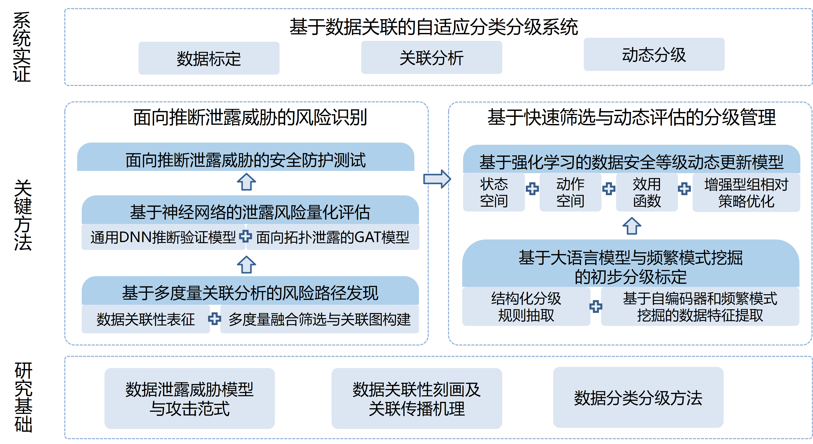
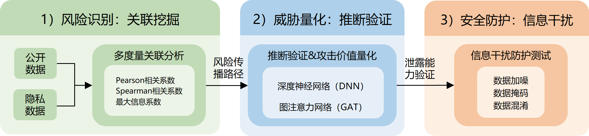
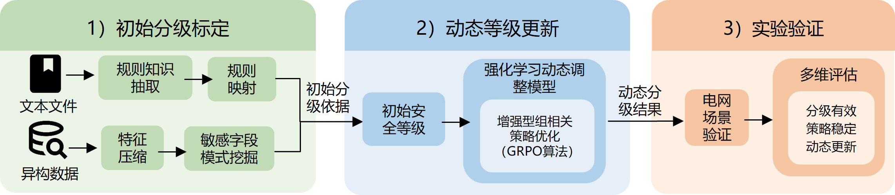

# 01 师兄毕业论文中的分类分级内容梳理

> 论文：邢之熠，《面向推断泄露威胁的电力数据风险识别与分级治理方法研究》，西安交通大学硕士学位论文，2026 年 4 月（答辩 2026-05-20）。
> 本文梳理指定的 **3.1、3.4.2、第 4 章**；为了讲清第 4 章的来历，顺带交代它依赖的 **2.3 节**（分级理论框架）和紧接 3.4.2 的 **3.4.3 节**（DNN 验证）。
> 公式按论文原式转写（原文公式是 MathType 对象，已对照渲染页逐个核对）。文末第 5 节是我的评注，单独列出，不混进梳理部分。

---

## 0 先看全局：这三部分在论文里的位置

论文主线是“**关联挖掘 → 推断验证 → 分级治理 → 系统实现**”（图 1-1）。和分类分级直接相关的是两段：

| 论文位置 | 回答的问题 | 产出 |
|---|---|---|
| 3.1 基于多度量关联分析的风险路径发现 | 哪些公开字段可能推出哪些敏感字段？ | 候选风险边、有向加权**风险关联图**、路径强度 |
| 3.2 / 3.4.3 神经网络量化 | 候选关系是否真能被攻击者利用？ | DNN 验证的 R²（阈值 0.7） |
| 3.4.2 关联分析实验结果 | 上述筛选在 IEEE 39 节点和 PJM 数据上的表现 | 关联矩阵、13 组高关联字段对 |
| 4.1 大模型 + 频繁模式的初步分级 | 如何得到初始等级？ | 结构化规则库、对象级初始等级（四级） |
| 4.2 强化学习动态更新 | 等级如何随推断风险调整？ | GRPO 策略给出的每个字段等级 |
| 4.3 实验 | 以上各步效果 | 抽取准确率、FP-Growth 例子、RL 收敛与效用 |

---

## 1 背景：2.3 节的分级理论框架（第 4 章的底座）

论文把分类分级写成“**数据对象识别 → 类别判定 → 风险评估 → 保护映射**”的统一过程。

**分类。** 对每个数据对象 $d_i$ 构造综合特征
$$z_i=[z_i^{sem},\,z_i^{meta},\,z_i^{biz},\,z_i^{ctx}]$$
（语义、元数据、业务、上下文特征），分类为 $c_i=\arg\max_{k\in C}P(c=k\mid z_i)$，类别如运行、交易、用户、设备、日志数据。

**静态初始定级。** 以影响对象 $a_1$、影响范围 $a_2$、危害程度 $a_3$、合规约束 $a_4$ 加权：
$$s_i^{(0)}=\omega_1a_{1i}+\omega_2a_{2i}+\omega_3a_{3i}+\omega_4a_{4i},\qquad g_i^{(0)}=\psi\big(s_i^{(0)}\big)\in\{1,2,3,4\}$$
四级对应**公开、一般、重要、核心**（依据《能源行业数据安全管理办法（试行）》）。

**引入推断风险。** 定义推断风险项和风险增强得分：
$$\Gamma_i=\max_{y\in D_{pri}}w(x_i,y),\qquad s_i=\alpha s_i^{(0)}+\beta\Gamma_i\ (\alpha,\beta>0),\qquad g_i=\psi(s_i)$$
$w(x_i,y)$ 取互信息或预测准确率。论文的解释是：本体不敏感的数据，只要与高敏感目标存在强推断关系，其等级应被抬升。

**动态化。** 把定级写成时变决策：状态 $S_t=[z_t,\Gamma_t,e_t,j_t]$（特征、推断风险、环境噪声、防护成本），动作 $b\in J$（等级操作），奖励 $r_t=U_t-\lambda_1W_t-\lambda_2X_t$（可用收益、推断损失、防护开销），目标为折扣累计奖励最大。

2.3 节还归纳了三类现有方法：规则与知识驱动、数据驱动（聚类初筛 $c_i=\arg\min_k\|z_i-\mu_k\|^2$，关联规则的支持度/置信度）、知识增强智能方法。第 4 章的三个模块正好对应这三类。

---

## 2 第 3.1 节：基于多度量关联分析的风险路径发现

### 2.1 3.1.1 面向推断泄露的数据关联性表征

**出发点。** 电网潮流方程、电价与供需的映射、负荷与用电行为的统计关系，使可观测数据能逐步逼近敏感信息。

**有向关联性。** 用“已知 $x$ 后 $y$ 的不确定性减少比例”定义由 $x$ 推断 $y$ 的关联性：
$$T(y\mid x)=\frac{I(y;x)}{H(y)}\in[0,1]$$
它是有方向的：$T(y\mid x)\neq T(x\mid y)$。

**与推断能力的关系（费诺不等式）。** 对马尔可夫链 $y\to x\to\hat y$，推断错误概率满足
$$P_e\ \ge\ \frac{H(y\mid x)-1}{\log|Y|}$$
论文据此推出：推断正确概率 $P_c$ 的上界随 $T(y\mid x)$ 增大而增大，即**关联性越大，攻击者理论上能推得越准**。这是用关联性筛风险的理论依据。

**多级传播。** 推断可以沿路径逐级逼近：$d_{pub}\to d_1\to\cdots\to d_{sen}$，写作映射复合 $d_{sen}=f_k\circ\cdots\circ f_1(d_{pub})$。

**三种度量互补。** 论文表 3-1：

| 度量 | 刻画对象 | 优势 | 局限 |
|---|---|---|---|
| Pearson | 线性相关 | 简单、适合大规模快速筛选 | 对非线性不敏感 |
| Spearman | 单调相关 | 对异常值稳健 | 难识别非单调、分段、周期关系 |
| MIC | 一般非线性依赖 | 能发现隐性耦合 | 计算量较大，受样本规模影响 |

### 2.2 3.1.2 多度量融合筛选与风险关联图构建

**综合关联强度**（各度量同尺度归一化后加权）：
$$w_{ij}=\omega_1\big|w_{ij}^{(P)}\big|+\omega_2\big|w_{ij}^{(S)}\big|+\omega_3\,MIC_{ij}$$

**候选风险边**：$E_{cand}=\{(d_i,d_j)\mid w_{ij}\ge\tau\}$（实验中阈值取 0.7）。

**风险关联图** $G_{corr}=(V,E,W)$：节点是数据实体/类别/特征，边表示潜在推断关联，边权 $w_{ij}$。它是**有向**的：有明确机理的边按先验定向（如“节点电价 → 阻塞分量 → 转移分布因子 → 网络拓扑”），方向不明的强耦合边留到验证阶段用单向预测、双向回归或重构误差判定。节点的初始敏感度可以取前期分级结果。

**路径强度。** 从公开数据 $d_{i_1}\in D_{pub}$ 到敏感数据 $d_{i_k}\in D_{pri}$ 的路径 $P$：
$$S(P)=\prod_{m=1}^{k-1}w_{i_m i_{m+1}},\qquad \bar S(P)=\Big(\prod_{m=1}^{k-1}w_{i_m i_{m+1}}\Big)^{1/(k-1)}$$
乘积式体现“短板效应”（任一弱边都会让整条路径衰减），论文后续采用乘积式作为先验风险值；几何平均用于跨长度比较。

**两点定位。** ① 风险关联图只是**高风险候选空间**，不等于泄露结论，某条边/路径必须在后续推断验证中能支撑敏感数据的有效重构才算真实威胁；② 图可**动态扩展**：数据敏感度调整时改节点权重，新数据接入时加节点和边（论文图 3-2 b/c）。

---

## 3 第 3.4.2 节：关联分析的风险挖掘验证结果（附 3.4.3）

### 3.1 仿真数据：IEEE 39 节点

数据：新英格兰 39 节点系统，节点负荷、节点电价、线路潮流、节点相角四类，各 2000 条；前两类视为开放度较高，后两类视为高敏感。连续量先用 K-Means 离散化，再算费诺关联性矩阵（行 = 已知量，列 = 推断量）：

| 已知＼推断 | 节点负荷 | 节点电价 | 线路潮流 | 节点相角 |
|---|---|---|---|---|
| 节点负荷 | 1 | 0.6019 | 0.5649 | 0.3203 |
| 节点电价 | 0.3028 | 1 | 0.3524 | 0.2517 |
| 线路潮流 | 0.5543 | 0.7046 | 1 | 0.4034 |
| 节点相角 | 0.3127 | 0.5038 | 0.3835 | 1 |

MIC 矩阵的数值整体明显更高（如负荷→电价 0.9712，潮流→负荷 0.9489，相角→潮流 0.8944）。论文结论：低敏公开数据能通过物理耦合间接携带高敏信息；MIC 对潮流约束、功率平衡决定的非线性依赖更敏感，多度量联合更不容易漏掉有攻击价值的候选边。

### 3.2 真实数据：PJM 39 个有效字段（2023-01 至 2024-01）

取联合关联阈值 0.7，识别出 13 组高关联字段对，并在 3.4.3 用通用 DNN 验证（基线 ARIMA、SVR；R² 阈值 0.7）：

| 字段对 | MIC | Spearman | Pearson | DNN R² | ARIMA | SVR |
|---|---|---|---|---|---|---|
| 计划潮流—非计划潮流 | 0.9999 | 1 | 1 | 1 | 0.9972 | 0.9981 |
| 市场出清价格—封顶后出清价格 | 0.9936 | 1 | 1 | 0.9999 | 0.9948 | 0.9963 |
| 经济最大容量—紧急最大容量 | 0.9475 | 0.9911 | 0.9624 | 0.9335 | 0.9315 | 0.9146 |
| 调频容量出清价—调频容量补偿总额 | 0.8794 | 0.9783 | 0.9850 | 0.9698 | 0.6534 | 0.6812 |
| 调频性能出清价—调频性能补偿总额 | 0.8751 | 0.9623 | 0.9177 | 0.8537 | 0.6887 | 0.7315 |
| 辅助服务所需容量—总兆瓦容量 | 0.8082 | 0.6469 | 0.6709 | 0.7257 | 0.6129 | 0.6584 |
| 系统电能价格—节点边际电价 | 0.7888 | 0.9637 | 0.9479 | 0.8955 | 0.9186 | 0.9342 |
| 平均每小时初步负荷—历史负荷 | 0.7634 | 0.9638 | 0.9726 | 0.9166 | 0.6641 | 0.6953 |
| 总兆瓦容量—非同步备用分配容量 | 0.7608 | 0.5922 | 0.7546 | **0.2954** | 0.5538 | 0.6187 |
| 发电总兆瓦数—平均每小时初步负荷 | 0.7552 | 0.9546 | 0.9562 | 0.8982 | 0.6835 | 0.9041 |
| 系统日前电能价格—日前总节点边际电价 | 0.7463 | 0.9078 | 0.8619 | 0.7332 | 0.9012 | 0.8874 |
| 紧急最大容量—已承诺总容量 | 0.7384 | **0.0110** | **0.0129** | **0.3413** | 0.0289 | 0.0417 |
| 经济最大容量—已承诺总容量 | 0.7251 | **0.0303** | **0.0165** | **0.4224** | 0.0361 | 0.0534 |

（原文表 3-4 的表头错位一列：“MIC数值”列实际放的是第二个字段名，上表已按内容对齐。）

论文的解读：
- 前几组在三类度量下都很强，属于稳定的显式关联；
- 末两组 MIC 高而 Pearson/Spearman 近零，说明存在线性度量看不到的非线性结构，印证了多度量融合的必要性；
- DNN 对 13 组中的 10 组验证有效（ARIMA 5 组、SVR 7 组），但“总兆瓦容量—非同步备用”等 MIC 高、DNN 低的组说明**统计关联不必然等于可利用的推断能力**，所以“关联筛选 → 模型验证”必须串联：前者缩小候选空间，后者判断现实攻击价值。

---

## 4 第 4 章：基于知识增强与数据驱动的分级治理方法

整章是“**初步分级标定（4.1）→ 动态等级更新（4.2）→ 实验验证（4.3）**”。

### 4.1 4.1.1 基于大语言模型的结构化分级规则抽取

- **任务定义**：把法规条文、工程模板、业务说明等非结构化文本转成统一的规则单元，每条至少包含**对象类别、关键字段、约束条件、风险提示、建议等级**。
- **流程**：“模型理解 → 约束生成 → 知识校正 → 结构化输出”。基础模型选 DeepSeek-R1-Distill-Qwen-32B；提示词分四部分（字段定义、约束说明、输出格式、异常处理），强制 JSON 输出。
- **检索增强（RAG）**：“检索 → 生成 → 校验”。知识库 = 标准文档（环评报告、行业规范、项目模板）+ 人工标注的结构化示例；向量化后检索 Top-K 片段与原文一起送入模型，再做字段完整性和逻辑一致性检查。
- **产出用途**：构建敏感字段查找表和类别映射，给后面的频繁模式挖掘提供字段筛选依据。

实验（4.3.2）：20 段输变电工程环评/建设说明/模板文本，人工标注项目名称、工程地点、电压等级、建设性质、线路长度 5 个字段；知识库 5 份模板 + 10 条示例；检索 Top-3。

| 抽取策略 | 字段级准确率 | JSON 有效率 | 字段完整率 |
|---|---|---|---|
| 直接抽取 | 79.0% | 80.0% | 84.0% |
| 提示约束抽取 | 88.0% | 95.0% | 91.0% |
| 检索增强抽取 | **94.0%** | **100%** | **97.0%** |

分字段看，项目名称、电压等级 100%，线路长度 85% 最低（“新建双回架空线路折单长度”与“线路总长”这类表述差异）。

### 4.2 4.1.2 基于自编码器和频繁模式挖掘的数据特征提取

- **动机**：字段维度高、冗余多；敏感性常体现为多字段**联合**暴露，单独看不敏感的字段组合后可能形成更高层次的推断风险。
- **流程**：“特征压缩 → 事务化表示 → 频繁模式挖掘 → 敏感映射”。
  1. 自编码器降维，重构损失 $L=\frac1N\sum_n\|x_n-\hat x_n\|^2$；
  2. 按规则库的敏感字段查找表，把每个待分级对象（线路、变电站、机组……）转成敏感字段项目集 $I_j$，组成敏感数据字典；
  3. FP-Growth 挖掘高支持度的敏感字段组合（算法 4-1 项头表、4-2 FP-Tree、4-3 FP-Growth）；
  4. 对象初始得分 = 其覆盖的频繁项集支持度之和：
  $$s_j=\sum_{F\in\mathcal F,\ F\subseteq I_j}\mathrm{sup}(F)$$
  归一化后按 $[0,0.1)$、$[0.1,0.5)$、$[0.5,0.85)$、$[0.85,1]$ 映射为一至四级。

实验（4.3.3）：6 类字段组合扰动扩增为 60 个 0/1 样本，自编码器 6-4-2-4-6，100 轮，训练/验证重构误差 0.013/0.017；FP-Growth 以 6 个线路对象为例、支持度阈值 50%，得到 11 个频繁项集（如{端点1, 电压等级}66.7%，{端点1, 电压等级, 线路电抗}50%）；初始等级为线路 1–6 分别三、三、一、四、四、二级（归一化得分 0.649、0.676、0、1、1、0.108）。

### 4.3 4.2 基于强化学习的数据安全等级动态更新模型

**状态：推断风险指数。** 用第 3 章关联分析结果，以 MIC 刻画公开数据对敏感目标的最大推断强度：
$$\Gamma_i=\max_{y\in D_{pri}}MIC(d_i,y)\in[0,1],\qquad s_t=\{\Gamma_1,\dots,\Gamma_N,P_{phys}\}$$
$P_{phys}$ 描述负荷波动、运行方式、市场环境等物理上下文。

**动作：四级等级。** $o_i\in\{1,2,3,4\}$（公开、一般、重要、核心），决策向量 $A=\{o_1,\dots,o_N\}$。

**效用函数：** 安全收益 − 可用性成本 − 合规惩罚：
$$U(A)=\sum_{i=1}^{N}\Big[S_i(o_i,\Gamma_i)-V_i(o_i)-P_i(o_i,\hat o_i)\Big]$$
$$S_i(o_i,\Gamma_i)=-\beta\,\Gamma_i\,e^{-\lambda o_i},\qquad V_i(o_i)=\eta\big(e^{\sigma o_i}-1\big),\qquad P_i=\begin{cases}\omega(\hat o_i-o_i)^2,&o_i<\hat o_i\\0,&o_i\ge\hat o_i\end{cases}$$
$S_i$ 为剩余推断风险随等级指数下降（取负），$V_i$ 为保护强度带来的可用性损失，$P_i$ 惩罚低于监管最低等级 $\hat o_i$ 的决策。

**求解：增强型 GRPO。** 每个特征采样一组候选等级，用组内均值/标准差构造相对优势 $\hat A=(r-\mu)/(\sigma+\epsilon)$ 代替价值网络；目标函数含策略梯度、KL 约束（防等级振荡）和熵正则（保持探索）。

实验（4.3.4，PJM 39 类特征）：

| 指标 | 结果 |
|---|---|
| 训练收敛 | GRPO 稳定在约 −300 效用平台；PPO、DQN 最终效用分别低约 25%、50%；最后 50 周期波动方差比 PPO 低 54.2% |
| 安全—可用性权衡 | GRPO 超过 60% 的决策点在帕累托前沿附近 |
| 综合效用 | 静态基线 206.6，DQN 101.9，PPO 178.7，**GRPO 210.5** |
| 动态攻击场景（中途切换推断策略） | 动态防御边界覆盖 90% 的攻击者演化轨迹；97% 关键物理特征保持最优保护状态 |

### 4.4 4.4 本章小结（论文原意）

实现了分级从“静态规则驱动”向“风险感知与动态优化驱动”的转变：大模型 + 检索增强把规范文本转成结构化分级知识；自编码器 + 频繁模式形成对象级初始等级；GRPO 在推断风险、可用性和合规之间动态权衡。第 5 章把它们做成“数据标定、关联分析、动态分级”三模块系统，部署于云南电网、榆林零碳智慧园区，并通过国网陕西电科院第三方测试。

---

## 5 评注：把论文方法接进南网体系前需要处理的问题

以下是我的判断，供后面的体系设计使用（[00 体系方案](00_分类分级体系方案.md) 第 3 节逐条给出处理办法）。

1. **等级标度不一致。** 论文用四级（公开/一般/重要/核心），南网新手册用“三类基础等级、五级”（一般 1–3 级、重要 4 级、核心 5 级），且 4、5 级须由上级部门认定。论文等级不能直接写进南网目录，需要映射，并且算法最多给出“建议申报重要数据”，不能自行定为 4/5 级。

2. **风险量是两两的。** 从 2.3 的 $\Gamma_i=\max_y w(x_i,y)$ 到 4.2 的 $\Gamma_i=\max_y MIC(d_i,y)$，风险都是“单个字段对单个目标”的关联。它看不到“单看都不相关、合起来才泄露”的情况。近期研究在四个电力数据集（10 个目标、264 个字段—目标对）上的结果是：按单字段口径只能召回 **13%（τ=0.5）/ 17%（τ=0.7）** 的关键字段；按“单独危险就扣留”处理后，大小 ≤3 的最小危险组合仍有 **98% / 96%** 原样保留。论文 3.1.1 已经说明“推断可通过多级关联逐步逼近”，但路径乘积式仍是链式的两两边，表示不了“多个字段共同指向一个目标”的超边。

3. **加性合成与“就高不就低”冲突。** $s_i=\alpha s_i^{(0)}+\beta\Gamma_i$ 是加权和：一个本体得分低、但能几乎完整推出核心数据的字段，可能只得到中等等级。南网分级原则第 4 条“从严性”要求按可能造成的最高影响定级，合成应是取最大（继承），而不是加权平均。

4. **“频繁”不等于“危险”。** 4.1.2 的初始得分是覆盖的频繁项集支持度之和，它衡量的是某组字段在对象里出现得多不多（暴露面），不衡量这组字段合起来能推出什么。线路 3（端点 2 + 线路电阻）因为两个字段都低频被过滤成一级，但“端点 + 电阻”恰恰是拓扑/参数推断的输入。频繁模式适合回答“现实中哪些字段经常被一起拿到”，这正好可以用来确定攻击者现实的背景组合（见体系方案 3.3 节）。另外，6 维 0/1 向量上的自编码器对后续挖掘没有实质作用，可以省去。

5. **强化学习承担了它不必承担的角色。** 按论文给出的效用形式，$U(A)$ 对字段可分，每个字段的四个动作里取最大即是全局最优（4N 次计算）；状态 $\Gamma_i$ 由 MIC 给定、不随动作改变。GRPO 相对静态基线的效用提升为 210.5/206.6≈+1.9%。更根本的是，它把**定级**（合规判定，须确定、可审计、就高不就低）和**处置**（开放方式、脱敏、扣留等可权衡的措施）混在一个动作里，合规还只是软惩罚。一旦风险量换成集合级（扣留一个字段会改变其他字段的最坏背景），决策才真正耦合，序列决策方法才有用武之地，而那是**处置层**的问题，不是定级层。

6. **实验规模偏小，需要在南网数据上重做。** 规则抽取的语料是环评报告的项目属性字段（不是分级规则本身），20 段 5 字段；FP-Growth 示例 6 个对象；DNN 验证 13 对。作为方法演示可以，作为南网项目的交付证据不够。

7. **适用维度。** 推断风险只影响“泄露/非法获取”这一维；南网等级同时覆盖篡改、破坏。推断继承只能**抬高**等级，不能因为“推不出别的”而降低本体等级。

这些问题都不否定论文的思路：“先关联筛、再模型验证”“频繁组合”“等级随风险动态调整”这三条主线都保留，只是各自落在体系里更合适的位置上。
