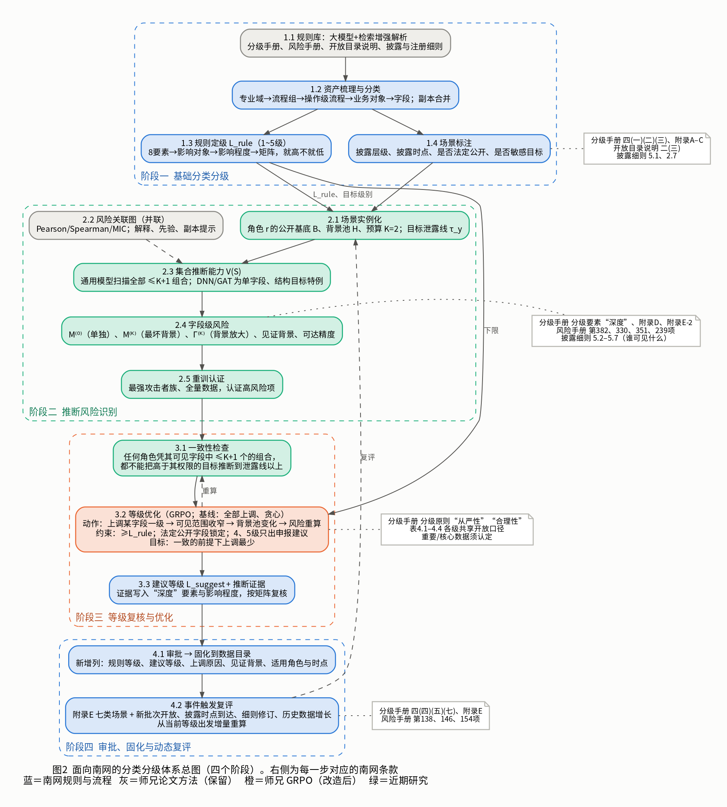
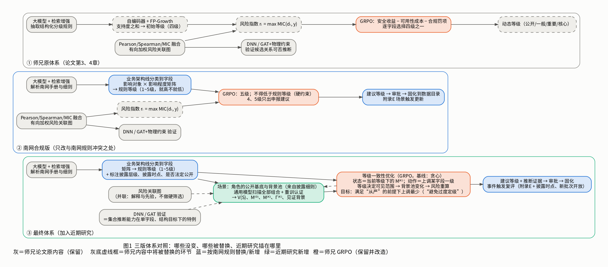
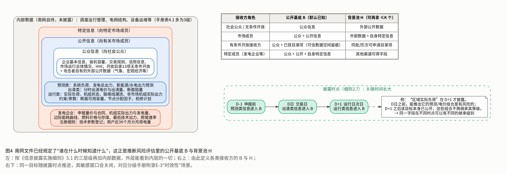
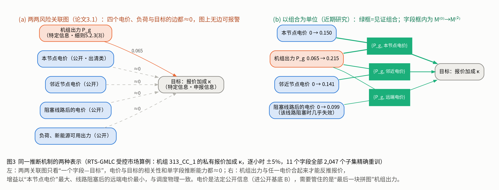
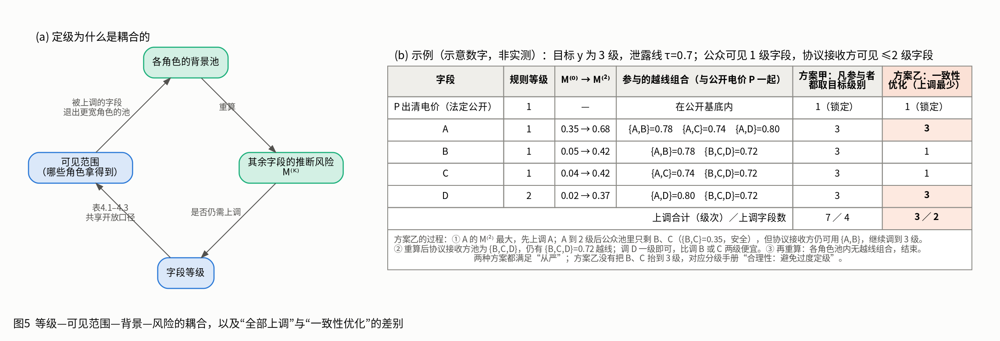
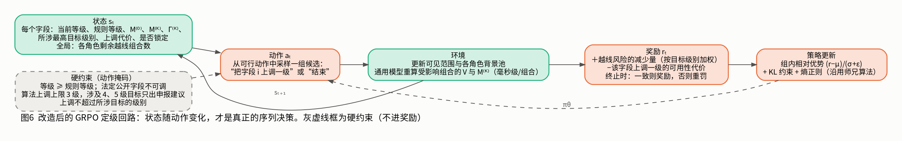

# 面向南网的电力数据分类分级体系方案（V2）

> 2026-10-07。本版以南网 2026 年文件为基准，在师兄论文体系上加入近期研究，范围**只到分类分级**（定级、复核、审批固化、动态复评），不含开放策略与防护处置。
> 相对 V1 的变化见文末“版本说明”。师兄论文梳理见 [01](01_师兄论文分类分级内容梳理.md)，南网文件总结见 [02](02_南网文件总结.md)。
> 南网条款以征求意见稿/审议稿为准。研究数字来自论文 V6_ieee 的公开/合成电力数据实验，**没有在南网数据上测过**；第 3.3 节的等级优化是本版新提出的表述，**尚未单独做实验**，验证计划见第 7 节。

---

## 0 摘要

**体系一句话**：南网规则给出每个字段的规则等级；我们用集合推断方法算出“哪些字段和别的字段合起来，会让本不该看到某敏感目标的人把它推出来”；再在“不低于规则等级”的硬约束下，用师兄的 GRPO 找出**上调最少**的等级方案，使这种推断在任何角色手里都不成立；结果作为建议等级连同证据走南网审批。

**四个阶段**（图 2）：

| 阶段 | 做什么 | 来源 |
|---|---|---|
| 一 基础分类分级 | 解析南网规则 → 分类到字段 → 矩阵得规则等级 → 标注披露层级与时点 | 南网流程 + 师兄（大模型 + 检索增强） |
| 二 推断风险识别 | 按角色确定已知背景 → 算集合推断能力 V(S) → 字段风险 M⁽⁰⁾、M⁽ᴷ⁾、Γ⁽ᴷ⁾ → 重训认证 | 近期研究；师兄的关联图并联、DNN/GAT 为特例 |
| 三 等级复核与优化 | 一致性检查 → GRPO 求上调最少的等级方案 → 建议等级 + 证据 | 师兄 GRPO（改造）+ 近期研究 |
| 四 审批、固化、复评 | 走南网审批，固化到数据目录，事件触发增量复评 | 南网流程 |

**三个关键设计**：
1. **用 M⁽ᴷ⁾ 替换师兄的风险输入 max MIC**。师兄 3.4.3 已经表明 MIC 高不等于能推出来，且 max MIC 看不到组合。
2. **GRPO 留在定级层，但解的问题变了**。等级决定谁能拿到字段，谁能拿到又决定别的字段的风险，所以上调一个字段会改变其余字段的状态。这才是序列决策，而且目标直接来自南网的两条分级原则：从严性与合理性（避免过度定级）。
3. **南网规则是硬约束**：不低于规则等级；法定公开字段不动；4、5 级只出申报建议；输出是建议，定级权在审批。



---

## 1 从师兄原体系到最终体系



| 环节 | ① 师兄原体系 | ② 南网合规版 | ③ 最终体系 | 改动性质 |
|---|---|---|---|---|
| 规则理解 | 大模型 + 检索增强抽取规则 | 语料换成南网手册与细则 | 同② | 保留 |
| 分类 | 语义/元数据/业务/上下文特征分类 | 业务架构蓝图线分类到字段 | 同②，并标注披露层级、时点、法定公开 | 按南网替换 |
| 初始定级 | 自编码器 + FP-Growth，支持度之和映射四级 | 影响对象 × 影响程度矩阵，五级 | 同② | **按南网替换** |
| 关系发现 | Pearson/Spearman/MIC 风险关联图 | 保留 | 保留，改为并联（解释与先验，不做硬筛选） | 保留，调整定位 |
| 推断验证 | DNN；GAT + 物理约束 | 保留 | 保留，作为 V(S) 在单字段、结构目标下的特例 | 保留，纳入统一刻度 |
| 风险量 | r = max MIC(dᵢ, y) | 同① | **V(S) → M⁽⁰⁾、M⁽ᴷ⁾、Γ⁽ᴷ⁾** | **近期研究替换** |
| 计算方式 | 逐对训练 | 同① | 通用模型扫描 + 重训认证 | 近期研究新增 |
| 等级决策 | GRPO 逐字段选四级；合规为罚项 | GRPO 五级；合规为硬约束 | **GRPO 做等级一致性优化**（上调谁、调几级） | 师兄方法保留，问题重述 |
| 动态更新 | 风险变化时重新决策 | 附录 E 场景触发 | 事件触发，从当前等级出发增量重算 | 按南网对齐 |
| 输出 | 算法直接给等级 | 建议等级 → 审批 | 建议等级 + 推断证据 → 审批 | 按南网对齐 |

三句话讲这层关系：
- 师兄建立了“规则初始分级 → 关联风险识别 → 风险驱动动态定级”的完整框架。
- 它有两处与现状不合：四级与支持度定级不符合南网五级规则；风险只看字段两两关联，看不到多字段联合和已有背景的放大。
- 本体系以南网规则为基线，保留师兄的规则抽取、关联发现、攻击验证和 GRPO 动态定级，把初始定级换成南网矩阵，把风险量换成集合推断风险，并把 GRPO 的决策问题改为“在南网约束下求上调最少的一致等级”。

---

## 2 阶段一：基础分类分级（南网规则）

### 2.1 规则库（师兄 4.1.1，语料换成南网文件）

输入：分级手册（表 4.1–4.4、附录 B–E）、风险评估手册评估项、开放目录说明、披露细则、注册细则。方法：大模型 + 检索增强 + JSON 约束输出。每个数据项一条记录：

```json
{"数据项": "", "专业域": "", "操作级流程": "", "业务对象": "",
 "影响对象": "", "影响程度": "", "建议规则等级": "", "依据条款": "",
 "披露层级": "公众|公开|特定|内部", "披露时点": "预测D-1|出清D|运行D+1|不披露",
 "是否法定公开": false, "是否敏感目标": false}
```

手册表 4.1–4.3 的“数据举例”直接作少样本示例和评测集。规则库只给建议，结果要人工确认。

### 2.2 分类

按《企业级业务架构蓝图》线分类：专业域 → 专业级流程组 → 操作级流程 → 业务对象 → 数据字段。此处合并**副本和近似代理**（如师兄表 3-4 中三项指标都约等于 1 的“计划潮流—非计划潮流”“出清价—封顶后出清价”）：它们是同一数据的不同写法，应同级管理，否则后面会被当成“推断发现”。师兄的关联分析可以自动提示候选。

### 2.3 规则定级

8 个分级要素 → 影响对象（群体/个体/单位自身）→ 影响程度（五档）→ 表 4.4 矩阵 → **规则等级 L_rule ∈ {1,…,5}**，三个维度就高不就低。这一步完全是南网手册的流程，替换师兄的 FP-Growth 定级。

### 2.4 场景标注（为阶段二准备）

每个字段多标三项，全部来自南网文件：
- **披露层级**：公众信息 / 公开信息 / 特定信息（披露细则 5.1）/ 内部数据；
- **披露时点**：预测类在申报前、出清类在交易日、运行类在次日（披露细则 2.7）；
- **是否法定公开**：细则或信息公开目录要求必须披露的字段。这类字段**等级锁定**，后面不参与上调。

同时确定**敏感目标集**：特定信息、规则等级 3 级及以上的数据、个人与企业敏感信息。

阶段一产出：字段清单，每个字段带分类路径、规则等级、依据条款、披露层级、时点、锁定标记。

---

## 3 阶段二：推断风险识别

### 3.1 场景：谁、已经知道什么、还能拿到什么

推断风险取决于接收方手里已有的数据。南网文件已经规定了这件事（图 4）。



对每类角色 r 确定四样东西：

| 要素 | 含义 | 来源 |
|---|---|---|
| 可见层级 c_r | 该角色最高能拿到几级数据 | 分级手册各级的共享开放口径、开放目录说明 |
| 公开基底 B_r | 该角色默认已知且不可收回的字段：法定公开字段 + 外部公开数据（气象、宏观经济等） | 披露细则、开放目录无条件条目 |
| 背景池 H_r | 该角色还可能拿到的字段：等级不超过 c_r 的非锁定字段 | 由当前等级决定 |
| 预算 K | 攻击者在基底之外最多再用几个字段作背景 | 定级取 K=2 |

**可见层级的默认设定**（需南网确认，见第 8 节）：

| 角色 | 可见层级 | 依据 |
|---|---|---|
| 社会公众（无条件开放） | 1 级 | 1 级“可对一般对象无条件共享、开放”；开放目录说明“无条件开放一般为 1 级” |
| 协议接收方（有条件开放的一般对象） | ≤2 级 | 2 级“有条件开放” |
| 特定对象（经审批的特定接收方） | ≤3 级 | 3 级“仅可对特定对象有条件共享、有条件开放” |
| — | 4、5 级 | 原则上不共享、不开放 |

市场场景下另有“公众信息/公开信息/特定信息”这一轴，可以作为更细的角色划分叠加上去。时间维度用披露时点处理：运行类信息在 D+1 进入公开基底，此后以它为目标的推断不再构成风险（分级手册附录 E-3“时效性”）。

### 3.2 敏感目标与泄露线

每个敏感目标 y 有自己的等级 g(y)（按南网手册定）和**泄露线 τ_y**：推断精度超过多少即视为该目标被泄露。**τ_y 由目标的数据主管部门给出**，写入规则库。建议初值 0.7，与师兄 3.4.3 的 R² 阈值一致，并在 0.5、0.9 下各出一份敏感性结果。

### 3.3 四个量

**集合推断能力**。只用字段集合 S 训练的最强攻击者，在留出数据上对目标 y 的推断精度：
$$V_y(S)=R^2_{\text{test}}(\hat h_S),\qquad \hat h_S=\arg\max_{h\in\mathcal H}R^2_{\text{val}}(h;S)$$
攻击者族 $\mathcal H$ 含多种模型结构，按验证集择优。它与师兄的方法是一脉相承的：
- 师兄 3.1.1 的有向关联性 $T(y\mid x)=I(y;x)/H(y)$ 推广到集合就是 $T(y\mid S)$；对连续目标，R² 与互信息单调对应（联合高斯时 $V=1-e^{-2I}$）；
- 师兄 3.2 的 DNN 验证“用 $x_i$ 预测 $y$ 的 R²”就是 $V_y(\{i\})$；
- 结构类目标（拓扑）用师兄 GAT + 物理约束的恢复精度作为 V，离散目标用准确率。

**字段级风险**。字段 i 在背景 T 上的增益 $\Delta_i(B\cup T)=V_y(B\cup T\cup\{i\})-V_y(B\cup T)$，则
$$M^{(0)}_{i\to y}=\Delta_i(B),\qquad M^{(K)}_{i\to y}=\max_{T\subseteq H\setminus\{i\},\,|T|\le K}\Delta_i(B\cup T),\qquad \Gamma^{(K)}_{i\to y}=M^{(K)}_{i\to y}-M^{(0)}_{i\to y}$$

| 量 | 回答的问题 |
|---|---|
| M⁽⁰⁾ | 这个字段自己能让目标多被推出多少？（师兄口径） |
| M⁽ᴷ⁾ | 在别人已有的数据背景下，它最多能多推出多少？ |
| Γ⁽ᴷ⁾ | 它的风险里有多少是被背景放大出来的？ |
| 见证背景 T* | 是和哪几个字段一起达到这个最坏值的？ |
| 可达精度 V(B∪T*∪{i}) | 加上它以后，目标实际能被推到多准？ |

取最大值而非平均，对应南网的从严性原则。实测中，一个字段在各种背景下增益的平均值只有最大值的约三分之一（中位数 0.32），平均型指标会系统性低报。只看增量也不够，同样 M=0.3，从 0 升到 0.3 和从 0.6 升到 0.9 含义不同，所以判定时必须连同可达精度一起看（3.2 节的泄露线）。

**为什么需要它**（图 3）：受控市场算例中，四个电价与目标的相关性和单字段推断能力都约为 0，机组出力单独也只有 0.065；出力与电价合起来才能反推报价。在四个电力数据集、264 个字段—目标对上，τ=0.5 时有 256 个字段会在不超过 2 个背景字段的组合中使目标越线，其中 223 个单独看是安全的；单字段口径只能找出其中的 13%（τ=0.5）/ 17%（τ=0.7）。



### 3.4 怎么算

1. **风险关联图（师兄 3.1，并联）**：Pearson/Spearman/MIC 融合，输出有向加权图。用途是解释（给业务人员看字段之间的关系）、副本提示、给扫描排优先级。**不做硬筛选**：图 3 里电价与目标之间没有边，却是危险组合的成员；先筛后算会正好漏掉“单看都弱、合起来强”的情况。
2. **通用模型扫描（近期研究）**：一个主干（掩码预训练 + 列重建 + 随机特征）对每个字段集合做闭式读出，估计全部不超过 K+1 个字段的组合的 V。每个集合 48–64 毫秒，逐集合重训要 14–56 秒。87 个字段全枚举约 11 万个集合，串行重训约 472 小时，扫描约 2.8 小时。
3. **重训认证**：对扫描出的高风险项（估计值落在泄露线以下 0.05 之内及以上的），用最强攻击者族、全量历史数据重训其前 3 个见证背景，得到认证值。扫描 + 认证的召回为 76–91%，无误报。
4. **评估口径**：按最强攻击者、全量数据评估。审计方只用 10% 数据时，会放行 25.6%（PJM）/ 13.2%（CAISO）的危险情形，且错误全是漏判。运行工况有差别时（如阻塞与非阻塞）分工况评估取最坏。

### 3.5 产出：推断证据表

| 目标 y | g(y) | 字段 i | 角色 | 公开基底 | 见证背景 T* | V(B∪T*) | V(B∪T*∪i) | M⁽⁰⁾ | M⁽ᴷ⁾ | Γ⁽ᴷ⁾ | 泄露线 | 估计/认证 | 攻击模型与数据量 |
|---|---|---|---|---|---|---|---|---|---|---|---|---|---|

---

## 4 阶段三：等级复核与优化

### 4.1 等级为什么要一起定



南网每一级都绑定了共享开放口径。字段被上调后，更宽的角色就拿不到它，它从这些角色的背景池里消失，池里其他字段的风险随之下降。所以**“字段 A 该不该上调”取决于“字段 B 有没有上调”**。

图 5(b) 的例子：A 与 B、A 与 C、A 与 D、以及 B+C+D 四个组合能把 3 级目标推过泄露线。
- **方案甲（全部上调）**：凡参与越线组合的字段都取目标级别，A、B、C、D 全到 3 级，共上调 7 级次。
- **方案乙（一致性优化）**：只把 A、D 调到 3 级，共 3 级次，其余组合自然失效。

两种方案都满足“从严”，方案乙没有把 B、C 抬高。分级手册的“合理性”原则要求“结合数据安全防护和保护成本之间关系，避免过度定级”，方案乙就是在从严与合理之间取的解。

示例所用的 V 值（P 为公开电价，始终已知）：V(P)=0.10；单字段 A 0.45、B 0.15、C 0.14、D 0.12；两字段 {A,B} 0.78、{A,C} 0.74、{A,D} 0.80、{B,C} 0.35、{B,D} 0.30、{C,D} 0.30；三字段 {B,C,D} 0.72。全部为示意数字。

### 4.2 一致性条件

记 ℓᵢ 为字段 i 的等级，角色 r 的背景池 $H_r(\ell)=\{i\ \text{非锁定}:\ \ell_i\le c_r\}$。

> **一致性**：对任何角色 r、任何等级高于其可见层级的目标 y（即 $g(y)>c_r$），该角色凭公开基底加上池中不超过 K+1 个字段，都不能把 y 推断到泄露线以上：
> $$\forall r,\ \forall y:\ g(y)>c_r,\quad \forall S\subseteq H_r(\ell),\ |S|\le K+1:\qquad V_y(B_r\cup S)\le\tau_y$$

说明：
- **前提**：$V_y(B_r)\le\tau_y$。若只凭公开基底就能把目标推过线，问题出在已公开的数据上，定级解决不了，单独标记为“基底已泄露”提交主管部门。
- M⁽ᴷ⁾ 与这个条件的关系：池内存在越线组合，等价于池内有字段在某个背景上“补上最后一步”；M⁽ᴷ⁾ 和见证背景指出是哪个字段、和谁一起。条件本身直接用 V 检查，M⁽ᴷ⁾ 用来排序、解释和作为优化的状态。

### 4.3 优化问题

$$\min_{\ell}\ \sum_i w_i\,(\ell_i-\ell_i^{\text{rule}})\qquad \text{s.t.}\quad \ell_i\ge\ell_i^{\text{rule}};\quad \ell_i=\ell_i^{\text{rule}}\ (i\ \text{法定公开});\quad \ell\ \text{满足一致性}$$

- $w_i$：字段 i 每上调一级的代价（可用性损失）。可由业务部门给出，或用开放目录中的使用场景数、开放对象数作代理，缺省取 1。
- **硬约束**：不低于规则等级；法定公开字段锁定；算法给出的等级最高到 3 级，若消除某条越线必须到 4 级（目标是重要/核心数据），输出“建议按重要数据识别申报”，不直接定级；上调不超过所涉目标的级别。

**性质**（保证问题有意义且好解）：
1. **上调只减少越线，不会新增**。上调使背景池变小，池内能凑出的组合只会变少。
2. **一定有可行解**。方案甲（全部上调到目标级别）可行，所以方案甲是最保守的上界。
3. **是覆盖型组合问题**。要在每个角色的池里移走一些字段，使每个越线组合至少缺一个成员；一般情形下求精确最优是困难的（同类覆盖问题中贪心有对数级近似保证，本问题多角色多级别的情形需实验确认）。这就是需要优化算法而不是逐字段查表的原因。

### 4.4 求解：GRPO 与两个基线

**基线一，全部上调（方案甲）**：一次算完，最保守，过度定级最多。

**基线二，贪心**：反复执行“在当前等级下重算风险 → 选出‘消除的越线风险 ÷ 上调代价’最大的字段 → 上调一级”，直到一致。

**GRPO（师兄 4.2 的改造）**：



| 要素 | 师兄原设定 | 改造后 |
|---|---|---|
| 状态 | 各字段 max MIC + 物理上下文 | 各字段的当前等级、规则等级、M⁽⁰⁾、M⁽ᴷ⁾、Γ⁽ᴷ⁾、所涉最高目标级别、上调代价、锁定标记；全局剩余越线数 |
| 动作 | 每个字段选一个等级（四级） | 选一个字段上调一级，或结束 |
| 状态转移 | 无（风险不随动作变） | 上调后背景池变化，通用模型重算受影响组合 |
| 奖励 | 安全收益 − 可用性成本 − 合规罚项 | 越线风险减少量（按目标级别加权）− 上调代价；终止时一致则奖励 |
| 合规 | 罚项 $P_i$ | 动作掩码（硬约束），不进奖励 |
| 算法 | 组内相对优势 + KL 约束 + 熵正则 | 不变 |

师兄效用函数的三项都有去处：安全收益项 $S_i=-\beta\Gamma_ie^{-\lambda o_i}$ 对应剩余越线风险，其中 $\Gamma_i$ 换成 M⁽ᴷ⁾；可用性成本项 $V_i=\eta(e^{\sigma o_i}-1)$ 可直接用作上调代价 $w_i$ 的形式（越高的等级代价越大）；合规项变成硬约束。

**对 GRPO 的预期要实事求是**：贪心在这类问题上通常已经接近最优。GRPO 可能体现优势的地方是代价不均匀、多目标多角色相互牵制、以及复评时从已有等级出发的增量调整。第一期交付建议以贪心为主方法、GRPO 为对比方法，谁做主角由第 7 节的实验决定。

### 4.5 回到南网矩阵：建议等级与证据

优化输出每个字段的建议等级 L_suggest 和上调原因。上调原因按南网的语言写成对分级要素的复核意见，例如：

> 字段 A 规则等级 1 级。复核发现：协议接收方在已掌握公开出清电价和字段 D 的情况下，再获得字段 A，可将 3 级数据 y 的推断精度由 0.12 提高到 0.80，超过主管部门设定的泄露线 0.7（M⁽⁰⁾=0.35，M⁽²⁾=0.68，Γ⁽²⁾=0.33；经重训认证）。依据分级要素“深度”及附录 D“分析挖掘出更敏感、更深度的衍生数据应提高级别”，字段 A 泄露后对【y 的影响对象】的影响程度应参照 y 评价，按表 4.4 复核为 3 级。

**两种口径，请南网选定**：
- **最小口径（方案乙）**：按一致性优化的结果上调，只调必要的字段、调到刚好排除可利用角色的级别；
- **保守口径（方案甲）**：凡参与越线组合的字段都取目标级别。

两种口径的结果可以同时给出，差值就是“为避免过度定级省下的部分”。

### 4.6 数据集的定级

对已知的字段组合（一个数据集、一张表），不需要字段级量，直接检查：
- 数据集等级不低于其字段的最高等级（附录 E-2、风险手册第 148 项）；
- 若数据集的字段合起来（加公开基底）能把某目标推过泄露线，数据集等级不低于该目标等级（附录 E-2“深入分析汇聚后是否可获得更多信息”）。

---

## 5 阶段四：审批、固化与动态复评

**审批与固化**：走分级手册四（四）（五）的流程。数据目录新增列：

| 字段 | 分类路径 | 披露层级/时点 | 法定公开 | 规则等级 | 建议等级 | 上调原因（目标、见证背景、可达精度） | 适用角色 | 口径（最小/保守） | 申报建议 | 复评条件 | 审批结论 |
|---|---|---|---|---|---|---|---|---|---|---|---|

**动态复评是事件触发的，不随运行工况逐时变化**（等级要审批、要固化）：

| 触发事件 | 来源 | 影响 |
|---|---|---|
| 体量变化、聚合合并、时效变化、脱敏、加工、安全事件、其他要素变化 | 分级手册附录 E | 规则等级和推断风险都可能变 |
| 新批次开放目录、某字段转为公开 | 新增 | 公开基底变大，**其余字段风险可能上升** |
| 披露时点到达（如运行类信息 D+1 公开） | 附录 E-3 的具体化 | 以该信息为目标的上调可以解除 |
| 披露/注册细则修订（如 2025 版 → 2026 版） | 新增 | 规则库、角色、目标集要更新 |
| 历史数据累积 | 新增 | 攻击者可用数据变多，V 上升，按年重算 |
| 重要数据规模变化 30% 以上、系统重大变化 | 风险评估手册 | 与风险评估同步 |

复评从当前已审批的等级出发增量重算：通用模型不必重训主干，只对变化涉及的组合重新读出，再只认证状态发生变化的字段；GRPO/贪心以当前等级为初始状态继续决策。这对应师兄“风险驱动动态更新”的原意。算法不主动降级：降级只在南网允许的情形（脱敏、精度降低、时效到期等）下先重算规则等级，再重新优化。

**与风险评估手册的衔接**：推断证据表可以直接作为第 382 项（公开数据聚合性推断）、330 项（汇聚）、351 项（加工产生新数据）、239 项（再识别）的评估材料，给这几项提供可复现的方法和判定标准。

---

## 6 与南网文件的对应和冲突检查

### 6.1 逐步对应

| 体系步骤 | 南网条款 | 关系 |
|---|---|---|
| 规则库、分类 | 分级手册四（一）（二）、附录 A | 执行 |
| 规则定级 | 分级手册四（三）、表 4.1–4.4、附录 B、C | 执行 |
| 场景标注 | 披露细则 2.7、5.1–5.7；开放目录说明二（三）；注册细则 5.10–5.12 | 引用 |
| 推断风险识别 | 分级要素“深度”；附录 D；附录 E-2；风险手册第 382、330、351、239 项 | 把原则性要求变成可计算的方法 |
| 取最坏背景 | 分级原则“从严性” | 执行 |
| 上调最少 | 分级原则“合理性：避免过度定级” | 执行 |
| 等级—可见范围 | 表 4.1–4.3 各级共享开放口径 | 引用 |
| 建议等级 + 审批 | 分级手册四（四）（五） | 执行 |
| 4、5 级只出申报建议 | “按上级部委、行业主管单位、属地政府要求识别、申报重要数据及核心数据” | 执行 |
| 动态复评 | 分级手册四（七）、附录 E；风险手册第 138、146、154 项 | 执行并具体化 |

### 6.2 可能的冲突点与处理

| 可能的冲突 | 处理 |
|---|---|
| 师兄四级 vs 南网五级 | 全部改为五级；“公开”不再是等级，而是 1 级数据的开放方式 |
| 算法定级 vs 审批定级 | 算法只出建议等级和证据 |
| 算法给出重要/核心数据 | 上限 3 级，其上只出申报建议 |
| 算法降低规则等级 | 硬约束禁止；降级只走南网允许的重新分级情形 |
| 上调法定必须公开的字段 | 锁定，放进公开基底 |
| 可用性成本进入定级 | 只用于在**同样合规**的方案之间选上调最少的，依据是“合理性”原则；不能用来抵消风险 |
| 等级随运行工况逐时变化 | 不采用；分工况评估取最坏，复评由事件触发 |
| FP-Growth 支持度定级 | 删除；如需保留师兄内容，只作为“哪些字段常被一起拿到”的统计，供扫描排优先级，不产生等级 |
| 自设阈值 | 泄露线由目标主管部门定，写入规则库 |
| 推断风险覆盖范围 | 只影响泄露/非法获取维度，只抬高不降低；篡改、破坏维度仍按规则等级 |

---

## 7 需要补的验证

等级一致性优化是新表述，交付前要有自己的实验依据。现有数据和真值表可以直接复用，不需要新采数据。

| 编号 | 内容 | 做法 | 判据 |
|---|---|---|---|
| E1 | 一致性优化的效果 | 在 RTS-GMLC、NEM、PJM、CAISO 上按披露层级给字段设规则等级和角色，用已有的重训真值表，比较方案甲、贪心、GRPO、小规模精确最优 | 上调级次、过度定级比例、是否达到一致 |
| E2 | 估计值代替真值 | 用通用模型估计值做优化，再用真值检查残余越线组合 | 残余比例；认证后是否归零 |
| E3 | GRPO 对比贪心 | 代价均匀/不均匀、单目标/多目标、多角色三种设置 | GRPO 是否稳定不劣于贪心；若否，以贪心为主方法 |
| E4 | 参数敏感性 | τ ∈ {0.5, 0.7, 0.9}；K=2 定级后用 K=3 检查残余 | 结论随 τ、K 的变化幅度 |
| E5 | 动态复评 | 模拟“某字段转为公开”“披露时点到达”，从当前等级增量重算 | 等级变动数量、计算时间 |
| E6 | 规则库 | 在分级手册表 4.1–4.3 的示例上评测大模型 + 检索增强的定级建议 | 与手册示例等级的一致率 |

已有的相关依据（口径不同，仅供参考）：按估计的 M⁽²⁾ 贪心移除字段并重算，剩余越线组合 0.3–1.6%，比真值最优多移除不超过 1.9 个字段；公开一个字段后，PJM 在 τ=0.7 下越线字段由 13 个增至 21 个，说明基底变化确实需要触发复评。

---

## 8 需要南网确认的事项与试点

**需确认**：
1. 敏感目标清单及各自的泄露线 τ_y；
2. 角色与可见层级表（3.1 节的默认设定是否成立，2 级与 3 级对外的区分）；
3. 法定公开字段清单（披露细则 2026 版生效后的口径）；
4. 采用最小口径还是保守口径；
5. 上调代价 w_i 的来源；
6. 背景预算 K（建议 2）。

**试点建议**：先做系统运行域（开放目录 39 项及跨域 3 项）与市场披露字段，目标取发电企业特定信息（机组实际出力与发电量、申报信息、燃料存储）和 D+1 才披露的运行信息。需要南网提供至少一年、按披露粒度的字段级历史样本。阶段：规则库与场景表（只依赖文件）→ 数据接入与副本合并 → 扫描与认证 → 等级优化与证据 → 业务部门审核。

---

## 9 边界

1. 泄露线是政策参数，同一套证据在 τ=0.5 与 0.9 下结论差别很大。
2. 结论相对于所选攻击者族成立；表格基础模型（如 TabPFN）在部分数据上更强，建议纳入认证用的攻击者族。
3. K=2 之外仍有少量更高阶组合，用 K=3 检查并报告残余。
4. M⁽ᴷ⁾ 是最大值统计量，小样本下偏高；定级依据应是认证值。
5. 目前验证充分的是连续数值目标；离散和结构目标需要换对应的 V，未在南网场景验证。
6. 等级一致性优化未做实验（第 7 节）；它在数学上是覆盖型问题，可行解和保守上界是确定的，GRPO 能否优于贪心没有证据。

---

## 版本说明（相对 V1）

- 范围收到分类分级：去掉开放处置菜单、扣留、风险评级矩阵换算、最小不安全组合的概念和定理。
- GRPO 从“处置层”移回定级层，问题重述为等级一致性优化；新增“等级—可见范围—背景—风险”的耦合和最小/保守两种口径。
- 上调依据由“关键字段继承目标等级”改为“一致性条件 + 上调最少”；V1 的继承规则相当于本版的保守口径。
- 关联图由串联第一级改为并联；FP-Growth 不再保留为必选模块。
- 新增三版体系对照图、冲突检查表、验证计划、需南网确认事项。
