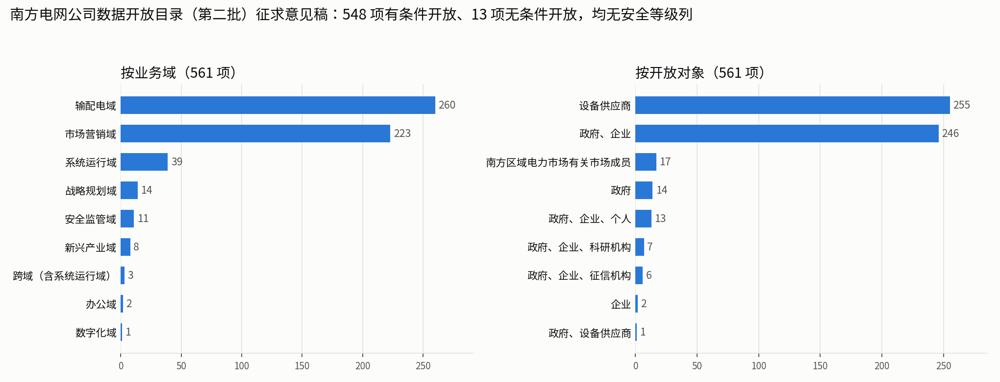

# 02 南网文件总结

> 来源：`reports/南网/南网文件.zip`（解压于 `reports/南网/南网文件_解压/`），共 5 组文件。提取文本和目录统计见 [V1 工作底稿](../V1/工作底稿/)。
> 注意版本状态：两本手册是**征求意见稿**，两份市场细则是**审议稿**，开放目录是**征求意见稿**，条款编号和内容都可能变动。
> 各文件带有“未经许可不得复制、网络传播”的知识产权声明，本整理只在项目内使用。

---

## 0 文件清单与各自回答的问题

| # | 文件 | 发文与日期 | 状态 | 回答的问题 |
|---|---|---|---|---|
| 1 | 数据分类分级工作手册 | 南方电网公司，2026 年 7 月（压缩包标 2026-07-27） | 征求意见稿 | 数据**定几级**、按什么流程定 |
| 2 | 数据安全风险评估工作手册（2026 年修订版） | 数字化部，2026 年 7 月 | 征求意见稿 | 系统里的数据风险**怎么评**、评什么 |
| 3 | 数据开放目录（第二批）+ 目录说明 + 意见反馈表 + 通知正文 + 收文处理单 | 办数字〔2025〕76 号，2025-11-24 印发；科研院收文 S〔2025〕1919 号 | 征求意见稿（反馈截止 2025-12-03） | 哪些数据**开放给谁**、按什么条件 |
| 4 | 南方区域电力市场信息披露实施细则（2026 年 V1.0 版） | 2026 年 8 月 | 审议稿 | 市场信息**谁、何时可见** |
| 5 | 南方区域电力市场注册实施细则（2026 年 V1.0 版） | 2026 年 8 月 | 审议稿 | 市场成员注册时**提交/持有**哪些信息 |

一句话概括它们的分工：**分级手册定“级”，风险手册定“评”，开放目录定“放”，披露细则定“谁在什么时候看得到”，注册细则定“谁手里有什么”。** 后两份不是分类分级文件，但它们恰好规定了推断风险评估最需要的输入：攻击者默认掌握什么。

---

## 1 数据分类分级工作手册（征求意见稿）

### 1.1 依据与原则

依据《网络安全法》《数据安全法》《个人信息保护法》《能源行业数据分类分级指南（2026 年版）》、GB/T 43697-2024 等 17 项文件，以及公司细则 Q/CSG2223007-2024、Q/CSG1210049-2020。

- **分类原则**：系统性、稳定性、扩展性、动态更新（聚合、合并、加工产生新数据时更新类别）。
- **分级原则**：实用性、扩展性、合理性（结合防护成本，避免过度定级）、**从严性（就高不就低，多因素时按最高影响对象和影响程度定级）**、动态更新（大量汇聚、规模/价值/影响范围成倍变化、时效性变化时更新级别）。

### 1.2 工作内容（七步）

数据资产梳理 → 数据分类 → 数据分级 → 分类分级审批 → **结果固化到数据目录** → 技术管控 → 动态更新管理。数字化管理部门牵头、业务部门配合。

### 1.3 分类方法

以最新《南方电网公司企业级业务架构蓝图》为准，按 GB/T 10113-2003 线分类：**专业域 → 专业级流程组 → 操作级流程 → 业务对象 → 数据字段**。2024 年 4 月版蓝图共 22 个专业域（纪检监察、战略规划、计划与财务、科技创新、输配电、新兴业务、产业金融、数字化、审计、党建、工会、办公、人力资源、企业架构、政策研究、市场营销、国际业务、供应链、安全监管、法规、巡视、系统运行）。**分类一直细到数据字段**，这与我们在字段层面做推断风险评估的粒度一致。

### 1.4 分级方法

**级别定义**：三类基础等级、五级。一般数据 = 1、2、3 级；重要数据 = 4 级；核心数据 = 5 级。重要/核心数据须按上级部委、行业主管、属地政府要求识别和申报；未被认定的原则上按一般数据定具体级别。

**分级对象**：数据项（如数据库表的一列字段）、数据集、衍生数据、跨行业领域数据。

**分级要素（8 个）**：领域、群体、区域、重要性（定性）；精度、规模、覆盖度（定量）；**深度**（通常用于衍生数据：通过统计、关联、挖掘或融合，对描述对象隐含信息或多维细节的刻画程度）。

**影响对象**：群体（国家安全、公共利益、经济运行、社会秩序）、个体（个人权益、其他组织权益）、单位自身。
**影响程度（附录 C）**：无影响、轻微、一般、严重、特别严重。

**三张判定规则表**（每级同时规定了共享开放口径）：

| 级别 | 群体影响（表 4.1） | 个体影响（表 4.2） | 单位自身（表 4.3） | 共享开放口径 |
|---|---|---|---|---|
| 5 级 | 与国家安全相关的核心数据（如关联 1 亿人以上个人信息的电力消费原始数据、100 万千瓦以上大型水电站图纸运维资料） | — | — | 原则上不共享、不开放 |
| 4 级 | 重要数据（如大型火电/核电站/换流站图纸、特级电力用户能源消费原始数据、关联 100 万人以上个人信息的能源消费原始数据） | — | — | 原则上不共享、不开放 |
| 3 级 | 调度运行管理、调度计划、继电保护、重要设备运行、**电力系统结构数据**、电力基础设施运维等 | 员工个人敏感信息、重要供应商/客户档案、未公布的投资与生产经营计划 | 基建管控、调度数据管理、变电站技术参数、重要客户基本信息等内部数据 | 仅对特定对象有条件共享、有条件开放 |
| 2 级 | 汇聚后无法回溯个人的电力消费数据、**低于规定精度频度**的调度运行与设备运行数据等 | 员工基本信息、一般供应商/客户基本信息 | 配电基础数据、发售电量、操作票、网络安全日志等 | 特定对象无条件共享、有条件开放（个体/单位：一般对象无条件共享、有条件开放） |
| 1 级 | 依法应公开的数据、网站公告等 | 依法或经授权公开的信息 | 可公开的公司基本数据 | 一般对象无条件共享、开放 |

**最终级别判定矩阵（表 4.4）**，三个维度按“就高不就低”取最大：

| 影响对象＼影响程度 | 无影响 | 轻微 | 一般 | 严重 | 特别严重 |
|---|---|---|---|---|---|
| 国家安全 | 1 | 4 | 4 | 5 | 5 |
| 公共利益 | 1 | 3 | 3 | 4 | 5 |
| 经济运行 | 1 | 2 | 3 | 4 | 5 |
| 社会秩序 | 1 | 2 | 3 | 4 | 5 |
| 其他组织 | 1 | 2 | 2 | 3 | 3 |
| 公民个人 | 1 | 2 | 2 | 3 | 3 |
| 单位自身 | 1 | 2 | 2 | 3 | 3 |

### 1.5 审批、固化、动态更新

- 审批：数字化与业务部门共同审批初始化和变更需求；
- 固化：审批结果固化到**数据目录**，形成分类分级清单并验证；
- 动态更新的四种触发：新建系统并网审查前、存量系统新增数据、数据业务属性/重要程度/影响程度变化（附录 E）、标准与制度变化。

### 1.6 附录 D（衍生数据）与附录 E（变更场景）——和推断风险关系最直接的两处

- **附录 D**：衍生数据分为脱敏、标签、统计、融合四类。脱敏数据经评定可降级；标签/统计数据可升可降；由重要/核心数据加工的衍生数据原则上同级管理；**“分析挖掘出更敏感、更深度的衍生数据，应提高数据级别”**。
- **附录 E** 的七类变更场景：①体量变化；②**聚合、合并**（汇聚后“应深入分析是否可较原始数据获得更多信息”，级别不低于所汇聚数据的最高级别）；③**时效性**（同一类数据在某时间点前后可有不同级别，须明确时间点与触发条件）；④脱敏（视为新数据重新定级）；⑤汇总统计分析加工（结果可高于、等于、低于原始）；⑥安全事件（应提高级别）；⑦其他。

### 1.7 这本手册给我们的抓手和留白

**抓手**：从严性原则（取最大）、“深度”要素、附录 D“挖掘出更敏感的衍生数据应提级”、附录 E-2“汇聚后能否获得更多信息”、附录 E-3“时效性分时定级”。推断风险不需要新造概念，就能挂在这几条上。

**留白**：
- 判断“能否推出更多信息”没有方法、没有度量、没有阈值；
- 定级对象是数据本身，没有接收方和其已有背景的概念，而推断风险恰恰取决于“谁拿到、他手里还有什么”；
- 有“数据集”这一分级对象，但没有“字段组合”这一概念：两个分属不同数据集、各自 1 级的字段，同时开放给同一接收方时会发生什么，手册覆盖不到。

**可反馈的文字问题（征求意见用）**：正文多处引用“表 3.2 / 表 3.3 / 表 3.4 / 图 3.1”，实际表格编号为 4.x；规范性引用文件第 14、15 项重复（均为 GB/T 22240-2020）；表 4.1 的 2 级与 3 级判定原则首句相同（“与公共利益、经济运行、社会秩序相关的一般数据”），区分只靠第二句。

---

## 2 数据安全风险评估工作手册（2026 年修订版，征求意见稿）

### 2.1 定位与流程

- **以信息系统为评估对象**，评估管理制度、技术措施和数据处理活动是否合规；依据《网络数据安全风险评估办法》、GB/T 45577-2025、GB/T 20984-2022 等 15 项。
- **频次**：涉及重要数据的系统每年评估，1 月底前报送年度计划；等保三级及以上每年一次、二级至少两年一次；重要数据规模变化 30% 以上、业务架构重大变化、发生重大安全事件时重评。评估机构须具备风险评估三级及以上资质；网级系统原则上由南网科研院评估。
- **流程**：评估准备（组队、定范围、调研、方案、部署工具）→ 评估实施（文档查验、访谈、演示、配置核查、工具验证；五步骤：信息调研、数据应用场景识别、脆弱性识别与分析、已有安全措施识别、风险分析与评价）→ 报告编制（七部分）→ 整改消缺（问题上传云盾平台统一问题库）。流程说明表共 14 个节点。
- **前置条件**：存量/改造系统**须先自行完成数据分类分级**，再申请评估。分类分级是风险评估的输入。

### 2.2 评估项体系

3 个评估类、43 个评估项、576 个评估子项（通用 564 项 + 关键信息基础设施扩展 12 项）：
- 数据安全管理要求：管理机构、人员、制度体系、处理者义务、合作方、安全威胁、应急、开发运维、云数据、网络平台服务等；
- 数据安全技术要求：数据资产管理、**数据分类分级**、数据安全风险评估、监测、访问权限、接口、应急处置、审计、**数据脱敏**、防泄露、终端、测试数据、网络安全、人工智能安全；
- 数据处理安全要求：收集、存储、传输、使用、**加工**、出境、**公开**、销毁与删除、交易、**共享**、其他、个人信息保护、特殊用户数据保护。

与分类分级和推断风险直接相关的子项：

| 子项 | 内容要点 | 与推断风险的关系 |
|---|---|---|
| 143–147 | 分类标准与目录、安全级别、资产清单、变更审核流程、个人信息与重要数据标识 | 分级结果本身 |
| 148 | 不同级别数据同时处理且难以分别保护时，按最高级别保护 | 数据集取最大 |
| 138 | 对数据分类分级、使用方式变化、**数据汇聚融合**、对外提供等开展变更管控 | 变更触发复评 |
| 154 | 业务或数据资产重大变化时局部/全面重评 | 同上 |
| 160 | 不同目的收集的个人信息汇聚融合时开展个人信息安全影响评估 | 汇聚风险 |
| 239 | 匿名化/去标识化个人信息的**重新识别风险**分析 | 再识别是推断的一种 |
| 330 | 汇聚大量数据时不暴露敏感信息 | 汇聚推断 |
| 351 | 数据加工产生新数据时进行安全审核，确保不存在泄露风险 | 衍生数据 |
| 376–385 | 数据公开的制度、审批、范围、脱敏水印、事前评估 | 公开场景 |
| **382** | **数据公开是否会带来聚合性风险：基于已公开数据，结合社会经验、自然知识或其他公开信息，尝试是否可以推断出涉密信息、其他未公开的关联信息，或其他对国家安全、社会公共利益有影响的信息** | **与我们的研究问题同一件事** |
| 420–448 | 共享的目的范围、最小范围、事前风险评估、接收方能力、共享风险评估机制（440） | 共享场景 |

### 2.3 风险评价矩阵

参照 GB/T 45577-2025，按危害程度与发生可能性给出高/中/低（照原表抄录）：

| 可能性＼危害程度 | 很高 | 高 | 较高 | 中 | 低 |
|---|---|---|---|---|---|
| 高 | 高 | 高 | 中 | 低 | 低 |
| 中 | 高 | 高 | 低 | 低 | 低 |
| 低 | 中 | 中 | 低 | 低 | 低 |

（“可能性中 × 危害较高 = 低风险”而“可能性高 × 较高 = 中风险”，中间一行比上下两行都陡，可能是笔误，可在征求意见时核实。）

### 2.4 留白

第 382 项要求“尝试推断”，但没有说明：用什么方法推、攻击者被假设拥有哪些背景、推到什么程度算“可以推断出”、结果如何换算成危害程度与可能性。整本手册以合规检查为主，技术检测示例（附录 1）是明文密码、参数可遍历这类漏洞，没有推断检测的示例。

---

## 3 数据开放目录（第二批）征求意见稿及说明

### 3.1 目录说明的要点

- **背景**：落实国家数据局《关于促进企业数据资源开发利用的意见》和“2025 年可信数据空间创新发展试点”；第一批目录已于 2025 年 6 月印发。
- **五原则**：依法合规、**分类分级**（按业务、按分级配置加密脱敏策略）、权责对等、需求导向、保障安全。
- **需求来源**：对外门户数据产品、各省能源数据中心上架产品、数据要素发展规划、**电力交易中心信息披露细则涉及的数据**、对外信息公开、其他。
- **开放边界 12 条**：国家秘密、危害国家安全、未授权个人敏感数据、商业秘密、核心数据、未依法公开的原始公共数据、公司内部运营数据等不纳入。
- **开放策略与等级挂钩**：**有条件开放 = 一般为 1、2、3 级数据**（须满足授权/脱敏条件并签数据使用协议，经南方能源行业可信数据空间开放）；**无条件开放 = 一般为 1 级数据**。
- **安全保障**：可信数据空间提供接入认证、**存证上链**、共享策略控制、数据沙箱、隐私计算、数据水印；开放前合规评估六方面（来源合法、处理合规、个人信息保护、数据权益、知识产权、主体资质）。
- **权限与流程**：未注册主体只能看无条件开放目录；已注册可下载无条件开放数据；已入驻可申请有条件开放数据（申请 → 审查 → 签约 → 提供）。

### 3.2 目录本身（561 项）

- 开放策略：**有条件 548 项、无条件 13 项**；
- 业务域：输配电 260、市场营销 223、系统运行 39、战略规划 14、安全监管 11、新兴产业 8、跨域 3、办公 2、数字化 1；
- 开放对象：设备供应商 255、政府与企业 246、南方区域电力市场有关市场成员 17、其余为政府、个人、科研机构、征信机构等组合；
- 更新频率：按月 458，按需 42，按日 37，其余按季/年/实时/小时/15 分钟；
- 开放条件（按文字归类）：“签数据使用协议 + 经可信数据空间开放”452 项，“须获个人/企业/外部机构授权或脱敏后开放”79 项，“按电力市场信息披露规则向市场成员披露”17 项，无条件 13 项；
- 13 项无条件开放：企业基本信息、关联信息、电力供应报告、交易机构基本信息、交易规则、收费标准、交易信用信息、市场运行情况、退市名单、信息披露报告、绿电交易情况、**线路负载率统计信息**、电力市场年度报告。
- 统计口径和逐项数据见 [开放目录_统计.json](../V1/工作底稿/开放目录_统计.json)。

### 3.3 观察

1. **目录没有安全等级列**（13 列为序号、业务域、部门、资源名称、字段、描述、场景、区域、时间、频率、开放对象、开放策略、开放条件）。等级只能从开放策略反推（无条件 ⇒ 1 级；有条件 ⇒ 1–3 级），这与分级手册“结果固化到数据目录”的要求还没接上。
2. **开放条件是法规模板**，内容是授权、脱敏、签约、经可信数据空间，**不涉及粒度、时延、接收方已有数据和字段组合**。
3. **26 项引用《南方区域电力市场信息披露实施细则（2025 年 V1.0 版）》**，而 2026 年 V1.0 版已进入审议，细则生效后这些条目的条件需同步更新，这正是分级手册“动态更新”要覆盖的情形。
4. **值得在试点中优先复核的组合**（只是按推断风险逻辑提出的复核对象，是否有问题要看实际开放粒度和接收方，不是结论）：
   - **电厂级发电量 + 运行监测**：第 560 项“发电厂发电量信息”（按日、含电厂名称）、第 552/553 项“火电厂/水电厂运行监测信息”（机组名、实际/计划电量、存煤等），以“获企业授权或脱敏”为条件向政府、企业开放。而披露细则 5.2.3 把“机组实际出力和发电量”“燃料供应、采购价格、存储情况”列为发电企业的**特定信息**。需要核对的是：开放时是否已聚合到不能识别单个电厂，以及“企业”接收方是否可能包含其竞争对手。若未聚合，它与公开的分时出清电价放在一起，就是 00 方案图 3 那类“出力 + 电价 → 报价”的组合。
   - **线路负载率统计信息（第 286 项，无条件开放、对个人开放）**：含区县局、供电所、变电站、线路名称、允许载流量、本季最高电流、重过载与是否受限。分级手册把“电力系统结构数据”列为 3 级示例；该条目是否属于结构数据需要业务判断，而从推断角度看，它是论文 3.2.2 拓扑推断所需的输入类型，建议列入试点评估。
   - **系统级实际量的恒等式推断**：第 539–543 项（发电总出力、非市场机组总出力、新能源总出力、水电总出力、区域及五省区实际负荷）都是面向市场成员的公开信息，相减即得市场化机组的分省总出力。推出的仍是分省汇总量，多半可以接受。这个例子可以用来说明方法能区分“能推出但无害”和“能推出且有害”。
   - **行业/地区用电统计 + 企业用电信用标签（征信机构）**：统计单元内大用户很少时，汇总值可能暴露单个大用户用电，需要评估最小统计单元规模（经典的小单元披露问题）。

---

## 4 南方区域电力市场信息披露实施细则（2026 年 V1.0 版，审议稿）

- **适用**：跨区跨省中长期、辅助服务、区域现货市场；披露主体包括发电企业、售电公司、电力用户、新型主体（独立储能、虚拟电厂、负荷聚合商）、电网企业、市场运营机构。广州电力交易中心负责实施，南方总调提供调度相关信息。
- **时点（2.7）**：**预测类信息在交易申报开始前披露，出清类信息在交易日披露，运行类信息在运行日次日披露**；按年、季、月、周、日周期；披露信息保留不少于 2 年。
- **三层级（5.1）**：**公众信息**（向社会公众）、**公开信息**（向有关市场成员）、**特定信息**（向特定市场成员，任何成员不得越权获取或泄露）。
- **发电企业**：公众信息为企业基本情况、股权关联、装机容量等；公开信息为电厂机组信息（单机容量、最大出力、接入电压等级等）、出力受限、检修计划；**特定信息为申报与合同、机组性能参数（最低技术出力、爬坡速率、边际能耗曲线等）、机组实际出力和发电量、燃料价格与存储、月度售电量与均价、水电新能源出力预测**。
- **市场运营机构**：公众信息 9 类（规则、信用、市场结构 HHI 等）；公开信息 22 类，包括约束信息（断面可用容量、必开必停机组）、参数信息（出清算法参数、价格限值、节点分配因子）、**预测信息**（系统负荷、供需平衡、发电总出力、非市场机组、新能源、水电）、**出清信息**（分时出清总量、电价、断面阻塞）、**运行信息**（机组状态、实际负荷、系统备用、联络线潮流、重要线路与变压器平均潮流、非市场机组实际出力曲线）、结算与考核等；特定信息为成交、预计划、结算、分省送电等。
- **保密与封存（第 7 章）**：签信息披露承诺书；**“对任何有助于还原运行日情况的关键信息应当记录、封存”**（出清模型、申报量价、边界信息、干预行为、实时运行数据、结算计量数据），封存 5 年。细则自己承认存在“还原”这一类推断风险，但处理方式是封存，不是评估披露组合的可推断性。

**对分级的意义**：它给每个市场字段规定了“法定可见范围 + 可见时点”。这就是推断评估里攻击者默认已知的**公开基底**，并且随时间变化；特定信息则是现成的**敏感目标**清单。我们论文里对 PJM/CAISO 就是按“次日披露的运行信息当目标、提前披露的预测与出清信息当候选”来定义角色的，与这份细则的口径一致。

---

## 5 南方区域电力市场注册实施细则（2026 年 V1.0 版，审议稿）

- **注册内容**：发电企业登记基本信息（含法人身份、实际控制人）、机组信息（调度名称、编号、电源类型、电压等级、结算单元、发电地址）、**技术参数**（额定容量、最大/最小技术出力、爬坡速率、最小连续开停机时间、日最大启停次数、调频速率，经调度确认）、新能源项目与辅助服务注册信息；电力用户由电网企业推送用电档案（户号、供电营业区域、电压等级、装机容量、电价类别、行业类别、计量点、用电地址），**并提供近 36 个月分月用电量**。
- **信息共享**：注册信息实行“首注负责制”，共享至全国各省区电力交易机构；与营销、新型电力负荷管理系统交互。
- **公示**：注册、变更、注销按规定公示（如注销公示 10 个工作日）。

**对分级的意义**：它说明市场成员在合法渠道内能持有哪些“内部视角”的信息（自身的技术参数和历史用电），也说明注册信息会跨机构流动。评估“市场成员”这类接收方的推断风险时，这些就是它们的背景池。

---

## 6 五份文件合起来看

| 维度 | 已有 | 缺口 |
|---|---|---|
| 定级 | 8 要素 + 影响矩阵 + 就高不就低；衍生/聚合/时效场景 | “能否推出更多信息”没有方法和阈值；没有接收方与背景的概念 |
| 评估 | 576 项合规检查；第 382 项明确要求做聚合推断测试 | 推断测试没有方法、背景假设和判定标准 |
| 开放 | 开放策略与 1–3 级挂钩；可信数据空间留痕 | 目录无等级列；条件不涉及粒度、时延、组合 |
| 可见性 | 公众/公开/特定三层级 + 预测/出清/运行三时点 | 未用于定级，与开放目录的口径需核对 |
| 持有 | 注册信息、历史用电、技术参数 | 未作为风险评估的背景假设 |

**共同的缺口只有一个：没有一处在量化“组合起来能推出什么”。** 这是本项目方法可以补上的位置，见 [00 体系方案](00_分类分级体系方案.md)。

**跨文件需要核对的口径**：①开放目录引用 2025 版披露细则，2026 版在审议；②分级手册要求结果固化到数据目录，但开放目录没有等级列；③披露细则的“特定信息”与开放目录的电厂级条目需要核对开放粒度；④分级手册的五级与《能源行业数据安全管理办法》的三级（一般/重要/核心）已兼容，但与师兄论文的四级不一致。
