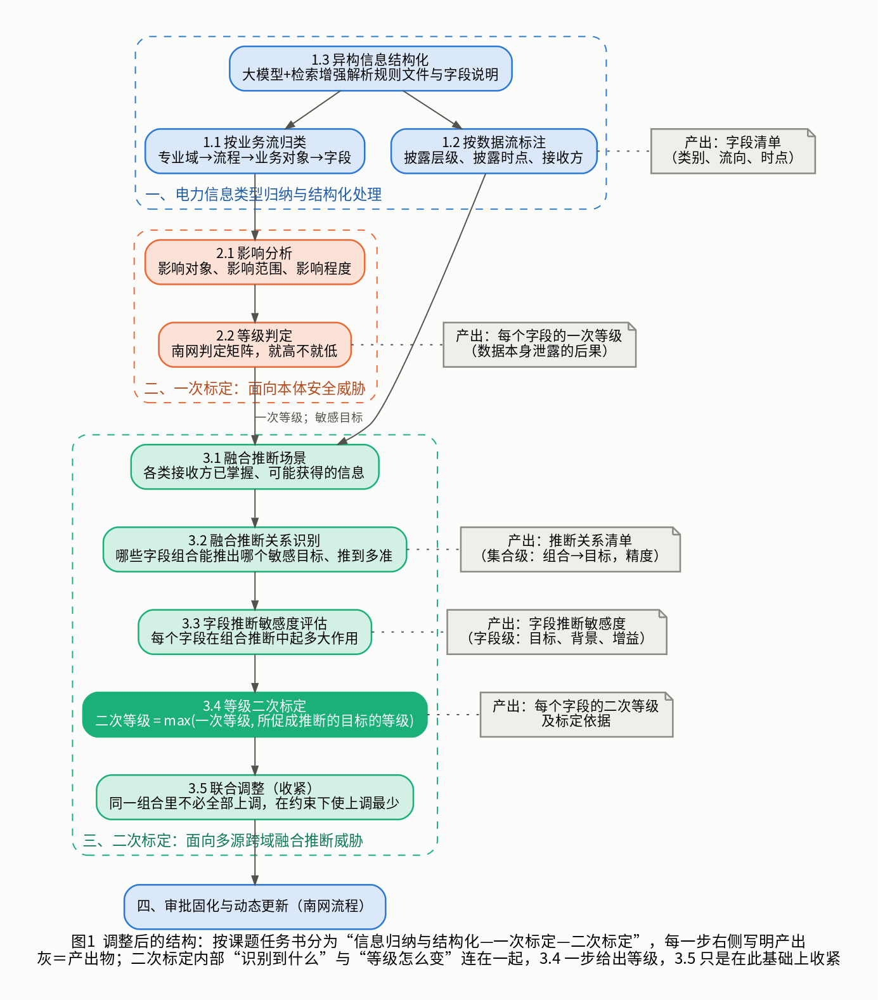

# 分类分级体系：针对老师意见的分析与调整方向（V7）

> 2026-10-08，组内讨论用。本版只整理思路，不做 PPT。文中“邢”指邢之熠的论文，“杜”指杜的近期研究。
> 上一版 PPT 在 [../V6/](../V6/README.md)，方案正文在 [../V2/](../V2/README.md)。

---

## 一、老师的问题出在哪

老师提了两类问题，我的理解如下。

**1. 结构没有对着任务书讲。**
任务书这一条的主线是三件事：归纳信息类型并做结构化处理；面向**本体安全威胁**做**一次标定**；面向**多源跨域融合推断威胁**做**二次标定**。V6 讲的是“四个阶段”，一次、二次标定这两个词没有出现，听的人对不上号。

**2. “推断风险识别”这一段说不清，前后也不连贯。**具体是三个疑问：

| 老师的疑问 | V6 的实际情况 | 问题所在 |
|---|---|---|
| 这一步识别的到底是什么？是推断风险，还是某个字段的风险？ | 其实先后得到了两种东西：先是“哪些字段组合能推出哪个敏感数据”（组合层面），再是“每个字段在其中起多大作用”（字段层面） | 两种东西混在一个标题下，没有分开说 |
| 识别出风险以后，这一步什么都不做，留到下一步才改等级？ | 是的。阶段二只算量，阶段三才检查、优化、出等级 | “发现问题”和“处理问题”被切成两个阶段，中间还隔着“一致性检查”这种新概念，读起来断开了 |
| 二次标定到底怎么标？ | 等级是“优化问题的解”，没有一句直接的规则 | 缺一条一看就懂的标定规则；优化本来只是为了少升几个字段，却被讲成了标定本身 |

归结起来：**V6 把“二次标定”拆成了“识别”和“优化”两个阶段，又没有给出一条直接的标定规则。**

---

## 二、调整方向

三处调整。

**调整 1：结构改成任务书的三段。**
信息类型归纳与结构化处理 → 一次标定 → 二次标定，最后接南网的审批固化。原来的“阶段二、阶段三”合并成“二次标定”一段。

**调整 2：把“识别到的是什么”分成两层说清楚。**
- 先得到**融合推断关系**：哪些字段组合能把哪个敏感数据推出来、推到多准。这是组合层面的事实。
- 再得到**字段推断敏感度**：每个字段在这些组合里起多大作用、对着哪个敏感数据、要和谁一起。这是字段层面的量，也就是要拿去标定的东西。

所以对老师问题的回答是：先识别“推断关系”，再落到“字段”，最后标的是字段的等级。

**调整 3：给二次标定一条直接的规则，识别完马上出等级。**

> **二次等级 = max（一次等级，该字段所促成推断的敏感数据的等级）**

意思是：一个字段如果能帮别人把某个更高等级的数据推出来，它就按那个数据的等级来管。这条规则一步给出结果，不需要先讲优化。它也直接对应南网的“就高不就低”，以及《分类分级手册》附录 D“分析挖掘出更敏感的衍生数据应提高级别”。

原来的“等级一致性优化”（包括 GRPO）不删，但降为二次标定里的**最后一小步“联合调整”**：同一个组合里的字段不必全部上调，升掉其中一部分，其余的组合就凑不齐了，可以少升几个。它的作用是避免过度定级，是在规则结果上做收紧。

这样二次标定内部就是一条连着的线：**看谁手里有什么 → 找出能推出敏感数据的组合 → 算每个字段的作用 → 按规则标等级 → 联合调整收紧**。

---

## 三、调整后的体系

### 第一部分：电力信息类型归纳与结构化处理

对应任务书“从业务流和数据流的角度归纳电力信息类型，提出异构信息的结构化处理方法”。

| 步骤 | 做什么 | 产出 | 来源 |
|---|---|---|---|
| 1.1 按业务流归类 | 按南网业务架构一层层分到字段 | 每个字段的类别 | 南网《分类分级手册》四(二)、附录 A |
| 1.2 按数据流标注 | 标出每个字段流向谁、什么时候公开 | 披露层级、披露时点、接收方 | 南网《披露细则》2.7、5.1；杜提出要标 |
| 1.3 异构信息结构化 | 用大模型加检索增强，把规则文件、字段说明这些文本变成结构化记录 | 规则库、字段清单 | 邢（论文 4.1.1） |

这里有一个顺带的好处：原来的“场景标注”在 V6 里显得突兀，现在它就是任务书说的“数据流角度”，位置很自然。

### 第二部分：一次标定（面向本体安全威胁）

对应任务书“围绕影响对象、影响范围、影响程度……提出面向本体安全威胁的安全等级一次标定方法”。

| 步骤 | 做什么 | 产出 | 来源 |
|---|---|---|---|
| 2.1 影响分析 | 判断这份数据本身泄露后影响谁、影响多大范围、多严重 | 影响对象、范围、程度 | 南网《分类分级手册》四(三)、附录 C |
| 2.2 等级判定 | 查南网的判定矩阵，就高不就低 | **一次等级**（1~5 级） | 南网《分类分级手册》表 4.4 |

一次等级就是 V6 里的“规则等级”，只是换了任务书的叫法。任务书说的“影响范围”，在南网手册里对应分级要素中的区域、规模、覆盖度。

### 第三部分：二次标定（面向多源跨域融合推断威胁）

对应任务书“考虑多源敏感信息跨域融合推断，提出……安全等级二次标定方法”。

| 步骤 | 做什么 | 产出 | 来源 |
|---|---|---|---|
| 3.1 融合推断场景 | 确定每类接收方已经掌握什么、还可能拿到什么 | 各类接收方的已知信息 | 杜；内容取自南网《披露细则》《分类分级手册》表 4.1~4.3 |
| 3.2 融合推断关系识别 | 找出哪些字段组合能把哪个敏感数据推出来，并用模型重训确认 | **推断关系清单**（组合 → 敏感数据，推断精度） | 杜（集合推断能力）；邢的关联分析作辅助，邢的模型验证思路保留 |
| 3.3 字段推断敏感度评估 | 把组合层面的结果落到每个字段：它促成了对哪个数据的推断、和谁一起、贡献多大 | **字段推断敏感度** | 杜（字段推断风险 M） |
| 3.4 等级二次标定 | 按规则：二次等级 = max（一次等级，所促成推断的敏感数据的等级） | **二次等级**及依据 | 规则依据南网“就高不就低”、附录 D |
| 3.5 联合调整 | 同一组合里不必全部上调，在南网约束下让上调最少 | 调整后的二次等级 | 杜提出问题；求解用邢的 GRPO |

对应南网的依据：《分类分级手册》的“深度”要素、“从严性”“合理性”原则、附录 D、附录 E；《风险评估手册》第 382 项。

### 第四部分：审批固化与动态更新

二次等级作为建议等级走南网的审批，写入数据目录；情况变化时重新标定。这部分不变。

---

## 四、二次标定怎么标：一个小例子

（数字为示意。）敏感数据 y 的一次等级是 3 级，泄露判定线 0.7。出清电价 P 是法定公开的。字段 A、B、C 一次等级 1 级，D 是 2 级。

**3.2 得到推断关系清单**（组合层面）：

| 字段组合（加上公开的 P） | 对 y 的推断精度 | 是否超过判定线 |
|---|---|---|
| {A, B} | 0.78 | 是 |
| {A, C} | 0.74 | 是 |
| {A, D} | 0.80 | 是 |
| {B, C, D} | 0.72 | 是 |
| 其余组合 | 低于 0.7 | 否 |

**3.3 得到字段推断敏感度**（字段层面）：

| 字段 | 促成推断的数据 | 作用最大时的背景 | 带来的精度提升 |
|---|---|---|---|
| A | y（3 级） | 已有 P 和 D | 0.68 |
| B | y（3 级） | 已有 P、C、D | 0.42 |
| C | y（3 级） | 已有 P、B、D | 0.42 |
| D | y（3 级） | 已有 P、B、C | 0.37 |

**3.4 按规则二次标定**：A、B、C、D 都促成了对 3 级数据的推断，二次等级都是 3 级。P 是法定公开字段，不调整。

**3.5 联合调整**：把 A 和 D 升到 3 级以后，其余接收方手里只剩 B、C，凑不出任何超过判定线的组合，所以 B、C 可以保持 1 级。最终只升 A、D 两个字段。

这个例子里，3.4 是“标定”，3.5 是“收紧”。即使不做 3.5，3.4 的结果也是合规的，只是偏保守。

---

## 五、和 V6 相比变了什么

| V6 | 调整后 |
|---|---|
| 四个阶段 | 任务书的三段，加审批固化 |
| “规则等级”“建议等级” | “一次等级”“二次等级” |
| 阶段一的“场景标注” | 归到第一部分的“按数据流标注” |
| 阶段二“推断风险识别”，产出是一组度量 | 拆成 3.2（组合层面的推断关系）和 3.3（字段层面的推断敏感度），各有明确产出 |
| 阶段三先讲“等级一致性条件”，等级是优化的解 | 3.4 先给一条直接的标定规则；一致性和优化收进 3.5，作为收紧 |
| GRPO 是阶段三的主角 | GRPO 是 3.5 的求解手段 |

方法本身没有变，变的是讲法和先后顺序。3.4 的规则其实就是最早一版方案里的“推断继承”，3.5 就是后来加的“上调最少”，现在把两者按“先标定、后收紧”排在了一起。

---

## 六、还需要定的几件事

1. **3.5 联合调整要不要作为必做的一步。**
   - 必做：结果不过度定级，GRPO 有位置；但要多解释一层。
   - 可选：主线更简单，3.4 的规则就是结论；GRPO 的分量会变轻。
   - 我的建议是讲成“3.4 给出标定结果，3.5 在此基础上收紧”，两个结果都给，由南网选口径。
2. **3.4 的规则要不要分档。** 现在是“超过判定线就按目标的等级”，一刀切。也可以按推断精度分几档（比如推得很准才取目标等级，推得一般则低一级）。分档更细，但要多定几个阈值，都需要南网认可。建议先用一刀切。
3. **二次标定的对外说法。** 任务书的总目标是“电力信息敏感度的科学评估”。可以把 3.3 的“字段推断敏感度”作为敏感度的量化结果，把 3.4 的等级作为标定结论，两者都报。
4. **3.5 的求解怎么写。** 实验结果是整数规划几毫秒就能得到最优，GRPO 没有实质优势。3.5 降为收紧步骤以后，这一点的影响变小了，但被问到时仍要如实说明。

---

## 七、下一步

如果这个方向可以，新一版 PPT 的结构是：
- 背景与依据（不变）；
- 体系框架：总图换成图 1 的三段结构，每一步写明产出；
- 关键方法：按 1.1–1.3、2.1–2.2、3.1–3.5 展开，二次标定是重点，用第四节的例子把“推断关系 → 字段敏感度 → 标定 → 收紧”串起来；
- 小结：各步骤与任务书、南网文件的对应。
