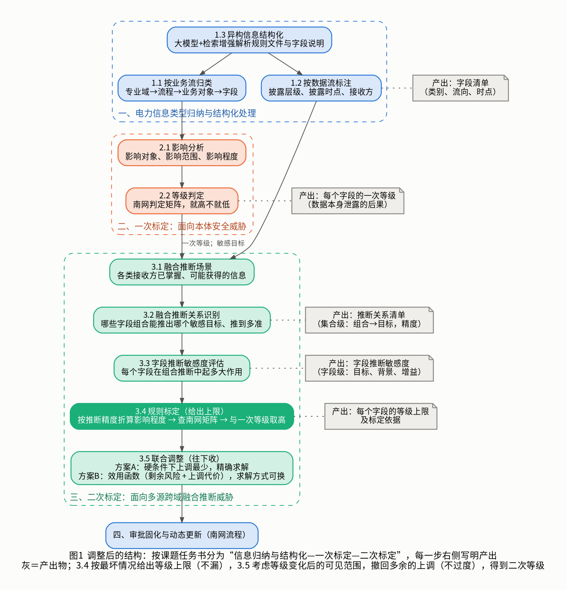

# 分类分级体系调整思路（V8）

> 2026-10-08，组内讨论用，只整理思路，不做 PPT。本版在 [V7](../V7/体系调整思路.md) 的基础上补了三样东西：连续的推断量怎么变成 1~5 级、规则标定之后为什么还要联合调整、联合调整的两种做法（方案 A、方案 B）。
> 文中“邢”指邢之熠的论文，“杜”指杜的近期研究。例子里的数字都是示意。

---

## 一、整体结构

按课题任务书分三段，最后接南网的审批固化。

| 部分 | 做什么 | 得到什么 |
|---|---|---|
| 一、信息类型归纳与结构化处理 | 按业务流分类到字段；按数据流标出每个字段给谁看、什么时候公开；用大模型把规则文件和字段说明结构化 | 字段清单 |
| 二、一次标定（本体安全威胁） | 看数据本身泄露后影响谁、多严重，查南网矩阵 | 每个字段的**一次等级** |
| 三、二次标定（融合推断威胁） | 见下 | 每个字段的**二次等级** |
| 四、审批固化与动态更新 | 南网原有流程 | — |

二次标定内部五步：

| 步骤 | 做什么 | 得到什么 |
|---|---|---|
| 3.1 融合推断场景 | 确定每类接收方已经掌握什么、还能拿到什么 | 各类接收方的已知信息 |
| 3.2 融合推断关系识别 | 找出哪些字段组合能把哪个敏感数据推出来、推到多准 | 推断关系清单（组合层面） |
| 3.3 字段推断敏感度评估 | 把结果落到每个字段：促成了对谁的推断、和谁一起、提升多少 | 字段推断敏感度（字段层面） |
| 3.4 规则标定 | 按一条固定规则给出等级 | 每个字段的等级**上限** |
| 3.5 联合调整 | 考虑等级变化后谁还能看到什么，撤回多余的上调 | **二次等级** |

3.4 和 3.5 是本文的重点。

---

## 二、3.4 规则标定：连续的量怎么变成等级

### 问题

我们算出来的是 0 到 1 之间的连续量（推断精度、提升量 M），南网要的是 1~5 级。中间必须有一个换算。

### 邢是怎么做的

邢的论文里有三种写法，本质都是“风险值过门槛就升级”：
- 理论框架里：综合得分 = 初始得分和风险值的加权和，再切档；
- 系统的“规则驱动模式”：关联强度或推断精度超过阈值，就“提升至对应级别”；
- GRPO：按“安全收益 − 可用性成本”选等级，解开来看也是风险值落在哪一段就是几级。

共同的缺口是：升到几级，和“被推断出来的是什么数据”没有挂钩。

### 我们的做法：借用南网自己的矩阵

南网定级只看两样：**影响对象**和**影响程度**。推断的情形可以这样对上：

- 影响对象：取被推断数据的影响对象。
- 影响程度：取被推断数据自身的影响程度，再按“推到多准”打折。
- 然后查南网的判定矩阵得到等级。

打折用一张表（档位和切点要南网认可，这里是示意）：

| 获得该字段后，敏感数据能被推到多准 | 影响程度 |
|---|---|
| 0.9 以上 | 与该数据自身相同 |
| 0.7 到 0.9 | 降一档 |
| 0.5 到 0.7 | 降两档 |
| 0.5 以下 | 视为无影响 |

### 两个连续量各管什么

| 量 | 回答的问题 | 用处 |
|---|---|---|
| 可达精度 | 后果有多重 | 决定影响程度打几折 |
| 提升量 M | 这个后果该不该算在这个字段头上 | 每个组合里提升量最大的字段必须担责；其余字段的提升量低于门槛的可以不计 |

### 有多个敏感数据时

对每个敏感数据分别按上面的办法得到一个等级，取最高的那个。不是找 M 最大的：M 最大的那个数据可能本身等级不高。

### 规则

> **等级上限 = max（一次等级，各个被促成推断的敏感数据按精度折算后查矩阵得到的等级）**

这条规则是按“其他字段都还停在一次等级”算的，也就是最坏情况。所以它**一定不会漏**，但会**偏严**：一个组合里每个成员都会被升上去，而实际上只要升掉其中一个，这个组合就凑不齐了。

---

## 三、3.5 联合调整：为什么需要，要解决什么

南网每一级都规定了能给谁看。字段升级以后，能看到它的人变少，别的字段在这些人手里的风险也跟着下降。

所以规则标定给出的上调里，有一部分是多余的。联合调整要做的就是：**把多余的上调撤回来，同时保证任何人都推不出比他权限更高的数据。**

| 步骤 | 保证什么 | 对应南网原则 |
|---|---|---|
| 3.4 规则标定 | 不漏 | 从严性 |
| 3.5 联合调整 | 不过度 | 合理性（避免过度定级） |

每个字段的最终等级落在“一次等级”和“等级上限”之间。

联合调整有两种做法，就是方案 A 和方案 B。两者的前四步完全相同，**区别只在这最后一步怎么表述、怎么求解**。

---

## 四、用同一个例子讲方案 A 和方案 B

### 例子

- 敏感数据 y：调度运行类数据，影响对象是公共利益、影响程度一般，一次等级 **3 级**。按折算表，y 被推到 0.7 以上相当于泄露了 3 级数据（公共利益一栏里，轻微和一般都是 3 级），0.7 以下视为无影响。
- 接收方：**社会公众**只能看 1 级字段；**协议接收方**能看 1、2 级字段。两者都不该知道 y。
- 字段：P 是法定公开的出清电价（不能动）；A、B、C 一次等级 1 级；D 一次等级 2 级。
- 3.2 识别出的推断关系（都已含公开的 P）：

| 字段组合 | 对 y 的推断精度 |
|---|---|
| {A, B} | 0.78 |
| {A, C} | 0.74 |
| {A, D} | 0.80 |
| {B, C, D} | 0.72 |
| 其他不含上述组合的情况 | 0.45 以下 |

- 3.4 规则标定：A、B、C、D 都参与了能把 y 推到 0.7 以上的组合，等级上限都是 **3 级**。如果就此结束，一共上调 2+2+2+1 = **7 级**。

### 方案 A：把联合调整当成一道有标准答案的题

**表述**：
- 条件（必须满足）：任何接收方凭手里和能看到的字段，都不能把 y 推到 0.7 以上；等级不低于一次等级；法定公开字段不动。
- 目标：在满足条件的前提下，上调的总量最少。

**求解**：这是一个标准的组合优化问题，用整数规划直接算出最优解。

**在例子里**：最优解是把 A 和 D 升到 3 级，B、C 不动，合计上调 **3 级**。检查一下：社会公众能看到的只有 B、C，合起来 0.35；协议接收方能看到的也只有 B、C（A、D 都到 3 级了），同样 0.35。都推不出 y。

**特点**：
- 讲起来最直接：条件是什么、目标是什么、答案是什么。
- 没有强化学习。上次实验里，几十个字段的规模下整数规划平均 8 毫秒出最优解。
- 条件满足不了的时候（见下面的变化情形），它只能回答“无解”。

### 方案 B：把联合调整写成一个打分函数

**表述**：给每一种等级方案打一个分（效用），分越高越好。分数由两部分组成：

> **效用 = −（很大的权重）× 剩余风险 − 上调代价**

- **剩余风险**：对每类接收方、每个敏感数据，看他最多能推到相当于几级的数据，比他的权限高出几级就记几级，全部加起来。叫“越权级差”。它等于 0，就是方案 A 里的条件成立。
- **上调代价**：每个字段上调的级数乘以它的代价，加起来。
- **硬限制**（不进分数，直接不允许）：不低于一次等级、法定公开字段不动、算法最高到 3 级。
- 权重取很大，意思是先把风险消干净，再谈少升几个。

**求解**：找分数最高的等级方案。可以用整数规划精确算，也可以用贪心，也可以用邢的 GRPO。求解方式可以换，函数不变。

**在例子里**，给几种方案打分（代价都取 1）：

| 等级方案 | 社会公众能推到 | 协议接收方能推到 | 剩余风险（越权级差） | 上调代价 | 效用 |
|---|---|---|---|---|---|
| 都不调 | 3 级（用 A、B） | 3 级（用 A、D） | (3−1)+(3−2) = 3 | 0 | −3×权重 |
| 只把 A 升到 3 级 | 推不出 | 3 级（用 B、C、D） | 0+1 = 1 | 2 | −权重−2 |
| A、D 升到 3 级 | 推不出 | 推不出 | 0 | 3 | **−3** |
| A、B 升到 3 级 | 推不出 | 推不出 | 0 | 4 | −4 |
| 全部升到 3 级 | 推不出 | 推不出 | 0 | 7 | −7 |

分数最高的是“A、D 升到 3 级”，和方案 A 的答案相同。

**和邢原来的效用函数相比**：结构一样，都是“安全 − 成本 − 合规”三项。区别在安全项：邢是每个字段各算各的，互不影响；这里的剩余风险要通过“谁能看到哪些字段”把所有字段连在一起，这才需要联合决策。合规项从扣分改成了硬限制。

### 两个方案什么时候会不一样

正常情况下答案相同。差别出现在**条件满足不了**的时候。

变化情形：业务部门要求 B、C、D 必须保持现有等级对外提供，只有 A 可以调。这时 {B, C, D} 这个组合怎么都拆不掉。

- 方案 A：条件无法满足，**无解**。只能停下来，交给人处理。
- 方案 B：照样打分，给出最好的可行方案“把 A 升到 3 级”，并报告：还剩 1 级的越权，来自协议接收方可以用 B、C、D 把 y 推到 0.72。这份报告正好是提交主管部门研判的材料。

另外两处差别：
- **复用**：方案 B 的函数可以直接用在后续复评上（比如新开放了一批数据，从当前等级出发重新找最高分），不用另写一套条件。
- **连续量的位置**：方案 B 里推断精度直接进了打分；还可以再加一个小项（精度超出切点多少），让分数随着每一步调整平滑变化。

### 对比

| | 方案 A | 方案 B |
|---|---|---|
| 联合调整怎么表述 | 硬条件 + 上调最少 | 效用函数：剩余风险（权重很大）+ 上调代价 |
| 怎么求解 | 整数规划 | 可换：整数规划、贪心、GRPO |
| 正常情况下的结果 | 最优解 | 相同 |
| 条件满足不了时 | 无解 | 给出剩余风险最小的方案，并报告剩余在哪 |
| 复评时 | 重新列条件求解 | 同一个函数，从当前等级出发 |
| 邢的内容 | 用不上 GRPO | 保留三项效用的结构；GRPO 是可选的求解方式 |
| 讲解难度 | 低 | 稍高，要解释“越权级差”和“权重很大” |
| 容易被问的 | — | “既然能精确算，为什么要 GRPO” |

---

## 五、强化学习放在哪

需要先说清楚一件事：**有了效用函数，不等于强化学习就有优势。**

方案 B 的效用函数里所有的量都是事先算好的，函数是确定的。这样的问题精确算法就能解，强化学习既不更快也不更准。上次实验的结果也是这样：GRPO 比贪心好不到 1%，都不如整数规划。

所以在方案 B 里，GRPO 的定位只能是“效用函数的一种求解方式”，不能说它带来了更好的结果。

强化学习真正能起作用的，是下面两个现在还没做的问题：

- **动态复评**。新一批数据开放、披露时间到了这些事会陆续发生，等级每改一次都要走审批，频繁改动有成本。目标是长期来看“风险加改动成本”最小，而未来会发生什么并不确定。这是随时间展开的决策，也最接近邢“动态更新”的本意。
- **验证该先做哪些**。上次实验表明要重训大约四成的字段组合才能保证不漏。先验证哪些、做到什么程度可以停，是在信息不全的情况下一步步做决定。

这两个方向我认为是对的，但没有任何实验，现在不能承诺效果。

---

## 六、建议

**选方案 B，求解默认用精确算法，GRPO 写成可选的求解方式，动态复评写成后续方向。**

理由：
- 方案 B 包含了方案 A：正常情况下两者答案一样。
- 它多出来的三点（无解时有结果、复评能复用、连续量有位置）对南网的实际使用有价值。
- 它保留了邢的效用函数结构，融合的痕迹最自然。
- 对 GRPO 的说法经得起追问。

如果希望讲得尽量简单，也可以对外只讲方案 A 的表述（条件加目标），把效用函数作为内部实现。

## 七、还要定的事

1. 选方案 A 还是方案 B，以及 GRPO 在材料里出现到什么程度。
2. 折算表的档位和切点，需要南网或老师认可。
3. 提升量 M 的门槛取多少。原则是每个组合里至少有一个字段担责。
4. 上调代价怎么定。可以先都取 1。
