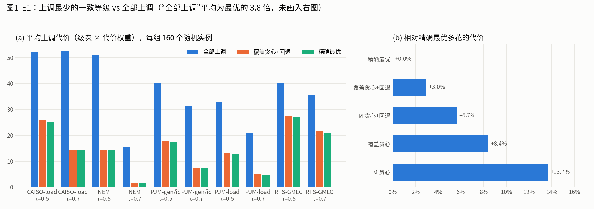
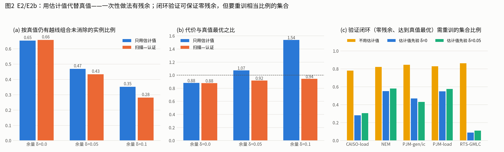
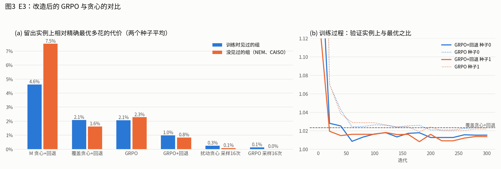

# WORKLOG（01 号）：等级一致性优化的验证

2026-10-07。对应 V2 方案第 7 节的 E1–E3，另加补充实验 E2b。问题、实例生成规则和判据在运行前写在 [base.yaml](base.yaml)。

## 结论

1. **E1：最小口径比“全部上调”少调约六成，而且精确最优几毫秒就能算出来。** 1,579 个随机实例上，全部上调的代价平均是最优的 3.8 倍；最优方案相对全部上调节省 63%。整数规划求精确最优平均 8 毫秒、最长 31 毫秒。覆盖贪心 + 回退比最优多花 3.0%，满足事先写的“≤10% 即贪心足够”。
2. **E2：用估计值代替真值，一次性做法都有残余，未达到“认证后残余为 0”的判据。** 只用估计值时，65% 的实例按真值仍有越线组合没消除；留 0.10 的余量后降到 35%，但代价升到最优的 1.54 倍。扫描后一次性认证也不行：余量 0.10 时仍有 28% 的实例有残余，而且要重训 46% 的集合。
3. **E2b（补充）：把验证做成闭环可以保证零残余并达到真值最优，代价是重训约四成的集合。** 以估计值为先验时平均需验证 39% 的集合，不用估计值时为 83%。估计值的作用是把验证量减半，不是省掉验证。
4. **E3：改造后的 GRPO 达到“不劣于贪心”的判据，但优势不到 1%，且两者都不如直接解整数规划。** GRPO + 回退比最优多花 0.8%–1.0%，覆盖贪心 + 回退为 1.6%–2.1%；两个种子、见过和没见过的组上方向一致。
5. **方案里描述的“每步上调 M 最大的字段”是几种方法里最差的**（多花 13.7%，回退后 5.7%）。

## 对方案的影响

- **阶段三的主求解器应改为整数规划**。本规模（22–35 个字段、几十到几百个越线组合）下它既精确又快，贪心和 GRPO 都没有必要性。GRPO 可以作为师兄方法的延续保留为可选求解器，结论是“可用、不劣于贪心”，但不能说它带来了实质收益。
- **证据环节要写成闭环验证**，不能写“扫描后认证前 3 个背景即可”。V2 方案 3.4 节的“召回 76–91%、无误报”说的是没有误报，漏报是存在的，这里量化了它的后果。
- **“M 最大者优先”不宜作为求解规则**，M^(K) 的用途是解释和证据，不是排序求解。

## 设置

- 数据：RTS-GMLC、NEM、PJM-load、PJM-gen/ic、CAISO-load 五组共 10 个目标；真值为不超过 3 个字段的全部组合的专用重训结果（K=2），估计值为论文固定估计器。只读复用，没有重训。
- 实例：数据集没有南网等级，所以随机生成。字段规则等级取 1 或 2 级，目标取 3 级或 2/3 级混合，代价均匀或在 [0.5, 2] 内随机，τ 取 0.5 和 0.7，每种组合 20 个实例。
- **一个结构性事实**：角色的可见范围嵌套时（公众 ⊂ 协议接收方），一致性条件等价于“每个最小越线组合里至少有一个字段的等级不低于目标等级”。所以问题就是带权的覆盖问题，变量是每个字段升到几级。

## E1 明细

| 方法 | 平均代价 | 上调字段数 | 与最优之比 | 相对全部上调节省 | 达到最优的实例比例 |
|---|---|---|---|---|---|
| 全部上调 | 37.5 | 21.9 | 3.76 | — | 0.1% |
| M 贪心 | 16.5 | 9.7 | 1.137 | 58.4% | 35.1% |
| M 贪心 + 回退 | 15.5 | 9.1 | 1.057 | 60.8% | 49.0% |
| 覆盖贪心 | 16.2 | 10.2 | 1.084 | 59.1% | 44.8% |
| 覆盖贪心 + 回退 | 15.1 | 9.4 | 1.030 | 61.7% | 73.2% |
| 精确最优 | 14.7 | 8.9 | 1.000 | 62.7% | 100% |

- 节省幅度因组而异：RTS-GMLC 约 32–41%，其余各组 51–89%（分组结果见 `outputs/e1_summary_by_group.csv`）。
- 代价均匀与否、目标等级是否混合，对结论影响很小（`outputs/e1_summary_by_setting.csv`）。
- 附加设置 lock10（10% 的 1 级字段锁定）下结论相同：贪心 + 回退为最优的 1.016 倍；平均每个实例有 0.62 个组合只由锁定字段构成，记为“基底已泄露”。该设置把锁定字段计入组合规模，比方案定义弱，仅作参考。

## E2 与 E2b 明细

| 口径 | 余量 δ | 残余组合比例 | 有残余的实例比例 | 代价与真值最优之比 | 重训集合比例 |
|---|---|---|---|---|---|
| 只用估计值 | 0 | 5.8% | 65% | 0.88 | 0 |
| 只用估计值 | 0.05 | 3.2% | 47% | 1.07 | 0 |
| 只用估计值 | 0.10 | 1.5% | 35% | 1.54 | 0 |
| 扫描—认证（一次性） | 0 | 5.8% | 66% | 0.88 | 35% |
| 扫描—认证（一次性） | 0.05 | 3.0% | 43% | 0.92 | 40% |
| 扫描—认证（一次性） | 0.10 | 2.2% | 28% | 0.94 | 46% |
| **验证闭环**，估计值先验 | 0 | 0 | 0 | 1.00 | 39% |
| **验证闭环**，估计值先验 | 0.05 | 0 | 0 | 1.00 | 40% |
| 验证闭环，不用估计值 | — | 0 | 0 | 1.00 | 83% |

（表中按整数规划求解；代价比小于 1 表示保护不足，不是更省。）

- 残余主要来自 PJM 两组：δ=0 时残余组合比例 12–14%，其余各组不到 2.5%。这与论文记录的“估计器在 PJM 上系统性低估 0.03–0.04”一致。
- 一次性认证的问题：估计值偏低的集合不会被送去认证，漏掉的越线组合就留在了可见范围里。
- 验证闭环的做法：按当前已知信息求最优等级 → 重训验证各目标背景池内所有还没验证的组合，以及清单中还没验证的组合 → 有新发现就再求解。结束时池内组合都验证过，所以零残余；清单都为真，所以代价等于真值最优。平均 2.7–3.3 轮收敛。
- 验证量因组和 τ 差别很大（估计值先验，按组 × τ 的均值范围）：RTS-GMLC 8–14%，CAISO 19–40%，PJM 两组 30–75%，NEM 32–81%。越线组合少、需要上调的字段少时（如 τ=0.7），留在池里的字段多，要验证的组合就多。

## E3 明细

留出实例 785 个，与精确最优之比（两个种子平均）：

| 方法 | 训练时见过的组 | 没见过的组（NEM、CAISO） |
|---|---|---|
| M 贪心 + 回退 | 1.046 | 1.075 |
| 覆盖贪心 + 回退 | 1.021 | 1.016 |
| GRPO（贪心解码） | 1.021 | 1.023 |
| GRPO + 回退 | 1.010 | 1.008 |
| 扰动贪心，采样 16 次取最优 | 1.003 | 1.001 |
| GRPO，采样 16 次取最优 | 1.001 | 1.000 |

- 判据核对（GRPO + 回退 对 覆盖贪心 + 回退，逐实例代价比）：种子 0 平均 0.993、没见过的组 0.995；种子 1 平均 0.992、没见过的组 0.992。两个种子都通过。逐实例看，约 77–79% 打平，13–15% GRPO 更好，8% 更差。
- 采样 16 次后两种方法都几乎达到最优，GRPO 的相对优势约 0.1 个百分点，可以忽略。
- 训练各 300 轮、约 49 分钟（单线程采样是瓶颈）；验证指标从第 60–80 轮起基本持平。

## 局限

1. 实例的规则等级、目标等级和代价是随机生成的，不是南网的真实等级；真实数据上越线组合的数量和结构会不同。
2. 可见范围按嵌套处理。市场披露的“公众/公开/特定”与开放目录的接收方类型并不完全嵌套，那时问题不再化简为单一覆盖条件，没有测。
3. 只测到 35 个字段、K=2。字段数上百、越线组合上万时整数规划是否仍然够快，没有测；这是贪心或 GRPO 可能有用的地方。
4. “重训验证”在这里是查已有真值表，没有计入每次重训的耗时（论文口径 14–56 秒/集合）。
5. 真值本身只覆盖不超过 3 个字段的组合；“零残余”是相对这张表而言。
6. GRPO 只训练了两个种子、一种网络结构，没有调参。

## 文件

- `src/env.py`、`src/grpo.py`；`scripts/run_e1_e2.py`、`run_e2b.py`、`train_grpo.py`、`eval_e3.py`、`figs.py`
- `outputs/e1_*.csv`、`e2_*.csv`、`e2b_*.csv`、`e3_*.csv`、`e3_verdict.json`、`grpo/`
- `figures/图1–图3`
